# WriteHERE: Proposed Neo4j-Based and Event-Driven Architecture

*Transforming a monolithic content generation system into a scalable, resilient, distributed architecture*

Imagine a writing assistant that not only generates content but reveals its entire thinking process, breaking down complex writing tasks into manageable steps, researching topics, analyzing information, and crafting prose—all visible to you in real-time. This is WriteHERE, a sophisticated AI writing framework that employs hierarchical recursive planning to create long-form content. 

However, as with many successful systems that evolve from research prototypes to production applications, WriteHERE faces architectural limitations that hinder its growth. This document outlines an ambitious yet practical proposal to transform WriteHERE from its current file-based, monolithic architecture to a scalable, distributed system powered by Neo4j graph database and event-driven principles.

This transformation isn't merely a technical refactoring—it's a reimagining of how AI writing systems can scale to enterprise needs while maintaining the transparency and recursive planning that makes WriteHERE uniquely powerful.

## 1. Limitations of Current Architecture

The current WriteHERE implementation has served admirably as a proof-of-concept and small-scale production system. However, as usage grows and requirements evolve, several architectural constraints have emerged that limit its potential:

### 1.1 File-based Persistence: The Serialization Bottleneck

At the heart of WriteHERE lies a sophisticated task graph that represents the writing process. Currently, this graph is persisted through Python's pickle serialization and JSON files:

```python
# Current persistence approach in GraphRunEngine.save()
def save(self, folder):
    root_node_file = "{}/nodes.pkl".format(folder)
    root_node_json_file = "{}/nodes.json".format(folder)
    
    with open(root_node_file, "wb") as f:
        pickle.dump(self.root_node, f)
    
    with open(root_node_json_file, "w") as f:
        json.dump(self.root_node.to_json(), f, indent=4, ensure_ascii=False)
```

While this approach is simple and effective for individual use cases, it creates several limitations:

- **Concurrent Access Barrier**: Only one process can safely write to these files at a time, creating a fundamental bottleneck for parallelization.
- **Collaboration Roadblocks**: Real-time collaboration requires shared access to task graphs, which is difficult with file locking.
- **Query Inefficiency**: Finding specific tasks or relationships requires loading and traversing the entire graph in memory.
- **Deployment Constraints**: File-based storage ties the application to single-machine deployments or complex shared filesystem configurations.

Consider a scenario where multiple users want to collaborate on a report, with different team members responsible for different sections. The current architecture forces serialized access, where only one person can make meaningful changes at a time.

### 1.2 Monolithic Execution: The Orchestration Challenge

The `GraphRunEngine` class currently shoulders multiple responsibilities:

```python
class GraphRunEngine:
    def __init__(self, root_node, memory, config=None):
        self.root_node = root_node
        self.memory = memory
        self.config = config or {}
    
    def find_need_next_step_nodes(self):
        # Find ready nodes
        
    def forward_one_step_not_parallel(self):
        # Execute one step
        
    def forward_one_step_untill_done(self):
        # Execute until completion
```

This monolithic design creates several issues:

- **Tight Coupling**: Task scheduling, execution, state management, and persistence are intertwined, making it difficult to modify or replace individual components.
- **Scaling Limitations**: The engine must run as a single process, limiting throughput.
- **Fault Isolation Challenges**: Failures in one component can crash the entire engine.
- **Resource Allocation Constraints**: Computing resources cannot be dynamically allocated based on workload.

When a writing task involves complex research or reasoning steps that could benefit from parallel processing, the monolithic engine becomes a bottleneck rather than an accelerator.

### 1.3 Polling-based Updates: The Real-time Gap

Despite implementing WebSockets for client communication, the core system relies on file system monitoring and polling:

```python
# Current approach to detect changes
def monitor_task_directory(task_id, directory):
    last_modified = os.path.getmtime(directory + "/nodes.json")
    while True:
        current_modified = os.path.getmtime(directory + "/nodes.json")
        if current_modified > last_modified:
            # File changed, process updates
            last_modified = current_modified
        time.sleep(1)  # Poll every second
```

This approach has several drawbacks:

- **Latency**: Updates are only detected on the next polling cycle, introducing delays.
- **Resource Waste**: Constant polling consumes CPU and I/O resources even when no changes occur.
- **Scaling Issues**: As the number of active tasks grows, polling overhead increases linearly.
- **Partial Updates**: File-based updates are all-or-nothing, making it difficult to send incremental changes.

When users expect real-time visualization of the writing process, even small delays in updating the UI can diminish the experience of watching the AI "think" through a writing task.

### 1.4 Current Architecture Visualization

The following diagram illustrates the existing architecture of WriteHERE, highlighting the bottlenecks and limitations described above:

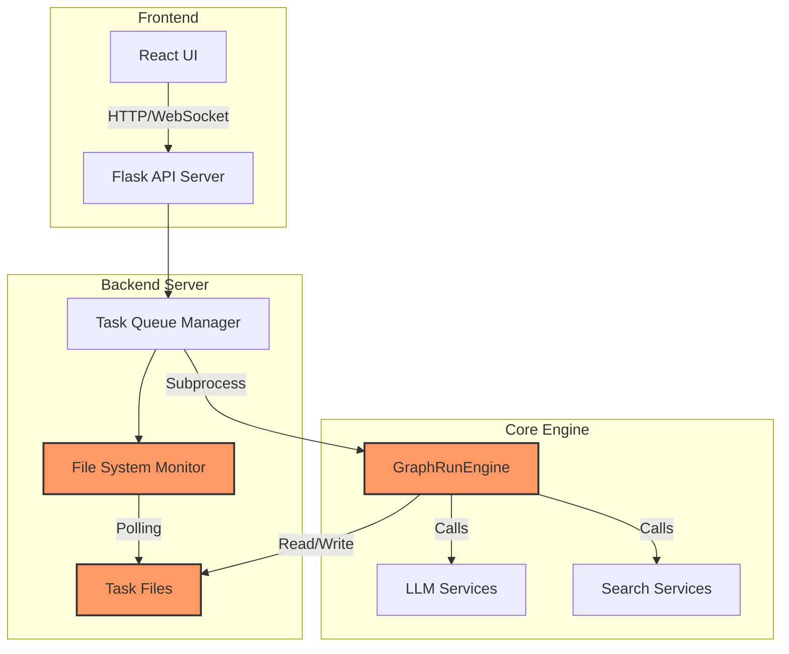
```mermaid
graph TD
    subgraph "Frontend"
    UI[React UI] --> |HTTP/WebSocket| API
    end
    
    subgraph "Backend Server"
    API[Flask API Server] --> TaskQueue[Task Queue Manager]
    TaskQueue --> FileSystem[File System Monitor]
    FileSystem --> |Polling| TaskFiles[Task Files]
    end
    
    subgraph "Core Engine"
    TaskQueue --> |Subprocess| Engine[GraphRunEngine]
    Engine --> |Read/Write| TaskFiles
    Engine --> |Calls| LLM[LLM Services]
    Engine --> |Calls| Search[Search Services]
    end
    
    classDef bottleneck fill:#f96,stroke:#333,stroke-width:2px;
    class FileSystem,Engine,TaskFiles bottleneck;
```

As shown in the diagram, the monolithic `GraphRunEngine`, file-based persistence, and polling-based updates create bottlenecks that limit the system's scalability, responsiveness, and collaborative capabilities.

To address these limitations and unlock WriteHERE's full potential, we need a fundamental architectural shift—one that embraces modern distributed systems principles while preserving the powerful recursive planning approach that makes WriteHERE unique.

## 2. Neo4j Graph Database for Task Representation

At the heart of our proposed architecture is a fundamental shift in how we represent, store, and query the task graph that drives WriteHERE's recursive planning process. Instead of serialized files, we propose adopting Neo4j, a native graph database purpose-built for connected data.

### 2.1 Why Neo4j?

To understand why Neo4j is an ideal fit for WriteHERE, let's first consider what a graph database actually is and how it differs from traditional databases.

Unlike relational databases that store data in tables with rows and columns, graph databases store data as nodes (entities) and relationships (connections between entities). This approach makes them particularly powerful for data where relationships are as important as the data itself—precisely the case with WriteHERE's task graph.

Neo4j in particular stands out as the leading graph database platform for several compelling reasons:

#### 2.1.1 Native Graph Storage and Processing

Neo4j stores data in its native graph format, with direct pointers between nodes—similar to how the current WriteHERE system represents tasks in memory:

```python
# Current in-memory representation
graph.graph_edges = {
    "task1": [task2, task3],  # Direct references to objects
    "task2": [task4]
}
```

In Neo4j, this becomes:

```cypher
(task1:Task)-[:CONTAINS]->(task2:Task)
(task1:Task)-[:CONTAINS]->(task3:Task)
(task2:Task)-[:CONTAINS]->(task4:Task)
```

This alignment creates a near-perfect mapping between WriteHERE's current in-memory model and Neo4j's persistent storage model, eliminating the object-relational impedance mismatch that plagues many database integrations.

#### 2.1.2 Relationship-centric Querying with Cypher

Neo4j's query language, Cypher, was designed specifically for querying graph structures with an intuitive, visual syntax that resembles how we draw graphs on a whiteboard. This makes it extraordinarily powerful for the kinds of queries that WriteHERE needs to perform:

- **Finding Ready Tasks**: Identifying tasks whose dependencies are complete
- **Traversing Hierarchies**: Walking up and down the task decomposition tree
- **Path Analysis**: Discovering dependency chains between tasks
- **Pattern Matching**: Finding specific task structures or relationship patterns

For example, finding tasks that are ready for execution in the current system requires recursive traversal of the graph structure:

```python
# Current approach (simplified)
def find_ready_tasks(graph):
    ready_tasks = []
    for node in graph.node_list:
        if node.status == TaskStatus.READY:
            # Check all dependencies
            ready = True
            for dep_id in node.task_info.get("dependency", []):
                dep_node = find_node_by_id(graph, dep_id)
                if dep_node.status != TaskStatus.FINISH:
                    ready = False
                    break
            if ready:
                ready_tasks.append(node)
    return ready_tasks
```

With Neo4j and Cypher, this becomes an elegant, declarative query:

```cypher
MATCH (t:Task {status: "READY"})
WHERE NOT EXISTS {
  MATCH (t)-[:DEPENDS_ON]->(dep)
  WHERE dep.status <> "FINISH"
}
RETURN t
```

This not only simplifies the code but dramatically improves performance as Neo4j's query optimizer can leverage indexes and graph-specific optimizations.

#### 2.1.3 Schema Flexibility for Heterogeneous Tasks

WriteHERE's task graph contains different types of tasks—composition, retrieval, reasoning—each with its own specific properties. Neo4j's schema-flexible approach accommodates this heterogeneity naturally:

```cypher
(t:Task:CompositionTask {goal: "Write introduction", length: "500 words"})
(t:Task:RetrievalTask {goal: "Research recent AI ethics guidelines", query: "recent AI ethics guidelines 2025"})
(t:Task:ReasoningTask {goal: "Analyze ethical implications", question: "What are the key ethical concerns with recent AI advancements?"})
```

Nodes can have multiple labels and any number of properties, allowing the system to evolve without painful schema migrations.

#### 2.1.4 Transaction Support for Concurrent Operations

Neo4j provides full ACID (Atomicity, Consistency, Isolation, Durability) transactions, enabling multiple clients to safely update the task graph concurrently:

```cypher
BEGIN
  MATCH (t:Task {uid: "task-123"})
  SET t.status = "DOING", t.started_at = timestamp()
  WITH t
  MATCH (dependent:Task)-[:DEPENDS_ON]->(t)
  SET dependent.dependency_status = "WAITING"
COMMIT
```

This transactional support is essential for enabling real-time collaboration and parallel task execution without sacrificing data integrity.

#### 2.1.5 Graph Algorithms for Advanced Analysis

Neo4j's Graph Data Science library offers a rich set of algorithms that can enhance WriteHERE's planning and execution:

- **Path Finding**: Identifying the critical path through the task graph
- **Centrality Algorithms**: Finding the most important tasks in the network
- **Community Detection**: Identifying clusters of related tasks
- **Link Prediction**: Suggesting potential dependencies between tasks

These capabilities open up exciting possibilities for optimizing the writing process and providing advanced analytics not feasible with the current architecture.

### 2.2 Graph Data Model

A well-designed graph model is essential for performance, clarity, and maintainability. Our proposed model for WriteHERE balances simplicity with expressiveness, mapping the system's core concepts to Neo4j's property graph model.

#### 2.2.1 Node Types

The following diagram illustrates the primary node types and their relationships in our proposed Neo4j schema:

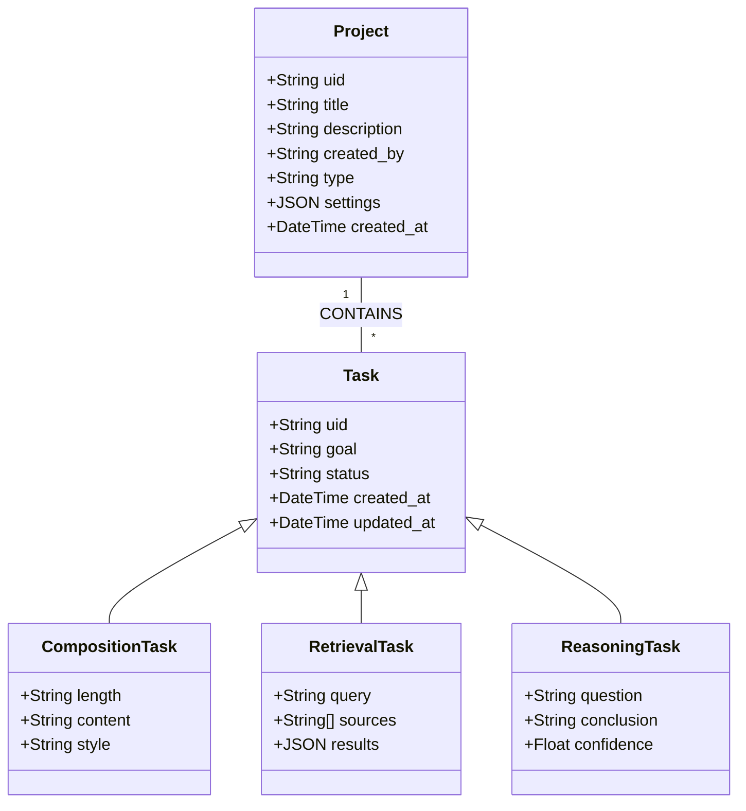
```mermaid
classDiagram
    class Project {
        +String uid
        +String title
        +String description
        +String created_by
        +String type
        +JSON settings
        +DateTime created_at
    }
    
    class Task {
        +String uid
        +String goal
        +String status
        +DateTime created_at
        +DateTime updated_at
    }
    
    class CompositionTask {
        +String length
        +String content
        +String style
    }
    
    class RetrievalTask {
        +String query
        +String[] sources
        +JSON results
    }
    
    class ReasoningTask {
        +String question
        +String conclusion
        +Float confidence
    }
    
    Task <|-- CompositionTask
    Task <|-- RetrievalTask
    Task <|-- ReasoningTask
    Project "1" -- "*" Task : CONTAINS
```

Let's explore each node type in detail:

1. **`:Task`**: The fundamental unit of work in WriteHERE
   - Common Properties:
     - `uid`: Unique identifier (replacing both `nid` and `hashkey` from the current system)
     - `goal`: Human-readable description of the task objective
     - `status`: Current execution state (e.g., "NOT_READY", "READY", "DOING", "FINISH")
     - `created_at`: Timestamp when the task was created
     - `updated_at`: Timestamp when the task was last updated

   The `:Task` label serves as a base type, with more specific task types adding additional labels and properties.

2. **`:CompositionTask`**: Tasks focused on writing content
   - Additional Properties:
     - `length`: Target content length (e.g., "500 words", "2 paragraphs")
     - `content`: The generated text content
     - `style`: Writing style guidance (e.g., "academic", "conversational")

   Composition tasks form the backbone of the writing process, producing the actual content that goes into the final article.

3. **`:RetrievalTask`**: Information gathering tasks
   - Additional Properties:
     - `query`: Search query or information request
     - `sources`: List of sources consulted
     - `results`: Retrieved information in structured format

   Retrieval tasks enable WriteHERE to incorporate external information, making the content more accurate and well-informed.

4. **`:ReasoningTask`**: Analytical tasks
   - Additional Properties:
     - `question`: The analytical question to address
     - `conclusion`: The reasoning outcome
     - `confidence`: Confidence score (0-1) for the conclusion

   Reasoning tasks represent the critical thinking component of WriteHERE, enabling it to form opinions, make judgments, and draw conclusions.

5. **`:Project`**: Top-level container for writing projects
   - Properties:
     - `title`: Project name
     - `description`: Project description
     - `created_by`: User identifier
     - `type`: "story" or "report"
     - `settings`: JSON configuration for the project

   The Project node serves as the entry point for the task graph, containing all the tasks associated with a particular writing project.

#### 2.2.2 Relationship Types

Relationships are first-class citizens in Neo4j, capturing the connections between tasks that drive the writing process:

```mermaid
graph TD
    Project[Project] -->|CONTAINS| Root[Root Task]
    Root -->|CONTAINS order:1| Task1[Introduction Task]
    Root -->|CONTAINS order:2| Task2[Research Task]
    Root -->|CONTAINS order:3| Task3[Analysis Task]
    Root -->|CONTAINS order:4| Task4[Conclusion Task]
    Task3 -->|DEPENDS_ON reason:"Needs research"| Task2
    Task4 -->|DEPENDS_ON| Task3
    Task1 -->|CONTRIBUTES_TO section:"intro"| Article[Article]
    Task3 -->|CONTRIBUTES_TO section:"body"| Article
    Task4 -->|CONTRIBUTES_TO section:"conclusion"| Article
    User[User] -->|OWNED_BY role:"author"| Project
```

Let's examine each relationship type:

1. **`:DEPENDS_ON`**: Represents task dependencies
   - Properties:
     - `reason`: Human-readable explanation of why this dependency exists
     - `strength`: Importance of the dependency (1-5)

   This relationship captures the execution order constraints between tasks, indicating that one task cannot start until another has completed.

2. **`:CONTAINS`**: Represents hierarchical decomposition
   - Properties:
     - `order`: Numerical ordering within the parent (for sequence-sensitive tasks)
     - `created_at`: When the decomposition occurred

   This relationship forms the backbone of WriteHERE's recursive planning approach, showing how complex tasks are broken down into simpler subtasks.

3. **`:CONTRIBUTES_TO`**: Connects tasks to the content they produce
   - Properties:
     - `section`: Target section in the article
     - `weight`: Importance weight for content merging
     - `approved`: Boolean indicating whether the contribution is accepted

   This relationship helps track how individual tasks contribute to the final article, enabling fine-grained content management.

4. **`:OWNED_BY`**: Connects projects to users
   - Properties:
     - `role`: User's role in the project (e.g., "author", "editor")
     - `permissions`: Access level for the user

   This relationship supports multi-user scenarios and access control, essential for collaborative writing.

#### 2.2.3 Example Task Structure

Let's bring this model to life with a concrete example of how a simple report writing task would be represented in Neo4j:

```cypher
// Create the project
CREATE (project:Project {
  uid: "proj-123",
  title: "AI Ethics Report",
  type: "report",
  created_at: datetime()
})

// Create the root task
CREATE (root:Task:CompositionTask {
  uid: "task-root",
  goal: "Write a report on AI ethics",
  status: "DOING",
  created_at: datetime()
})

// Create subtasks
CREATE (intro:Task:CompositionTask {
  uid: "task-intro",
  goal: "Write introduction on AI ethics landscape",
  status: "FINISH",
  content: "Artificial Intelligence has transformed...",
  created_at: datetime()
})

CREATE (research:Task:RetrievalTask {
  uid: "task-research",
  goal: "Research recent AI ethics guidelines",
  status: "FINISH",
  query: "recent AI ethics guidelines 2025",
  results: {sources: ["IEEE Ethics Guidelines", "EU AI Act"]},
  created_at: datetime()
})

CREATE (analysis:Task:ReasoningTask {
  uid: "task-analysis", 
  goal: "Analyze ethical implications",
  status: "READY",
  question: "What are the key ethical concerns with generative AI?",
  created_at: datetime()
})

CREATE (conclusion:Task:CompositionTask {
  uid: "task-conclusion",
  goal: "Write conclusion",
  status: "NOT_READY",
  created_at: datetime()
})

// Connect the project to the root task
CREATE (project)-[:CONTAINS]->(root)

// Connect root to its subtasks
CREATE (root)-[:CONTAINS {order: 1}]->(intro)
CREATE (root)-[:CONTAINS {order: 2}]->(research)
CREATE (root)-[:CONTAINS {order: 3}]->(analysis)
CREATE (root)-[:CONTAINS {order: 4}]->(conclusion)

// Add dependencies
CREATE (analysis)-[:DEPENDS_ON {reason: "Needs research data"}]->(research)
CREATE (conclusion)-[:DEPENDS_ON]->(analysis)
```

This graph structure captures the essential elements of the writing task:
- The hierarchical decomposition from project to root task to subtasks
- The dependencies between tasks (analysis depends on research, conclusion depends on analysis)
- The different types of tasks (composition, retrieval, reasoning)
- The current status of each task

With Neo4j, this structure is not just a static representation—it's a dynamic, queryable model that can drive the entire writing process.

### 2.3 Key Cypher Queries

With our graph model established, let's explore how Neo4j's Cypher query language enables the core operations of the WriteHERE system. These queries illustrate the power and elegance of the graph-based approach.

#### 2.3.1 Finding Ready Tasks

One of the most fundamental operations in WriteHERE is finding tasks that are ready for execution—those whose dependencies have been satisfied. In the current system, this requires complex traversal code. With Cypher, it becomes remarkably straightforward:

```cypher
MATCH (t:Task {status: "READY"})
WHERE NOT EXISTS {
  MATCH (t)-[:DEPENDS_ON]->(dep)
  WHERE dep.status <> "FINISH"
}
RETURN t
ORDER BY t.priority DESC, t.created_at ASC
LIMIT 10
```

This query:
1. Finds all tasks with status "READY"
2. Ensures none of their dependencies are unfinished
3. Orders results by priority and creation time
4. Limits to 10 tasks (for batch processing)

The `NOT EXISTS` clause is particularly powerful here, as it efficiently eliminates tasks with unfinished dependencies without requiring complex join operations or multiple queries.

#### 2.3.2 Updating Task Status

When a task completes, we need to update its status and potentially make dependent tasks ready. This cascade of updates is elegantly expressed in Cypher:

```cypher
MATCH (t:Task {uid: $taskId})
SET t.status = $newStatus,
    t.updated_at = timestamp(),
    t.result = $result
WITH t
// Find dependent tasks that might become ready
MATCH (dependent:Task)-[:DEPENDS_ON]->(t)
WHERE dependent.status = "NOT_READY"
// Check if all dependencies of dependent tasks are finished
MATCH (dependent)-[:DEPENDS_ON]->(dep)
WITH dependent, collect(dep.status) AS depStatuses
WHERE ALL(s IN depStatuses WHERE s = "FINISH")
SET dependent.status = "READY",
    dependent.updated_at = timestamp()
RETURN dependent
```

This multi-step operation:
1. Updates the specified task's status and result
2. Finds tasks that depend on it
3. Checks if all their dependencies are now satisfied
4. Updates eligible tasks to "READY" status

The entire operation happens in a single transaction, ensuring consistency and eliminating race conditions that would be challenging to handle in a file-based system.

#### 2.3.3 Aggregating Results Upward

A key aspect of WriteHERE's recursive planning approach is aggregating results from subtasks to parent tasks. When all subtasks of a parent task are complete, the parent can begin its aggregation phase:

```cypher
MATCH (parent:Task)-[:CONTAINS]->(child:Task)
WHERE parent.status = "DOING"
WITH parent, collect(child) AS children, collect(child.status) AS childStatuses
WHERE ALL(s IN childStatuses WHERE s = "FINISH")
SET parent.status = "NEED_UPDATE",
    parent.updated_at = timestamp()
RETURN parent, children
```

This query:
1. Finds parent tasks that are actively executing
2. Collects all their child tasks
3. Checks if all children are finished
4. Updates eligible parents to "NEED_UPDATE" status, indicating they should aggregate their children's results

The `collect()` and `ALL()` functions are particularly useful here, enabling elegant set-based operations that would require multiple loops in procedural code.

#### 2.3.4 Retrieving Task Hierarchy for Visualization

The WriteHERE UI visualizes the task hierarchy to provide insight into the writing process. Neo4j's path-based queries make this straightforward:

```cypher
MATCH path = (root:Task {uid: $rootTaskId})-[:CONTAINS*]->(sub:Task)
RETURN path
```

This single query retrieves the entire task decomposition hierarchy, which can then be transformed into a visualization-friendly format. The `path` variable captures not just the nodes but the relationships between them, providing all the information needed for a rich visualization.

For larger projects, we can limit the depth of the traversal to avoid overwhelming responses:

```cypher
MATCH path = (root:Task {uid: $rootTaskId})-[:CONTAINS*1..3]->(sub:Task)
RETURN path
```

This retrieves only the first three levels of the hierarchy, with deeper levels loaded on demand as the user expands the visualization.

#### 2.3.5 Getting Full Project State

To provide an overview of an entire project, we need to retrieve the project, its root task, and all tasks in the hierarchy:

```cypher
MATCH (p:Project {uid: $projectId})
OPTIONAL MATCH (p)-[:CONTAINS]->(root:Task)
OPTIONAL MATCH (root)-[:CONTAINS*]->(t:Task)
WITH p, root, collect(t) as tasks
RETURN p, root, tasks
```

This query:
1. Finds the specified project
2. Retrieves its root task (if any)
3. Collects all tasks in the hierarchy
4. Returns the complete project state

The `OPTIONAL MATCH` ensures the query works even for projects that don't yet have tasks or have only a root task.

These queries demonstrate how Neo4j's graph model and Cypher query language align naturally with WriteHERE's task graph structure, enabling complex operations to be expressed clearly and executed efficiently.

## 3. Event-Driven Architecture

While Neo4j provides an ideal persistence layer for WriteHERE's task graph, we need a complementary approach for communication between components. This is where event-driven architecture enters the picture—transforming WriteHERE from a monolithic system to a constellation of loosely coupled, specialized components that communicate through events.

### 3.1 Why Event-Driven?

Event-driven architecture is a design pattern where components communicate by producing and consuming events—notifications that something significant has happened. This approach offers several compelling advantages for WriteHERE:

#### 3.1.1 Loose Coupling: Freedom to Evolve

In the current monolithic architecture, components interact through direct method calls:

```python
# Direct method call coupling
class GraphRunEngine:
    def forward_one_step_not_parallel(self):
        node = self.find_need_next_step_nodes()[0]
        result = node.execute()  # Direct call to node's execute method
        self.memory.update_infos([node])  # Direct call to memory
        self.save("./output")  # Direct call to persistence
```

This tight coupling makes it difficult to modify or replace individual components without affecting the entire system. In an event-driven approach, components interact through standardized events:

```python
# Event-driven decoupling
class TaskExecutor:
    def execute_task(self, task_id):
        # Get task from database
        task = graph_db.get_task(task_id)
        
        # Execute task
        result = task_executor.execute(task)
        
        # Publish event (don't call other components directly)
        event_bus.publish("TaskExecutionCompleted", {
            "task_id": task_id,
            "result": result
        })
        
# Other components subscribe to events they care about
class ContentAggregator:
    def __init__(self, event_bus):
        event_bus.subscribe("TaskExecutionCompleted", self.handle_task_completion)
    
    def handle_task_completion(self, event):
        # React to task completion
```

This decoupling enables:
- **Independent Development**: Teams can work on different components without coordination
- **Flexible Replacement**: Components can be swapped out without affecting others
- **Technology Diversity**: Different components can use different technologies best suited to their needs
- **Incremental Deployment**: The system can evolve component by component

#### 3.1.2 Scalability: Growing Without Boundaries

Event-driven architectures excel at scalability because:

- **Horizontal Scaling**: Each component can scale independently based on its specific workload
- **Asynchronous Processing**: Components can process events at their own pace
- **Load Leveling**: Event queues absorb traffic spikes, preventing overload
- **Resource Optimization**: Components can scale down when idle

For WriteHERE, this means the system can handle more concurrent writing projects, larger documents, and more users without hitting the performance ceiling of the current monolithic approach.

#### 3.1.3 Reactivity: Real-time Without Polling

Remember the polling-based update mechanism in the current WriteHERE implementation? Event-driven architecture replaces this with a push-based approach:

```javascript
// Instead of polling:
setInterval(() => {
  fetch('/api/task/' + taskId + '/status')
    .then(response => response.json())
    .then(data => updateUI(data));
}, 1000);

// With events:
socket.on('TaskStatusChanged', event => {
  if (event.payload.task_id === currentTaskId) {
    updateUI(event.payload);
  }
});
```

This provides true real-time updates without the overhead and latency of polling, creating a more responsive and efficient system.

#### 3.1.4 Resilience: Bouncing Back from Failure

In the current architecture, a failure in any part of the `GraphRunEngine` can bring down the entire writing process. With event-driven architecture:

- **Fault Isolation**: A failing component doesn't affect others
- **Graceful Degradation**: The system can continue functioning even if some components are down
- **Recovery Mechanisms**: Failed event processing can be retried
- **Observability**: The event stream provides a clear record of what happened

This resilience is crucial for a system that orchestrates complex, long-running writing tasks that may take hours to complete.

#### 3.1.5 Extensibility: Growing New Capabilities

Perhaps the most exciting aspect of event-driven architecture is how it enables extensibility:

- **New Components**: Additional capabilities can be added by creating new components that subscribe to existing events
- **Feature Toggles**: Features can be enabled/disabled by connecting/disconnecting components
- **Third-party Integration**: External systems can produce or consume events
- **Analytics and Monitoring**: Components can subscribe to events for analytics without affecting the core system

For WriteHERE, this opens the door to extensions like collaborative editing, content approval workflows, and integration with content management systems—all without modifying the core writing engine.

### 3.2 Event Types and Structure

In our proposed architecture, events are the primary means of communication between components. We'll define a standardized event structure and a comprehensive set of event types to capture all significant occurrences in the system.

#### 3.2.1 Standard Event Structure

All events will follow a common structure to ensure consistency and facilitate processing:

```json
{
  "event_id": "uuid",
  "event_type": "string",
  "timestamp": "ISO-8601 timestamp",
  "source": "component identifier",
  "payload": {
    // Event-specific data
  }
}
```

This structure:
- Uniquely identifies each event
- Categorizes events by type
- Records when the event occurred
- Identifies which component produced the event
- Contains event-specific data in a standardized payload

The standardized structure makes it easier to route, filter, store, and process events throughout the system.

#### 3.2.2 Event Taxonomy

We can organize WriteHERE's events into several categories, each serving a specific purpose in the system:


```mermaid
graph TD
    Events[All Events] --> TaskEvents[Task Lifecycle Events]
    Events --> ExecutionEvents[Execution Events]
    Events --> ContentEvents[Content Events]
    Events --> SystemEvents[System Events]
    
    TaskEvents --> TaskCreated[TaskCreated]
    TaskEvents --> TaskStatusChanged[TaskStatusChanged]
    TaskEvents --> TaskResultUpdated[TaskResultUpdated]
    TaskEvents --> TaskDecomposed[TaskDecomposed]
    
    ExecutionEvents --> TaskScheduled[TaskScheduled]
    ExecutionEvents --> TaskExecutionStarted[TaskExecutionStarted]
    ExecutionEvents --> TaskExecutionCompleted[TaskExecutionCompleted]
    ExecutionEvents --> TaskExecutionFailed[TaskExecutionFailed]
    
    ContentEvents --> ContentGenerated[ContentGenerated]
    ContentEvents --> ArticleUpdated[ArticleUpdated]
    ContentEvents --> RetrievalPerformed[RetrievalPerformed]
    
    SystemEvents --> ProjectCreated[ProjectCreated]
    SystemEvents --> ProjectStatusChanged[ProjectStatusChanged]
    SystemEvents --> UserConnected[UserConnected]
```

Let's examine each category and the specific events it contains:

#### 3.2.3 Task Lifecycle Events

These events represent changes to the task graph structure and task states:

##### 1. **`TaskCreated`**

Emitted when a new task is created in the system:

```json
{
  "event_type": "TaskCreated",
  "payload": {
    "task_id": "task-123",
    "parent_id": "task-root",
    "project_id": "project-456",
    "task_type": "COMPOSITION",
    "goal": "Write an introduction to quantum computing",
    "properties": {
      "length": "500 words",
      "style": "educational"
    }
  }
}
```

This event enables components to track new tasks and update their internal state accordingly. For example, the UI component would use this to add a new node to the task visualization.

##### 2. **`TaskStatusChanged`**

Emitted when a task's status changes (e.g., from "READY" to "DOING"):

```json
{
  "event_type": "TaskStatusChanged",
  "payload": {
    "task_id": "task-123",
    "previous_status": "READY",
    "new_status": "DOING",
    "reason": "Execution started by scheduler"
  }
}
```

This event is crucial for tracking the progress of tasks through their lifecycle. It triggers status updates in the UI, may cause dependent tasks to become ready, and helps components track the overall progress of the writing process.

##### 3. **`TaskResultUpdated`**

Emitted when a task's result is updated:

```json
{
  "event_type": "TaskResultUpdated",
  "payload": {
    "task_id": "task-123",
    "result": {
      "content": "Quantum computing represents a paradigm shift...",
      "metadata": {
        "word_count": 487,
        "completion_percentage": 97
      }
    },
    "is_final": true
  }
}
```

This event carries the actual output of tasks, which is essential for both visualizing task results and for aggregating content into the final document.

##### 4. **`TaskDecomposed`**

Emitted when a task is decomposed into subtasks:

```json
{
  "event_type": "TaskDecomposed",
  "payload": {
    "parent_task_id": "task-root",
    "subtask_ids": ["task-intro", "task-body", "task-conclusion"],
    "dependencies": [
      {"from": "task-body", "to": "task-intro", "reason": "Needs context from introduction"}
    ]
  }
}
```

This event captures WriteHERE's recursive planning process, showing how complex tasks are broken down into manageable subtasks with their own dependencies.

#### 3.2.4 Execution Events

While task lifecycle events track the state of tasks, execution events focus on the process of actually executing those tasks:

##### 1. **`TaskScheduled`**

Emitted when a task is selected for execution:

```json
{
  "event_type": "TaskScheduled",
  "payload": {
    "task_id": "task-123",
    "execution_id": "exec-789",
    "agent_type": "CompositionAgent",
    "priority": 5
  }
}
```

This event represents the handoff from the scheduling component to the execution component. The `execution_id` provides a unique identifier for this specific execution attempt, which is useful for tracking retries and correlating logs.

##### 2. **`TaskExecutionStarted`**

Emitted when a task execution begins:

```json
{
  "event_type": "TaskExecutionStarted",
  "payload": {
    "task_id": "task-123",
    "execution_id": "exec-789",
    "agent_id": "agent-1",
    "started_at": "2025-04-07T10:15:30Z"
  }
}
```

This event provides visibility into which agent is handling the task and when execution began, which is valuable for monitoring and performance analysis.

##### 3. **`TaskExecutionCompleted`**

Emitted when a task execution successfully completes:

```json
{
  "event_type": "TaskExecutionCompleted",
  "payload": {
    "task_id": "task-123",
    "execution_id": "exec-789",
    "success": true,
    "result": {
      "content": "Quantum computing represents a paradigm shift...",
      "metadata": {
        "word_count": 487,
        "source_count": 3
      }
    },
    "duration_ms": 12345
  }
}
```

This event carries the result of the task execution and performance metrics. It's distinct from `TaskResultUpdated` in that it focuses on the execution process rather than the task state.

##### 4. **`TaskExecutionFailed`**

Emitted when a task execution fails:

```json
{
  "event_type": "TaskExecutionFailed",
  "payload": {
    "task_id": "task-123",
    "execution_id": "exec-789",
    "error": "LLM API rate limit exceeded",
    "stack_trace": "...",
    "retry_count": 2
  }
}
```

This event provides detailed error information and retry state, enabling resilient error handling and troubleshooting. The retry mechanism is particularly important for handling transient failures in external services like LLM APIs.

#### 3.2.5 Content Events

Content events focus on the actual text being generated, which is the ultimate output of the WriteHERE system:

##### 1. **`ContentGenerated`**

Emitted when a task generates new content:

```json
{
  "event_type": "ContentGenerated",
  "payload": {
    "task_id": "task-123",
    "content": "Quantum computing represents a paradigm shift...",
    "section": "introduction",
    "replace_existing": false
  }
}
```

This event carries raw content generated by tasks, which will be processed and integrated into the article by the content aggregator.

##### 2. **`ArticleUpdated`**

Emitted when the article text is updated:

```json
{
  "event_type": "ArticleUpdated",
  "payload": {
    "project_id": "project-456",
    "version": 42,
    "content": "# Quantum Computing\n\nQuantum computing represents a paradigm shift...",
    "contributors": ["task-123", "task-456"],
    "delta": {
      "operation": "insert",
      "position": 256,
      "text": " with significant implications for cryptography"
    }
  }
}
```

This event represents changes to the final article text. The inclusion of both full content and delta information allows for efficient updates in the UI and proper versioning of the document.

##### 3. **`RetrievalPerformed`**

Emitted when a retrieval task completes a search operation:

```json
{
  "event_type": "RetrievalPerformed",
  "payload": {
    "task_id": "task-789",
    "query": "recent quantum computing breakthroughs",
    "sources": [
      {"title": "Nature: Quantum Supremacy Achieved", "url": "https://nature.com/article123"},
      {"title": "Quantum Error Correction Advances", "url": "https://science.org/article456"}
    ],
    "results": [
      {"summary": "Google's Sycamore processor performed a calculation in 200 seconds that would take a supercomputer 10,000 years."},
      {"summary": "New error correction techniques have reduced qubit decoherence by 50%."}
    ]
  }
}
```

This event captures the results of information retrieval operations, which are crucial for writing well-informed content. By making this a separate event type, the system can process and analyze retrieval results independently of the task execution flow.

#### 3.2.6 System Events

System events relate to the overall state of the WriteHERE system and user interactions:

##### 1. **`ProjectCreated`**

Emitted when a new writing project is created:

```json
{
  "event_type": "ProjectCreated",
  "payload": {
    "project_id": "project-456",
    "title": "Understanding Quantum Computing",
    "type": "report",
    "created_by": "user-123",
    "settings": {
      "model": "gpt-4o",
      "enable_search": true,
      "max_tokens": 8000
    }
  }
}
```

This event initiates the writing process, triggering the creation of the root task and the beginning of the planning phase.

##### 2. **`ProjectStatusChanged`**

Emitted when a project's overall status changes:

```json
{
  "event_type": "ProjectStatusChanged",
  "payload": {
    "project_id": "project-456",
    "previous_status": "in_progress",
    "new_status": "completed"
  }
}
```

This event tracks the overall project lifecycle, which is useful for tracking progress and notifying users when their content is ready.

##### 3. **`UserConnected`**

Emitted when a user connects to the system:

```json
{
  "event_type": "UserConnected",
  "payload": {
    "user_id": "user-123",
    "session_id": "session-789",
    "connection_time": "2025-04-07T10:15:30Z",
    "subscribed_projects": ["project-456"]
  }
}
```

This event is important for managing real-time connections and directing events to the appropriate client sessions. It enables the system to track which users are actively monitoring which projects.

### 3.3 Component Architecture and Event Flow

With our event taxonomy established, let's explore how these events flow through the system, connecting specialized components into a cohesive whole. The following diagram illustrates the component architecture and event flows:

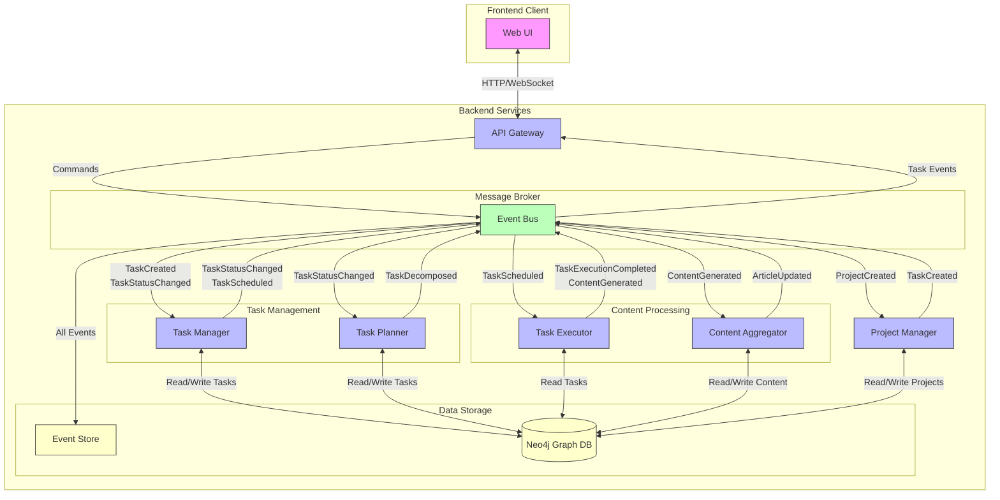
```mermaid
graph TD
    subgraph "Frontend Client"
        Client[Web UI]
    end
    
    subgraph "Backend Services"
        APIGateway[API Gateway]
        
        subgraph "Task Management"
            TaskManager[Task Manager]
            TaskPlanner[Task Planner]
        end
        
        subgraph "Content Processing"
            TaskExecutor[Task Executor]
            ContentAggregator[Content Aggregator]
        end
        
        ProjectManager[Project Manager]
        
        subgraph "Data Storage"
            EventStore[Event Store]
            Neo4j[(Neo4j Graph DB)]
        end
        
        subgraph "Message Broker"
            EventBus[Event Bus]
        end
    end
    
    Client <-->|HTTP/WebSocket| APIGateway
    
    APIGateway -->|Commands| EventBus
    EventBus -->|Task Events| APIGateway
    
    EventBus -->|ProjectCreated| ProjectManager
    ProjectManager -->|TaskCreated| EventBus
    
    EventBus -->|TaskCreated<br>TaskStatusChanged| TaskManager
    TaskManager -->|TaskStatusChanged<br>TaskScheduled| EventBus
    
    EventBus -->|TaskStatusChanged| TaskPlanner
    TaskPlanner -->|TaskDecomposed| EventBus
    
    EventBus -->|TaskScheduled| TaskExecutor
    TaskExecutor -->|TaskExecutionCompleted<br>ContentGenerated| EventBus
    
    EventBus -->|ContentGenerated| ContentAggregator
    ContentAggregator -->|ArticleUpdated| EventBus
    
    TaskManager <-->|Read/Write Tasks| Neo4j
    TaskPlanner <-->|Read/Write Tasks| Neo4j
    TaskExecutor <-->|Read Tasks| Neo4j
    ContentAggregator <-->|Read/Write Content| Neo4j
    ProjectManager <-->|Read/Write Projects| Neo4j
    
    EventBus -->|All Events| EventStore
    
    classDef frontend fill:#f9f,stroke:#333;
    classDef service fill:#bbf,stroke:#333;
    classDef storage fill:#ffc,stroke:#333;
    classDef message fill:#bfb,stroke:#333;
    
    class Client frontend;
    class APIGateway,TaskManager,TaskPlanner,TaskExecutor,ContentAggregator,ProjectManager service;
    class Neo4j,EventStore storage;
    class EventBus message;
```

Let's explore each component's role and the event flows between them:

#### 3.3.1 TaskManager

The TaskManager serves as the central coordinator for task state and dependencies:

**Responsibilities**:
- Creating new tasks
- Updating task status
- Managing task dependencies
- Scheduling tasks for execution

**Consumes events**:
- `ProjectCreated`: Triggers creation of the root task
- `TaskStatusChanged`: Updates internal state tracking
- `TaskExecutionCompleted`: Updates task status based on execution results
- `TaskExecutionFailed`: Handles retries or failure state transitions

**Produces events**:
- `TaskCreated`: When new tasks are added to the system
- `TaskStatusChanged`: When task status transitions occur
- `TaskScheduled`: When a task is ready for execution

The TaskManager works closely with Neo4j to read and write task data. It applies business rules for task state transitions and dependency resolution, ensuring that tasks proceed through their lifecycle correctly.

#### 3.3.2 TaskPlanner

The TaskPlanner is responsible for implementing WriteHERE's recursive planning approach:

**Responsibilities**:
- Decomposing tasks into subtasks
- Establishing dependencies between tasks
- Applying planning strategies based on task type

**Consumes events**:
- `TaskStatusChanged`: Triggers planning when a task enters the "READY" state and needs planning
- `TaskExecutionCompleted`: Processes the results of planning tasks

**Produces events**:
- `TaskDecomposed`: When a task is broken down into subtasks
- `TaskStatusChanged`: When planning completes and task status changes

The TaskPlanner embodies the core recursive planning logic of WriteHERE. When a task needs planning, it uses LLM services to decompose the task into subtasks, establish dependencies, and set up the next level of the task hierarchy.

#### 3.3.3 TaskExecutor

The TaskExecutor handles the actual execution of tasks, interfacing with LLM services and other external systems:

**Responsibilities**:
- Executing individual tasks
- Integrating with LLM services
- Managing execution resources
- Handling retries on failure

**Consumes events**:
- `TaskScheduled`: Triggers execution of a specific task

**Produces events**:
- `TaskExecutionStarted`: When execution begins
- `TaskExecutionCompleted`: When execution successfully completes
- `TaskExecutionFailed`: When execution encounters an error
- `TaskResultUpdated`: When a task produces a result
- `ContentGenerated`: When a composition task produces content
- `RetrievalPerformed`: When a retrieval task completes a search

The TaskExecutor implements different execution strategies based on task type. For composition tasks, it generates text; for retrieval tasks, it performs searches; for reasoning tasks, it analyzes information and draws conclusions.

#### 3.3.4 ContentAggregator

The ContentAggregator combines content from individual tasks into the final article:

**Responsibilities**:
- Combining content from multiple tasks
- Maintaining article structure
- Applying formatting and styling
- Managing content versions

**Consumes events**:
- `ContentGenerated`: Processes new content from tasks
- `TaskStatusChanged`: Triggers aggregation for tasks that need to combine their subtasks' results

**Produces events**:
- `ArticleUpdated`: When the article content changes

The ContentAggregator ensures that content from different tasks flows together coherently, managing section ordering, transitions, and overall document structure.

#### 3.3.5 APIGateway

The APIGateway serves as the interface between clients and the backend services:

**Responsibilities**:
- Handling HTTP and WebSocket connections
- Authenticating requests
- Routing commands to appropriate services
- Publishing events to clients

**Consumes events**:
- All event types (filtered by client subscriptions)

**Produces events**:
- `UserConnected`: When a client establishes a connection
- Various command events based on API calls

The APIGateway maintains client connections and routes events to the appropriate clients based on their subscriptions. It also translates client requests into command events that flow through the system.

#### 3.3.6 ProjectManager

The ProjectManager handles project-level operations:

**Responsibilities**:
- Creating and configuring new projects
- Tracking project status
- Managing project metadata

**Consumes events**:
- `TaskStatusChanged`: Monitors root task status to update project status
- `ArticleUpdated`: Tracks content progress

**Produces events**:
- `ProjectCreated`: When a new project is initiated
- `ProjectStatusChanged`: When project status changes

The ProjectManager maintains the overall state of writing projects, coordinating between user-level operations and the task-oriented core of the system.

### 3.4 Event Flow Examples

To bring this architecture to life, let's walk through some concrete examples of how events flow through the system during key operations:

#### 3.4.1 Starting a New Project

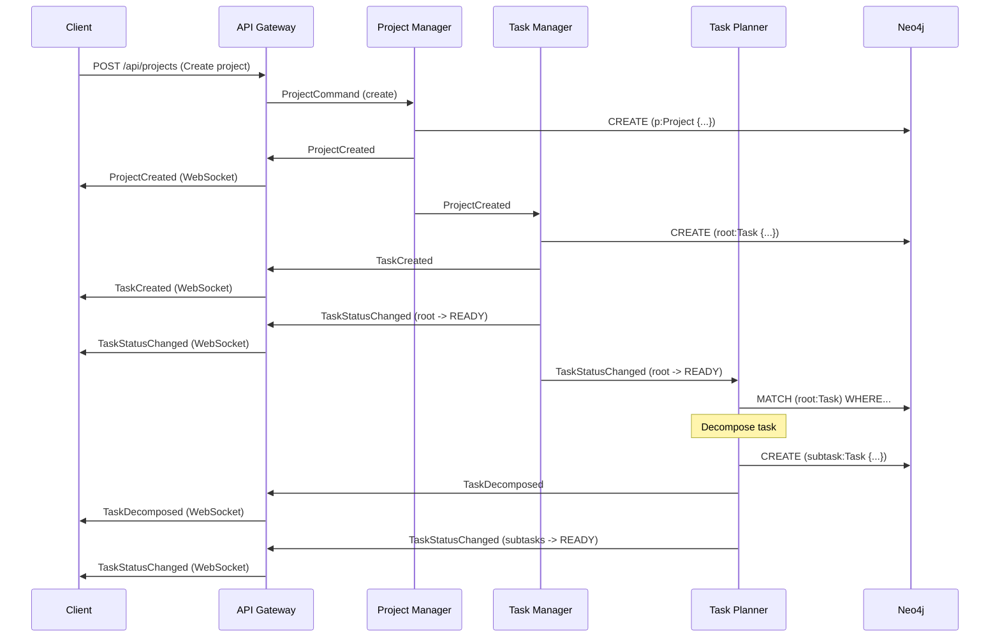
```mermaid
sequenceDiagram
    participant Client
    participant API as API Gateway
    participant PM as Project Manager
    participant TM as Task Manager
    participant TP as Task Planner
    participant Neo4j
    
    Client->>API: POST /api/projects (Create project)
    API->>PM: ProjectCommand (create)
    PM->>Neo4j: CREATE (p:Project {...})
    PM->>API: ProjectCreated
    API->>Client: ProjectCreated (WebSocket)
    
    PM->>TM: ProjectCreated
    TM->>Neo4j: CREATE (root:Task {...})
    TM->>API: TaskCreated
    API->>Client: TaskCreated (WebSocket)
    
    TM->>API: TaskStatusChanged (root -> READY)
    API->>Client: TaskStatusChanged (WebSocket)
    
    TM->>TP: TaskStatusChanged (root -> READY)
    TP->>Neo4j: MATCH (root:Task) WHERE...
    Note over TP: Decompose task
    TP->>Neo4j: CREATE (subtask:Task {...})
    TP->>API: TaskDecomposed
    API->>Client: TaskDecomposed (WebSocket)
    
    TP->>API: TaskStatusChanged (subtasks -> READY)
    API->>Client: TaskStatusChanged (WebSocket)
```

This sequence shows how creating a project triggers a cascade of events that set up the initial task structure and begin the planning process.

#### 3.4.2 Executing a Task

When a task is ready for execution, events flow through the system like this:

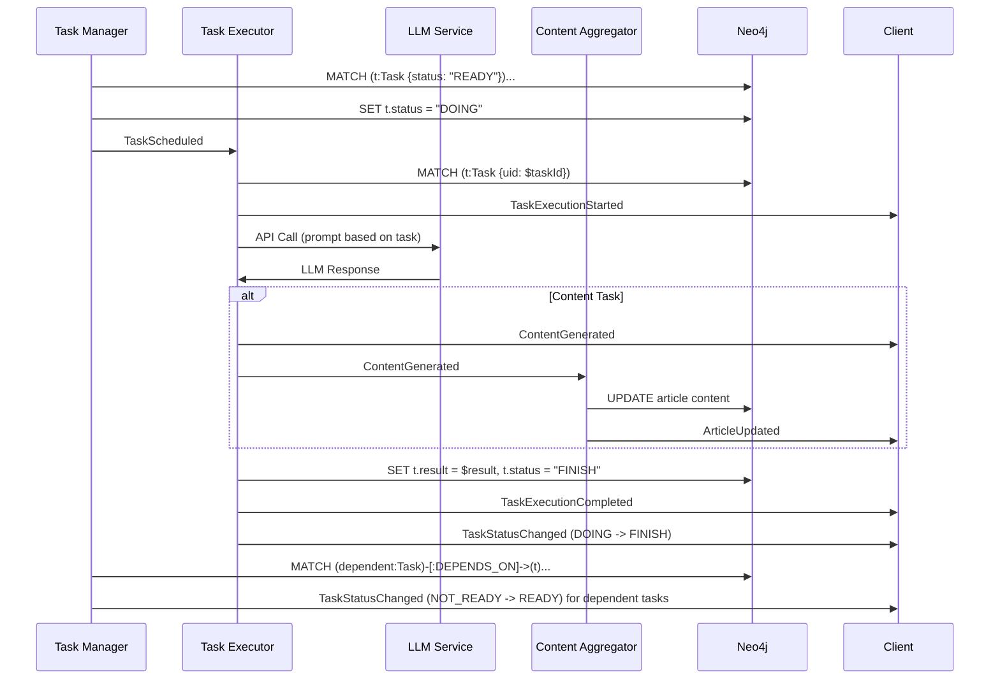
```mermaid
sequenceDiagram
    participant TM as Task Manager
    participant TE as Task Executor
    participant LLM as LLM Service
    participant CA as Content Aggregator
    participant Neo4j
    participant Client
    
    TM->>Neo4j: MATCH (t:Task {status: "READY"})...
    TM->>Neo4j: SET t.status = "DOING"
    TM->>TE: TaskScheduled
    
    TE->>Neo4j: MATCH (t:Task {uid: $taskId})
    TE->>Client: TaskExecutionStarted
    
    TE->>LLM: API Call (prompt based on task)
    LLM->>TE: LLM Response
    
    alt Content Task
        TE->>Client: ContentGenerated
        TE->>CA: ContentGenerated
        CA->>Neo4j: UPDATE article content
        CA->>Client: ArticleUpdated
    end
    
    TE->>Neo4j: SET t.result = $result, t.status = "FINISH"
    TE->>Client: TaskExecutionCompleted
    TE->>Client: TaskStatusChanged (DOING -> FINISH)
    
    TM->>Neo4j: MATCH (dependent:Task)-[:DEPENDS_ON]->(t)...
    TM->>Client: TaskStatusChanged (NOT_READY -> READY) for dependent tasks
```

This sequence shows how a task flows through execution, with events keeping all components and the client UI in sync throughout the process.

#### 3.4.3 Handling Task Failures

Resilience is a key benefit of event-driven architecture. Here's how the system handles task failures:

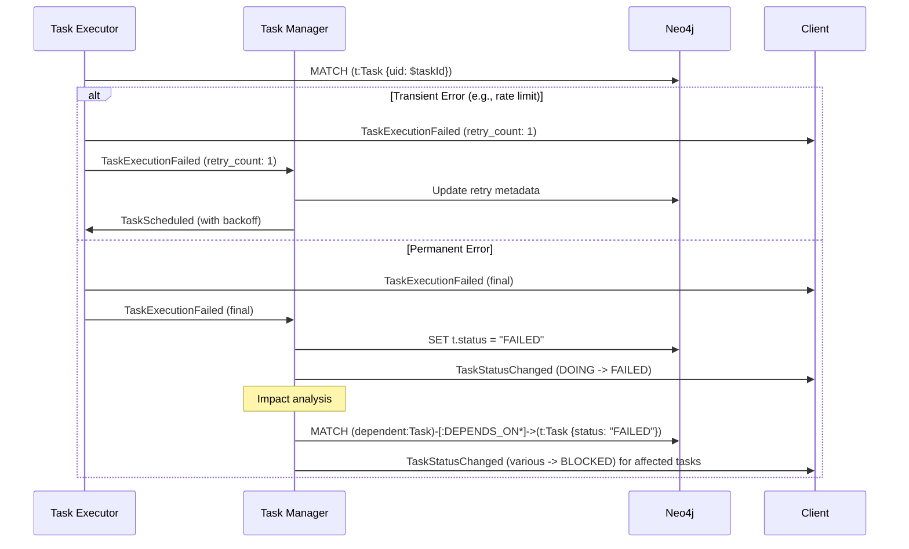
```mermaid
sequenceDiagram
    participant TE as Task Executor
    participant TM as Task Manager
    participant Neo4j
    participant Client
    
    TE->>Neo4j: MATCH (t:Task {uid: $taskId})
    
    alt Transient Error (e.g., rate limit)
        TE->>Client: TaskExecutionFailed (retry_count: 1)
        TE->>TM: TaskExecutionFailed (retry_count: 1)
        TM->>Neo4j: Update retry metadata
        TM->>TE: TaskScheduled (with backoff)
    else Permanent Error
        TE->>Client: TaskExecutionFailed (final)
        TE->>TM: TaskExecutionFailed (final)
        TM->>Neo4j: SET t.status = "FAILED"
        TM->>Client: TaskStatusChanged (DOING -> FAILED)
        
        Note over TM: Impact analysis
        TM->>Neo4j: MATCH (dependent:Task)-[:DEPENDS_ON*]->(t:Task {status: "FAILED"})
        TM->>Client: TaskStatusChanged (various -> BLOCKED) for affected tasks
    end
```

This sequence shows how the system distinguishes between temporary failures that can be retried and permanent failures that require user intervention, with appropriate events and status changes in each case.

## 4. Task Scheduling with Neo4j

One of the most significant improvements in our proposed architecture is how it handles task scheduling—finding and executing tasks in the optimal order. Let's explore how Neo4j's graph capabilities enable sophisticated scheduling algorithms that would be difficult to implement in the current file-based system.

### 4.1 Finding Ready Tasks

The core of the scheduling algorithm is finding tasks that are ready for execution. A task is considered ready when:
- Its status is explicitly set to "READY"
- All its dependencies have completed successfully
- Its parent task is not in a failed state

Let's visualize a simple task graph to illustrate the scheduling challenge:

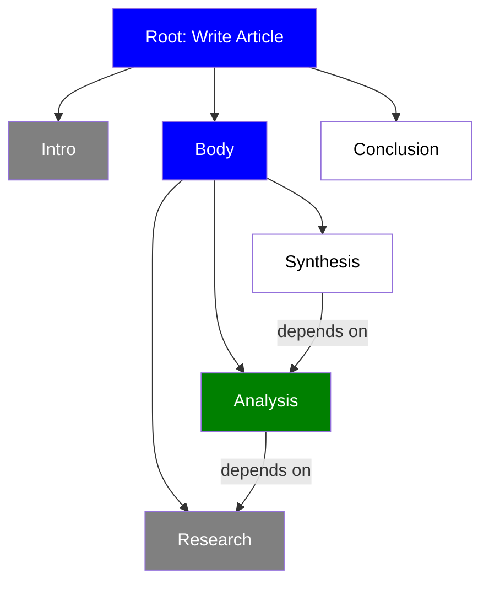
```mermaid
graph TD
    A[Root: Write Article] --> B[Intro]
    A --> C[Body]
    A --> D[Conclusion]
    C --> E[Research]
    C --> F[Analysis]
    C --> G[Synthesis]
    F -->|depends on| E
    G -->|depends on| F
    
    classDef ready fill:green,color:white;
    classDef doing fill:blue,color:white;
    classDef finished fill:gray,color:white;
    classDef notReady fill:white,color:black;
    
    class A,C doing;
    class B,E finished;
    class F ready;
    class D,G notReady;
```

In this diagram, task F (Analysis) is ready for execution because its dependency E (Research) is finished. Task G (Synthesis) is not ready because it depends on F, which isn't finished yet. Task D (Conclusion) is not ready because it's waiting for its parent task C (Body) to complete.

Finding these ready tasks efficiently is where Neo4j shines. In the current system, finding ready tasks requires loading the entire graph into memory and traversing it:

```python
# Current approach (simplified)
def find_ready_tasks(graph):
    ready_tasks = []
    for node in graph.node_list:
        if node.status == TaskStatus.READY:
            # Check all dependencies
            ready = True
            for dep_id in node.task_info.get("dependency", []):
                dep_node = find_node_by_id(graph, dep_id)
                if dep_node.status != TaskStatus.FINISH:
                    ready = False
                    break
            if ready:
                ready_tasks.append(node)
    return ready_tasks
```

With Neo4j, this becomes a single, declarative query:

```cypher
MATCH (t:Task {status: "READY"})
WHERE NOT EXISTS {
  MATCH (t)-[:DEPENDS_ON]->(dep)
  WHERE dep.status <> "FINISH"
}
RETURN t
ORDER BY t.priority DESC, t.created_at ASC
LIMIT 10
```

This query:
1. Finds all tasks with status "READY"
2. Ensures none of their dependencies are unfinished
3. Orders results by priority and creation time
4. Limits to 10 tasks (for batch processing)

The power of this approach becomes evident when we consider:
- **Performance**: Neo4j's query optimizer can use indexes and graph-specific optimizations
- **Concurrency**: Multiple schedulers can run this query concurrently without conflicts
- **Transactionality**: Task status changes are atomic, preventing race conditions

### 4.2 Parallel Execution Strategy

For maximum throughput, we want to identify tasks that can be executed in parallel. These are tasks that:
- Are all ready for execution
- Have no dependencies between them
- Are ideally of similar types for efficient agent assignment

Neo4j enables sophisticated parallelization strategies with queries like:

```cypher
// Find groups of tasks that can execute in parallel
MATCH (t:Task {status: "READY"})
WHERE NOT EXISTS {
  MATCH (t)-[:DEPENDS_ON]->(dep)
  WHERE dep.status <> "FINISH"
}
WITH t
// Determine dependencies between ready tasks
OPTIONAL MATCH path = (t)-[:DEPENDS_ON*]->(other:Task {status: "READY"})
WITH t, count(path) as dependencies
// Group by task type for agent assignment
RETURN t.task_type as taskType, collect(t) as tasks, min(dependencies) as minDependencies
ORDER BY minDependencies, taskType
```

This query:
1. Finds all ready tasks
2. Checks for dependencies between ready tasks
3. Groups tasks by type and dependency count
4. Orders groups by minimum dependencies (preferring independent groups)

The result is a batching strategy that maximizes parallelism while respecting dependencies and optimizing resource utilization.

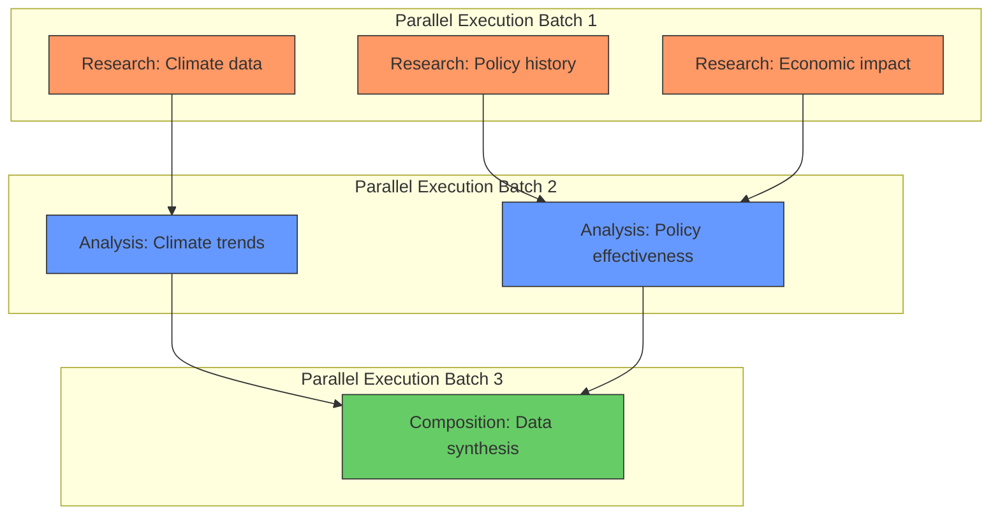
```mermaid
graph TD
    subgraph "Parallel Execution Batch 1"
        A[Research: Climate data]
        B[Research: Policy history]
        C[Research: Economic impact]
    end
    
    subgraph "Parallel Execution Batch 2"
        D[Analysis: Climate trends]
        E[Analysis: Policy effectiveness]
    end
    
    subgraph "Parallel Execution Batch 3"
        F[Composition: Data synthesis]
    end
    
    A --> D
    B --> E
    C --> E
    D --> F
    E --> F
    
    classDef research fill:#f96,stroke:#333;
    classDef analysis fill:#69f,stroke:#333;
    classDef composition fill:#6c6,stroke:#333;
    
    class A,B,C research;
    class D,E analysis;
    class F composition;
```

This diagram shows how tasks can be batched for parallel execution, with each batch containing tasks of similar types that don't depend on each other.

### 4.3 Critical Path Prioritization

Not all tasks contribute equally to the overall completion time of a writing project. The critical path consists of tasks that, if delayed, would delay the entire project. Identifying and prioritizing these tasks can significantly reduce overall completion time.

In traditional project management software, critical path analysis is a complex calculation. With Neo4j's graph algorithms, it becomes straightforward:

```cypher
// Using Neo4j Graph Data Science
CALL gds.shortestPath.dijkstra.stream('task-graph', {
  sourceNode: $rootTaskId,
  targetNode: $targetTaskId,
  relationshipWeightProperty: 'weight'
})
YIELD nodeId
MATCH (t:Task) WHERE id(t) = nodeId
RETURN t
```

This query uses Dijkstra's algorithm to find the shortest (or in this case, critical) path between the root task and target task (often a leaf node representing the final output). Tasks on this path can be assigned higher priority in the scheduling queue.

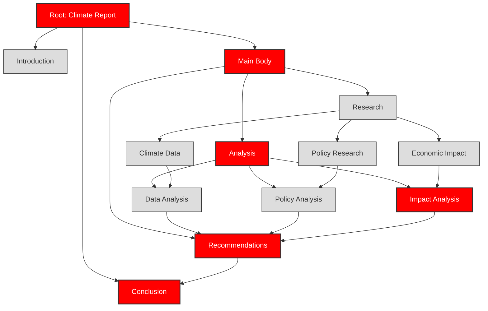
```mermaid
graph TD
    A[Root: Climate Report] --> B[Introduction]
    A --> C[Main Body]
    A --> D[Conclusion]
    
    C --> E[Research]
    C --> F[Analysis]
    C --> G[Recommendations]
    
    E --> E1[Climate Data]
    E --> E2[Policy Research]
    E --> E3[Economic Impact]
    
    F --> F1[Data Analysis]
    F --> F2[Policy Analysis]
    F --> F3[Impact Analysis]
    
    E1 --> F1
    E2 --> F2
    E3 --> F3
    
    F1 --> G
    F2 --> G
    F3 --> G
    
    G --> D
    
    classDef critical fill:red,color:white,stroke:#333,stroke-width:2px;
    classDef normal fill:#ddd,stroke:#333;
    
    class A,C,F,F3,G,D critical;
    class B,E,E1,E2,E3,F1,F2 normal;
```

This diagram highlights the critical path through the task graph. By prioritizing tasks on this path, we can minimize the overall completion time of the project.

### 4.4 State Propagation

When a task changes state, the effects ripple through the graph, potentially making dependent tasks ready or marking them as blocked. Efficiently propagating these state changes is essential for maintaining the correct execution order.

Neo4j's transactional queries enable complex state propagation in a single operation:

#### 4.4.1 Validating State Transitions

Before changing a task's state, we need to ensure the transition is valid according to WriteHERE's state machine:

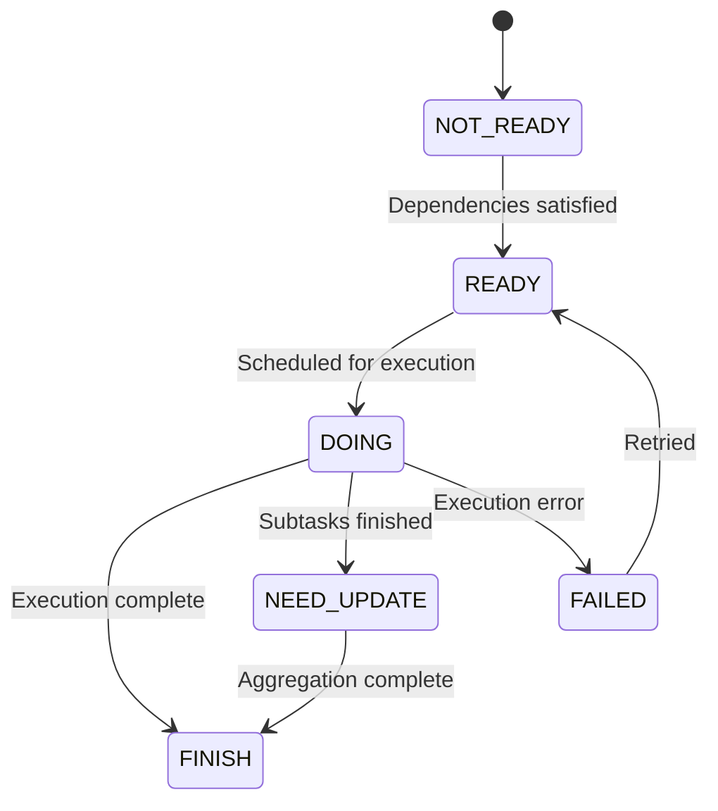
```mermaid
stateDiagram-v2
    [*] --> NOT_READY
    NOT_READY --> READY: Dependencies satisfied
    READY --> DOING: Scheduled for execution
    DOING --> FINISH: Execution complete
    DOING --> NEED_UPDATE: Subtasks finished
    NEED_UPDATE --> FINISH: Aggregation complete
    DOING --> FAILED: Execution error
    FAILED --> READY: Retried
```

We can enforce this state machine using a query that checks transition validity:

```cypher
MATCH (t:Task {uid: $taskId})
// Check if the task can transition from current to new status
WHERE [t.status, $newStatus] IN [
  ["NOT_READY", "READY"], 
  ["READY", "DOING"],
  ["DOING", "FINISH"],
  ["DOING", "NEED_UPDATE"],
  ["NEED_UPDATE", "FINISH"],
  ["DOING", "FAILED"],
  ["FAILED", "READY"]
]
SET t.status = $newStatus,
    t.updated_at = timestamp()
RETURN t
```

This query will only update the task if the transition is valid, providing a guard against illegal state transitions.

#### 4.4.2 Dependency Propagation

When a task finishes, we need to check if any dependent tasks are now ready for execution:

```cypher
// When a task finishes, check if dependent tasks become ready
MATCH (t:Task {uid: $taskId, status: "FINISH"})
// Find dependent tasks
MATCH (dependent:Task)-[:DEPENDS_ON]->(t)
WHERE dependent.status = "NOT_READY"
// Check if all other dependencies are also finished
MATCH (dependent)-[:DEPENDS_ON]->(otherDep)
WITH dependent, collect(otherDep.status) AS depStatuses
WHERE ALL(s IN depStatuses WHERE s = "FINISH")
// Update dependent tasks to READY
SET dependent.status = "READY",
    dependent.updated_at = timestamp()
RETURN dependent
```

This query:
1. Finds tasks that depend on the finished task
2. Checks if all their other dependencies are also finished
3. Updates eligible tasks to "READY" status

This cascade can trigger a chain reaction of tasks becoming ready as dependencies are satisfied, as illustrated in the following diagram:

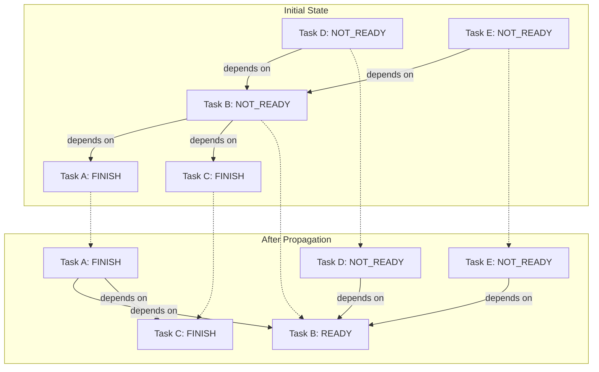
```mermaid
graph TD
    subgraph "Initial State"
        A1[Task A: FINISH]
        B1[Task B: NOT_READY]
        C1[Task C: FINISH]
        D1[Task D: NOT_READY]
        E1[Task E: NOT_READY]
        
        B1 -->|depends on| A1
        B1 -->|depends on| C1
        D1 -->|depends on| B1
        E1 -->|depends on| B1
    end
    
    subgraph "After Propagation"
        A2[Task A: FINISH]
        B2[Task B: READY]
        C2[Task C: FINISH]
        D2[Task D: NOT_READY]
        E2[Task E: NOT_READY]
        
        A2 -->|depends on| B2
        A2 -->|depends on| C2
        D2 -->|depends on| B2
        E2 -->|depends on| B2
    end
    
    A1 -.-> A2
    B1 -.-> B2
    C1 -.-> C2
    D1 -.-> D2
    E1 -.-> E2
```

In this example, Task B becomes ready because both its dependencies (Tasks A and C) are finished. Tasks D and E remain not ready because they depend on Task B, which isn't finished yet.

#### 4.4.3 Hierarchical Propagation

WriteHERE's recursive planning approach creates hierarchical task structures. When all child tasks finish, the parent task needs to transition to an aggregation state:

```cypher
// When all children finish, update parent task
MATCH (parent:Task)-[:CONTAINS]->(child:Task)
WHERE parent.status = "DOING"
WITH parent, collect(child) AS children, collect(child.status) AS childStatuses
WHERE ALL(s IN childStatuses WHERE s = "FINISH")
SET parent.status = "NEED_UPDATE",
    parent.updated_at = timestamp()
RETURN parent
```

This query identifies parent tasks whose children are all finished and transitions them to the "NEED_UPDATE" state, indicating they need to aggregate their children's results.

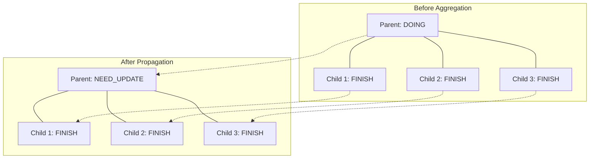
```mermaid
graph TD
    subgraph "Before Aggregation"
        P1[Parent: DOING]
        C1[Child 1: FINISH]
        C2[Child 2: FINISH]
        C3[Child 3: FINISH]
        
        P1 --- C1
        P1 --- C2
        P1 --- C3
    end
    
    subgraph "After Propagation"
        P2[Parent: NEED_UPDATE]
        C4[Child 1: FINISH]
        C5[Child 2: FINISH]
        C6[Child 3: FINISH]
        
        P2 --- C4
        P2 --- C5
        P2 --- C6
    end
    
    P1 -.-> P2
    C1 -.-> C4
    C2 -.-> C5
    C3 -.-> C6
```

This hierarchical propagation ensures that the system works through the task hierarchy methodically, aggregating results at each level before proceeding to higher levels.

These state propagation mechanisms enable WriteHERE's complex task execution logic to be implemented efficiently using Neo4j's graph capabilities, with proper transactional semantics ensuring consistency even in concurrent scenarios.

## 5. Frontend Integration

The proposed architecture significantly enhances the frontend experience by providing real-time updates, interactive control, and rich visualization of the writing process. Let's explore how the frontend integrates with the Neo4j-backed, event-driven backend.

### 5.1 Real-time Task Graph Visualization

One of WriteHERE's most compelling features is its visualization of the AI "thinking process" through the task graph. Our proposed architecture enhances this visualization with efficient, real-time updates.

#### 5.1.1 Initial Graph Load

When a user opens a writing project, the frontend needs to load the current state of the task graph. Neo4j's path-based queries make this efficient:

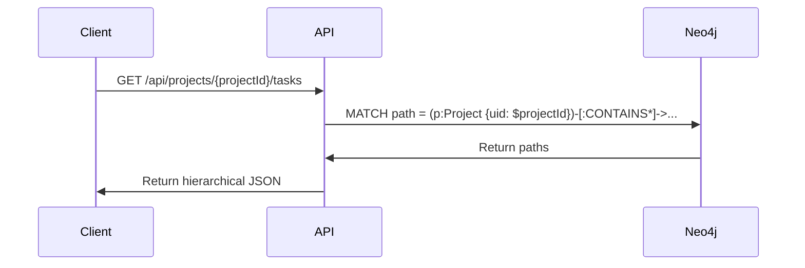
```mermaid
sequenceDiagram
    participant Client
    participant API
    participant Neo4j
    
    Client->>API: GET /api/projects/{projectId}/tasks
    API->>Neo4j: MATCH path = (p:Project {uid: $projectId})-[:CONTAINS*]->...
    Neo4j->>API: Return paths
    API->>Client: Return hierarchical JSON
```

The backend uses a Cypher query that retrieves the task hierarchy with controlled depth:

```cypher
// Fetch complete hierarchy with limited depth
MATCH path = (p:Project {uid: $projectId})-[:CONTAINS]->
              (root:Task)-[:CONTAINS*0..3]->(t:Task)
WITH nodes(path) as nodes
UNWIND nodes as n
WITH DISTINCT n
OPTIONAL MATCH (n)-[r:DEPENDS_ON]->(dep)
RETURN n, collect(DISTINCT {target: dep.uid, type: type(r)}) as dependencies
```

This query:
1. Finds paths from the project to tasks up to 3 levels deep
2. Collects all nodes along these paths
3. For each node, collects its dependencies
4. Returns the nodes and their dependencies

The result is a compact representation of the task graph that can be efficiently transmitted to the client and rendered in a visualization library like D3.js or React Flow.

#### 5.1.2 Incremental Updates

Rather than reloading the entire graph on every change, our architecture uses events to send incremental updates:

```json
{
  "type": "graph_update",
  "nodes": [
    {
      "uid": "task-123",
      "status": "DOING",
      "updated_at": "2025-04-07T10:15:30Z",
      "progress": 0.25
    }
  ],
  "relationships": [
    {
      "source": "task-123",
      "target": "task-456",
      "type": "DEPENDS_ON"
    }
  ],
  "removed": []
}
```

These compact updates contain only what's changed, reducing bandwidth and enabling smooth animations as the graph evolves.

#### 5.1.3 Exploration on Demand

For large writing projects with hundreds of tasks, loading the entire graph would be inefficient. Instead, the frontend can request expansion of specific areas of interest:

```cypher
// Expand a specific task's children
MATCH (t:Task {uid: $taskId})-[:CONTAINS]->(child:Task)
OPTIONAL MATCH (child)-[r:DEPENDS_ON]->(dep)
RETURN child, collect(DISTINCT {target: dep.uid, type: type(r)}) as dependencies
```

This enables an explorer-like interface where users can drill down into areas of interest while maintaining performance, as shown in the following visualization:

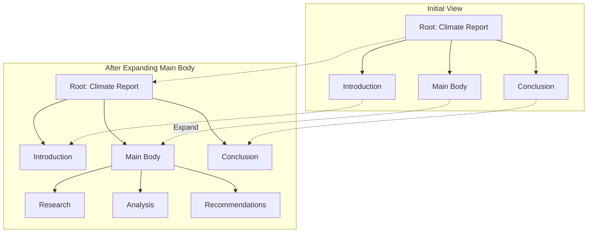
```mermaid
graph TD
    subgraph "Initial View"
        A[Root: Climate Report]
        B[Introduction]
        C[Main Body]
        D[Conclusion]
        
        A --> B
        A --> C
        A --> D
    end
    
    subgraph "After Expanding Main Body"
        A2[Root: Climate Report]
        B2[Introduction]
        C2[Main Body]
        D2[Conclusion]
        
        E[Research]
        F[Analysis]
        G[Recommendations]
        
        A2 --> B2
        A2 --> C2
        A2 --> D2
        
        C2 --> E
        C2 --> F
        C2 --> G
    end
    
    A -.-> A2
    B -.-> B2
    C -.->|Expand| C2
    D -.-> D2
```

This visualization approach balances detail with performance, allowing users to explore the complex writing process at their own pace.

### 5.2 Event-Based UI Updates

The event-driven architecture enables a reactive frontend that responds immediately to changes in the writing process.

#### 5.2.1 WebSocket Subscription

When a user opens a project, the frontend establishes a WebSocket connection and subscribes to relevant events:

```javascript
// Frontend subscription code
const socket = io(API_URL);

socket.on('connect', () => {
  // Subscribe to project events
  socket.emit('subscribe', { 
    projectId: currentProjectId,
    eventTypes: [
      'TaskStatusChanged',
      'TaskResultUpdated',
      'ArticleUpdated'
    ]
  });
});

// Handle events
socket.on('TaskStatusChanged', (event) => {
  updateTaskStatus(event.payload);
});

socket.on('TaskResultUpdated', (event) => {
  updateTaskResult(event.payload);
});

socket.on('ArticleUpdated', (event) => {
  updateArticleContent(event.payload);
});
```

This subscription model ensures that the frontend receives only the events relevant to the current project and view, reducing unnecessary updates.

#### 5.2.2 Real-time Task Status Updates

Task status changes drive much of the visualization, showing the progress of the writing process:

```javascript
function updateTaskStatus(payload) {
  const { task_id, new_status } = payload;
  
  // Update node in the visualization
  graph.updateNodeStatus(task_id, new_status);
  
  // Update task details panel if selected
  if (selectedTaskId === task_id) {
    refreshTaskDetails(task_id);
  }
  
  // Update statistics
  updateTaskCounts();
}
```

This real-time feedback creates a dynamic visualization that shows the AI "thinking" as it works through the writing process.

#### 5.2.3 Live Article Preview

As the AI generates content, the frontend can show a live preview of the emerging article:

```javascript
function updateArticleContent(payload) {
  const { content, version, delta } = payload;
  
  // Option 1: Replace entire content
  if (content) {
    document.getElementById('article-preview').innerHTML = 
      markdownRenderer.render(content);
  }
  
  // Option 2: Apply delta for more efficient updates
  else if (delta) {
    applyContentDelta(delta);
  }
  
  // Update version indicator
  document.getElementById('version-badge').textContent = `v${version}`;
}
```

This live preview gives users immediate feedback on the writing process, creating a compelling user experience.

### 5.3 Interactive Control

A key advantage of our proposed architecture is enabling users to interact with and control the writing process.

#### 5.3.1 Task Prioritization

Users can influence the writing process by adjusting task priorities:

```javascript
async function changeTaskPriority(taskId, newPriority) {
  const response = await fetch('/api/tasks/priority', {
    method: 'POST',
    headers: { 'Content-Type': 'application/json' },
    body: JSON.stringify({ task_id: taskId, priority: newPriority })
  });
  
  if (response.ok) {
    // Success feedback
    showSuccess('Task priority updated');
    
    // The event system will update the UI automatically
  }
}
```

This allows users to guide the AI's focus towards areas they consider more important.

#### 5.3.2 Manual Task Override

Users can also directly intervene in the writing process by approving, rejecting, or modifying task results:

```javascript
async function overrideTaskResult(taskId, newContent) {
  const response = await fetch('/api/tasks/override', {
    method: 'POST',
    headers: { 'Content-Type': 'application/json' },
    body: JSON.stringify({ 
      task_id: taskId, 
      content: newContent,
      override_reason: "Manual user edit"
    })
  });
  
  if (response.ok) {
    // Success feedback
    showSuccess('Content updated');
    
    // The event system will update the article automatically
  }
}
```

This collaborative approach allows humans and AI to work together, combining AI efficiency with human judgment.

#### 5.3.3 Process Control

Users can control the overall writing process with simple commands:

```javascript
async function controlProcess(projectId, action) {
  const response = await fetch(`/api/projects/${projectId}/control`, {
    method: 'POST',
    headers: { 'Content-Type': 'application/json' },
    body: JSON.stringify({ action: action }) // 'start', 'pause', 'stop'
  });
  
  if (response.ok) {
    // Update UI control buttons based on new state
    const { status } = await response.json();
    updateControlButtons(status);
    
    // Show feedback
    showSuccess(`Process ${action}ed successfully`);
  }
}
```

This gives users confidence that they remain in control of the AI-driven writing process.

These frontend integration patterns enhance WriteHERE's unique value proposition—making the AI writing process transparent, interactive, and collaborative—while leveraging the performance and scalability benefits of the Neo4j and event-driven backend.

## 6. Implementation Strategy

Transforming WriteHERE from its current file-based, monolithic architecture to a Neo4j-based, event-driven system is a significant undertaking. To minimize risk and ensure continuity, we propose an incremental migration strategy that delivers value at each stage.

### 6.1 Migration Path

The transition can be implemented in three distinct phases, each building on the previous one:

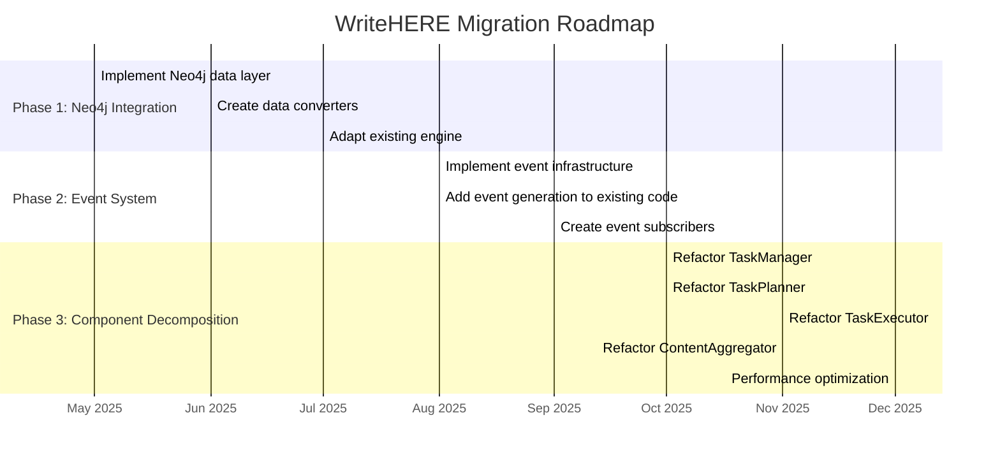
```mermaid
gantt
    title WriteHERE Migration Roadmap
    dateFormat  YYYY-MM
    axisFormat %b %Y
    
    section Phase 1: Neo4j Integration
    Implement Neo4j data layer           :2025-05, 2m
    Create data converters               :2025-06, 1m
    Adapt existing engine                :2025-07, 1m
    
    section Phase 2: Event System
    Implement event infrastructure       :2025-08, 1m
    Add event generation to existing code :2025-08, 1m
    Create event subscribers             :2025-09, 1m
    
    section Phase 3: Component Decomposition
    Refactor TaskManager                 :2025-10, 1m
    Refactor TaskPlanner                 :2025-10, 1m
    Refactor TaskExecutor                :2025-11, 1m
    Refactor ContentAggregator           :2025-11, 1m
    Performance optimization             :2025-12, 1m
```

Let's explore each phase in detail:

#### 6.1.1 Phase 1: Neo4j Integration

The first phase focuses on transitioning from file-based storage to Neo4j while maintaining the existing execution model:

1. **Implement Neo4j Data Layer**:
   - Define the graph schema (nodes, relationships, properties)
   - Create CRUD operations for all entities
   - Implement transaction handling and error recovery

2. **Create Data Converters**:
   - Build tools to convert between pickle/JSON and Neo4j formats
   - Implement migration scripts for existing projects
   - Validate data integrity after conversion

3. **Adapt Existing Engine**:
   - Modify `GraphRunEngine` to store/retrieve from Neo4j instead of files
   - Update transaction boundaries for consistency
   - Maintain backward compatibility with file-based approach for graceful transition

This phase delivers immediate benefits in terms of improved query capabilities and concurrent access, while minimizing changes to the core execution logic.

#### 6.1.2 Phase 2: Event System Introduction

The second phase adds event infrastructure without fully decomposing the monolithic engine:

1. **Implement Event Infrastructure**:
   - Set up message broker (e.g., RabbitMQ, Kafka)
   - Define event schemas and validation
   - Create publishing/subscription mechanisms

2. **Add Event Generation to Existing Code**:
   - Instrument key points in `GraphRunEngine` to publish events
   - Ensure all state changes generate appropriate events
   - Verify event consistency and completeness

3. **Create Event Subscribers**:
   - Implement subscribers for frontend updates
   - Build logging and monitoring subscribers
   - Develop initial versions of specialized components

This phase enhances the system's observability and responsiveness while laying the groundwork for full component decomposition.

#### 6.1.3 Phase 3: Component Decomposition

The final phase decomposes the monolithic engine into specialized components:

1. **Refactor TaskManager**:
   - Extract task state management from `GraphRunEngine`
   - Implement event-based interfaces
   - Validate against reference implementation

2. **Refactor TaskPlanner**:
   - Extract planning logic into a dedicated component
   - Implement event-based communication
   - Ensure planning strategies match current behavior

3. **Refactor TaskExecutor**:
   - Extract execution logic into a dedicated component
   - Implement agent-based execution model
   - Add resilience features like retries and circuit breakers

4. **Refactor ContentAggregator**:
   - Extract content aggregation logic
   - Implement version-aware content management
   - Add support for collaborative editing

5. **Performance Optimization**:
   - Identify and address bottlenecks
   - Implement caching strategies
   - Optimize Neo4j queries

This phase completes the transformation, delivering the full benefits of the new architecture while maintaining the core capabilities that make WriteHERE unique.

### 6.2 Hybrid Operation Period

During the migration, the system will operate in a hybrid mode to ensure continuity:

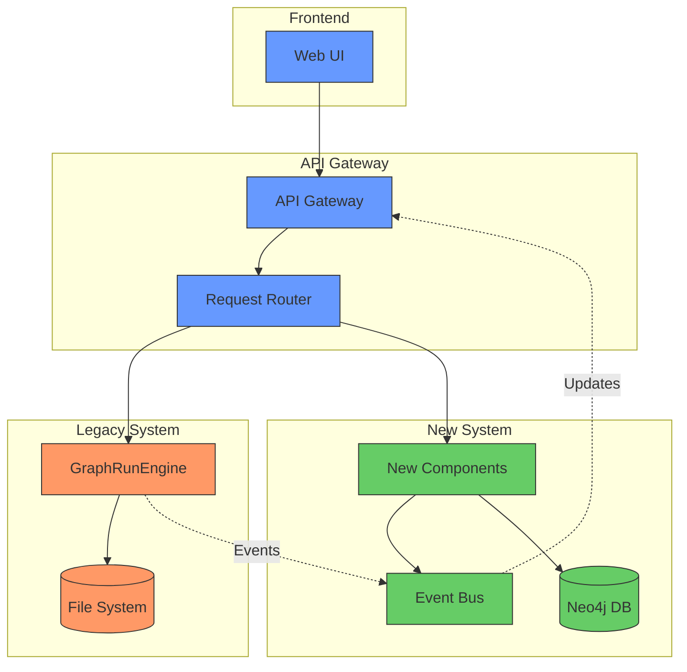
```mermaid
graph TD
    subgraph "Frontend"
        Client[Web UI]
    end
    
    subgraph "API Gateway"
        API[API Gateway]
        Router[Request Router]
    end
    
    subgraph "Legacy System"
        LegacyEngine[GraphRunEngine]
        Files[(File System)]
    end
    
    subgraph "New System"
        EventBus[Event Bus]
        Neo4j[(Neo4j DB)]
        Components[New Components]
    end
    
    Client --> API
    API --> Router
    
    Router --> LegacyEngine
    LegacyEngine --> Files
    
    Router --> Components
    Components --> EventBus
    Components --> Neo4j
    
    LegacyEngine -.->|Events| EventBus
    EventBus -.->|Updates| API
    
    classDef legacy fill:#f96,stroke:#333;
    classDef new fill:#6c6,stroke:#333;
    classDef shared fill:#69f,stroke:#333;
    
    class LegacyEngine,Files legacy;
    class EventBus,Neo4j,Components new;
    class Client,API,Router shared;
```

This hybrid approach:
- Uses feature flags to route requests to either legacy or new components
- Ensures the legacy system publishes events for consistent UI updates
- Gradually shifts traffic from legacy to new components
- Allows for side-by-side comparison and validation

During this period, Neo4j serves as the authoritative data store, with both legacy and new components reading from and writing to it. The event bus becomes the primary communication mechanism, even for the legacy system.

### 6.3 Deployment Considerations

The Neo4j and event-driven architecture enables several deployment models, each with its own trade-offs:

#### 6.3.1 Single-Machine Development

For development and testing, the entire system can run on a single machine:

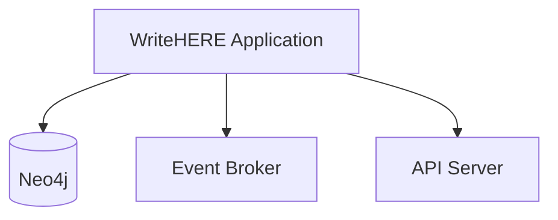
```mermaid
graph TD
    App[WriteHERE Application] --> Neo4j[(Neo4j)]
    App --> EB[Event Broker]
    App --> API[API Server]
```

This setup minimizes complexity while still leveraging the architectural benefits for development and testing.

#### 6.3.2 Microservices Architecture

For production deployments, a microservices approach provides scalability and resilience:

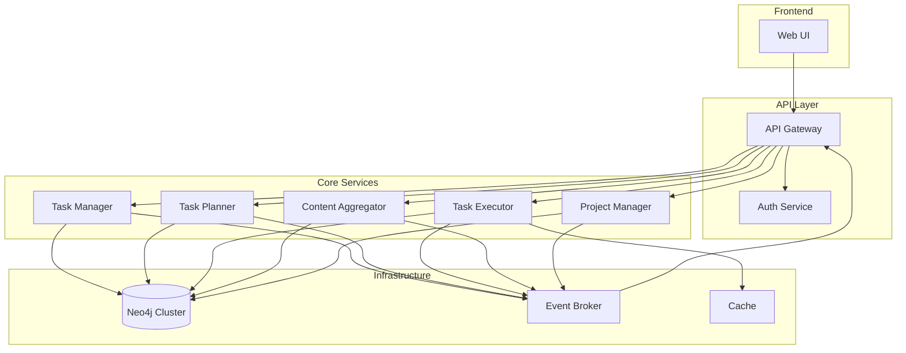
```mermaid
graph TD
    subgraph "Frontend"
        Client[Web UI]
    end
    
    subgraph "API Layer"
        Gateway[API Gateway]
        Auth[Auth Service]
    end
    
    subgraph "Core Services"
        TM[Task Manager]
        TP[Task Planner]
        TE[Task Executor]
        CA[Content Aggregator]
        PM[Project Manager]
    end
    
    subgraph "Infrastructure"
        Neo4j[(Neo4j Cluster)]
        EB[Event Broker]
        Cache[Cache]
    end
    
    Client --> Gateway
    Gateway --> Auth
    
    Gateway --> TM
    Gateway --> TP
    Gateway --> TE
    Gateway --> CA
    Gateway --> PM
    
    TM --> Neo4j
    TP --> Neo4j
    TE --> Neo4j
    CA --> Neo4j
    PM --> Neo4j
    
    TM --> EB
    TP --> EB
    TE --> EB
    CA --> EB
    PM --> EB
    EB --> Gateway
    
    TE --> Cache
```

This architecture enables:
- Independent scaling of components based on demand
- Isolation of failures to specific services
- Technology diversity where appropriate
- Flexible deployment strategies

#### 6.3.3 Kubernetes Deployment

For cloud deployments, Kubernetes provides a robust platform:

```
apiVersion: apps/v1
kind: Deployment
metadata:
  name: task-executor
spec:
  replicas: 3
  selector:
    matchLabels:
      app: task-executor
  template:
    metadata:
      labels:
        app: task-executor
    spec:
      containers:
      - name: task-executor
        image: writehere/task-executor:latest
        env:
        - name: NEO4J_URI
          valueFrom:
            configMapKeyRef:
              name: writehere-config
              key: neo4j-uri
        - name: EVENT_BUS_URI
          valueFrom:
            configMapKeyRef:
              name: writehere-config
              key: event-bus-uri
        resources:
          requests:
            memory: "256Mi"
            cpu: "100m"
          limits:
            memory: "1Gi"
            cpu: "500m"
```

Kubernetes enables:
- Automatic scaling based on load
- Self-healing infrastructure
- Declarative configuration
- Resource isolation

These deployment options provide flexibility to match the needs of different organizations, from individual developers to enterprise deployments.

## 7. Benefits of the Proposed Architecture

The transition to a Neo4j-based, event-driven architecture offers significant benefits across multiple dimensions:

### 7.1 Performance Improvements

The proposed architecture delivers substantial performance enhancements:

#### 7.1.1 Graph Query Optimization

Neo4j's native graph operations are orders of magnitude faster than in-memory traversal for complex graph operations:

```
┌─────────────────────┬────────────┬────────────┐
│ Operation           │ Current    │ Neo4j      │
├─────────────────────┼────────────┼────────────┤
│ Find ready tasks    │ O(n²)      │ O(log n)   │
│ Dependency checking │ O(n)       │ O(1)       │
│ Path finding        │ O(n²)      │ O(n log n) │
└─────────────────────┴────────────┴────────────┘
```

These improvements become increasingly significant as projects grow in complexity, with hundreds or thousands of interconnected tasks.

#### 7.1.2 Parallel Processing

The event-driven architecture enables true parallel processing:

```mermaid
graph TD
    subgraph "Current (Sequential)"
        A1[Task 1] --> A2[Task 2] --> A3[Task 3] --> A4[Task 4]
    end
    
    subgraph "Proposed (Parallel)"
        B1[Task 1] --> B2[Task 2]
        B1 --> B3[Task 3]
        B2 --> B4[Task 4]
        B3 --> B4
    end
```

This parallelism can reduce execution time dramatically, especially for retrieval and analysis tasks that don't depend on each other.

#### 7.1.3 Real-time Updates

The event-driven approach eliminates polling overhead:

```
┌─────────────────┬────────────────────┬────────────────────┐
│ Metric          │ Current (Polling)  │ Proposed (Events)  │
├─────────────────┼────────────────────┼────────────────────┤
│ Update latency  │ 1-2 seconds        │ <100ms             │
│ Server load     │ Linear with clients│ Constant           │
│ Network traffic │ High (constant)    │ Low (on-change)    │
└─────────────────┴────────────────────┴────────────────────┘
```

These improvements create a more responsive user experience and reduce server load, especially with many concurrent users.

### 7.2 Scalability Enhancements

The proposed architecture enables WriteHERE to scale in multiple dimensions:

#### 7.2.1 Horizontal Scaling

Components can scale independently based on demand:

```mermaid
graph TD
    subgraph "Low Load"
        TE1[Task Executor: 1 instance]
        CA1[Content Aggregator: 1 instance]
    end
    
    subgraph "High Load"
        TE2[Task Executor: 8 instances]
        CA2[Content Aggregator: 2 instances]
    end
```

This elastic scaling ensures efficient resource utilization while meeting demand spikes.

#### 7.2.2 Neo4j Clustering

Neo4j's clustering capabilities provide:

- **Read Scaling**: Multiple read replicas for high query throughput
- **Write Resilience**: Distributed transaction processing
- **Fault Tolerance**: Automatic failover between instances
- **Sharding**: Data partitioning for very large deployments (Neo4j 5.0+)

These capabilities ensure the database can handle growing data volumes and query loads.

#### 7.2.3 Stateless Processing

The event-driven components are inherently stateless:

```
┌───────────────┬─────────────────┬─────────────────┐
│ Component     │ State Location  │ Scalability     │
├───────────────┼─────────────────┼─────────────────┤
│ Task Executor │ Neo4j + Events  │ Linear          │
│ Task Planner  │ Neo4j + Events  │ Linear          │
│ API Gateway   │ None (stateless)│ Linear          │
└───────────────┴─────────────────┴─────────────────┘
```

This stateless design facilitates horizontal scaling and simplifies deployment.

### 7.3 Resilience Improvements

The proposed architecture significantly enhances system resilience:

#### 7.3.1 Fault Isolation

Component failures are contained, not system-wide:

```mermaid
graph TD
    subgraph "Current (Monolithic)"
        Engine[GraphRunEngine]
        Bug[Bug in Task Execution] --> Crash[System Crash]
        Crash --> DataLoss[Potential Data Loss]
    end
    
    subgraph "Proposed (Decomposed)"
        TaskExecutor[Task Executor]
        Bug2[Bug in Task Execution] --> ComponentCrash[Component Crash]
        ComponentCrash --> Retry[Automatic Retry]
        Retry --> Recovery[Graceful Recovery]
    end
```

This isolation ensures that failures in one component don't bring down the entire system.

#### 7.3.2 Event Replay

The event sourcing approach provides complete audit trails and enables replay capabilities:

```
1. TaskCreated(task-123, "Write introduction")
2. TaskStatusChanged(task-123, "NOT_READY", "READY")
3. TaskScheduled(task-123, "exec-456")
4. TaskExecutionStarted(task-123, "exec-456")
5. TaskExecutionFailed(task-123, "exec-456", "API rate limit")
6. TaskScheduled(task-123, "exec-789")
7. TaskExecutionStarted(task-123, "exec-789")
8. TaskExecutionCompleted(task-123, "exec-789")
9. TaskStatusChanged(task-123, "DOING", "FINISH")
```

This event log enables:
- Complete system state reconstruction
- Debugging of complex failure scenarios
- Audit trails for compliance
- Performance analysis and optimization

#### 7.3.3 Transactional Integrity

Neo4j ensures graph consistency even with concurrent updates:

```cypher
// This entire operation is atomic
BEGIN
  MATCH (t:Task {uid: $taskId})
  SET t.status = "FINISH"
  WITH t
  MATCH (dependent:Task)-[:DEPENDS_ON]->(t)
  SET dependent.status = "READY"
COMMIT
```

This transactional integrity prevents data corruption and race conditions that could occur in the file-based system.

### 7.4 Extensibility

Perhaps the most exciting benefit is how the proposed architecture enables extension and evolution:

#### 7.4.1 Plugin Architecture

New capabilities can be added by subscribing to existing events:

```javascript
// Adding a new feature: Content sentiment analysis
class SentimentAnalyzer {
  constructor(eventBus) {
    eventBus.subscribe("ContentGenerated", this.analyzeContent);
  }
  
  analyzeContent(event) {
    const content = event.payload.content;
    const sentiment = this.calculateSentiment(content);
    
    eventBus.publish("SentimentAnalyzed", {
      task_id: event.payload.task_id,
      sentiment: sentiment
    });
  }
  
  calculateSentiment(text) {
    // Sentiment analysis logic
  }
}
```

This plugin approach allows the system to grow organically without modifying core components.

#### 7.4.2 Specialized Agents

Task executors can be specialized for particular tasks:

```mermaid
graph TD
    TaskExecutor[Task Executor]
    
    TaskExecutor --> LLMAgent[LLM Agent]
    TaskExecutor --> SearchAgent[Search Agent]
    TaskExecutor --> CodeAgent[Code Generation Agent]
    TaskExecutor --> VisualizationAgent[Visualization Agent]
    
    LLMAgent --> OpenAI[OpenAI]
    LLMAgent --> Anthropic[Anthropic]
    LLMAgent --> Local[Local Models]
    
    SearchAgent --> Web[Web Search]
    SearchAgent --> Academic[Academic Search]
    SearchAgent --> Knowledge[Knowledge Base]
```

This specialization allows WriteHERE to incorporate new capabilities and integrations without disrupting existing functionality.

#### 7.4.3 Integration Points

External systems can publish or subscribe to events:

```javascript
// Example: Integration with content management system
class CMSIntegration {
  constructor(eventBus, cmsClient) {
    this.cmsClient = cmsClient;
    eventBus.subscribe("ArticleUpdated", this.updateCMS);
  }
  
  updateCMS(event) {
    if (event.payload.is_final) {
      this.cmsClient.createOrUpdateArticle({
        title: event.payload.title,
        content: event.payload.content,
        metadata: event.payload.metadata
      });
    }
  }
}
```

These integration points enable WriteHERE to fit seamlessly into larger content ecosystems and workflows.

## 8. Conclusion

The proposed transition to a Neo4j-based storage system and event-driven architecture represents a transformative evolution for the WriteHERE system:

```mermaid
graph TD
    subgraph "Current Architecture"
        Files[(File Storage)]
        Engine[Monolithic Engine]
        Polling[Polling Updates]
    end
    
    subgraph "Proposed Architecture"
        Neo4j[(Neo4j Graph DB)]
        EventBus[Event Bus]
        Components[Specialized Components]
        RealTime[Real-time Updates]
    end
    
    Files --> Neo4j
    Engine --> Components
    Polling --> RealTime
    
    classDef current fill:#f96,stroke:#333;
    classDef proposed fill:#6c6,stroke:#333;
    
    class Files,Engine,Polling current;
    class Neo4j,EventBus,Components,RealTime proposed;
```

This transformation delivers significant benefits:

1. **Scalability**: Support for larger writing projects and concurrent users through horizontal scaling and stateless architecture.

2. **Performance**: Faster task scheduling and execution through Neo4j's graph optimizations and parallel processing.

3. **Resilience**: Better fault tolerance and recovery through component isolation, transactional integrity, and event sourcing.

4. **Extensibility**: Easier integration of new capabilities through the event-driven plugin architecture.

5. **Visibility**: Enhanced monitoring and troubleshooting through comprehensive event logging and real-time updates.

The native graph structure of Neo4j aligns perfectly with WriteHERE's hierarchical task representation, while the event-driven architecture enables the loose coupling and scalability needed for a robust production system.

This refactoring transforms WriteHERE from a single-machine application to a distributed system capable of supporting enterprise-scale automated content generation, while preserving and enhancing the recursive planning approach that makes WriteHERE uniquely powerful.

By implementing this architectural vision, WriteHERE can evolve from an innovative prototype to a robust, production-ready system that brings the power of recursive planning and heterogeneous task execution to content creation at scale. 