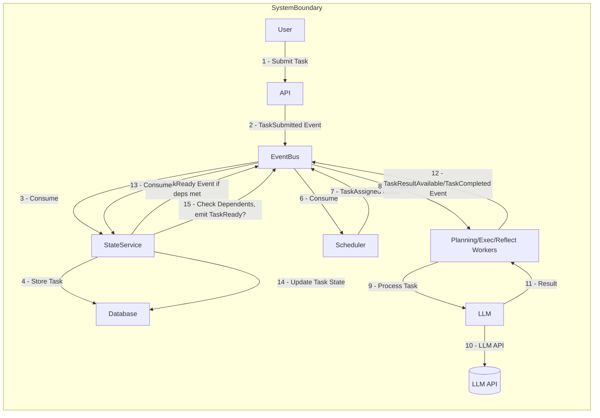

# Event-Driven Architecture for the Recursive Engine

## 1. Introduction

This document proposes an event-driven, asynchronous architecture for the Recursive Engine, designed for scalability, resilience, and modularity. Instead of a central engine managing a stateful graph in memory and sequentially stepping through nodes, this architecture relies on independent services communicating via events over a message bus. Tasks are processed asynchronously as their dependencies are met and resources become available.

### 1.2 Design Philosophy

The proposed architecture follows several key principles:

- **Microservices Orientation**: Break down the monolith into focused, independently deployable services.
- **Event-First Communication**: Services communicate primarily through events, reducing tight coupling.
- **Stateless Workers**: Processing logic is contained in stateless workers that can scale horizontally.
- **Persistent State**: Task state is stored in a durable database rather than in-memory.
- **Explicit Dependencies**: Task dependencies are explicitly modeled and tracked.
- **Scalable Processing**: Allow concurrent execution where dependencies permit.

## 2. Core Concepts

- **Events:** Atomic pieces of information representing significant state changes or requests (e.g., `TaskSubmitted`, `TaskCompleted`, `SubtasksPlanned`).
- **Event Bus/Message Broker:** A central pub/sub system (like Kafka, RabbitMQ, NATS) decoupling producers and consumers of events.
- **Services/Workers:** Independent, potentially distributed components responsible for specific functions (e.g., Planning, Execution, LLM Interaction, State Management).
- **State Store:** A persistent database (e.g., PostgreSQL, MongoDB, Redis) holding the current state of all tasks, including dependencies, results, and status.

### 2.1 Event-Driven Architecture Patterns

This design leverages several established event-driven architecture patterns:

1. **Event Sourcing**: The system maintains a log of events that describe state changes, enabling reconstruction of state and audit trails.
2. **CQRS (Command Query Responsibility Segregation)**: The system separates the responsibility for processing commands (e.g., submitting tasks) from queries (e.g., fetching task state).
3. **Choreography over Orchestration**: Services react to events autonomously rather than being directed by a central controller, improving resilience and reducing bottlenecks.

### 2.2 Component Interaction Flow



In this flow, note how no component directly calls another component. Instead, each component reacts to events, performs its work, and publishes new events. This decoupling allows components to evolve independently and facilitates scaling individual components based on load.

## 3. Data Structures

The data model design is central to the success of this architecture. It must support both efficient state management and high-throughput event processing.

### 3.1. Task Representation

Stored persistently (e.g., in a document or relational database). Each task record should contain:

- `task_id`: Unique identifier (e.g., UUID).
- `parent_task_id`: ID of the task that generated this one (null for root).
- `root_task_id`: ID of the original root task for context grouping.
- `goal`: The objective of this specific task.
- `task_type`: COMPOSITION, REASONING, RETRIEVAL, PLANNING, REFLECTION, AGGREGATION.
- `status`: PENDING_DEPS, READY, ASSIGNED, RUNNING, COMPLETED, FAILED.
- `dependencies`: List of `task_id`s that must be COMPLETED before this task is READY.
- `dependents`: List of `task_id`s waiting for this task to complete.
- `input_data`: Information needed to start the task (potentially references to results of dependencies).
- `result`: The output produced by the task upon completion.
- `error_info`: Details if the task failed.
- `assigned_worker_id`: Identifier of the worker processing the task (transient).
- `created_at`, `updated_at`: Timestamps.
- `metadata`: Other relevant info (e.g., config used, LLM parameters).
- `detailed_status`: Finer-grained status based on `AgentStatusCode`/`ActionStatusCode` (e.g., PLUGIN_RUNNING, LLM_CALL_PENDING). Optional, for detailed monitoring.
- `required_capabilities`: List of tool/action names needed for this task (Optional, aids scheduling).
- `agent_state`: Serialized state of the agent processing the task, if applicable (e.g., ReAct steps).

#### 3.1.1 Task Status Lifecycle

When implementing task state transitions, the following lifecycle should be enforced:

1. **PENDING_DEPS**: Initial state for most tasks. Waiting for dependencies to complete.
2. **READY**: All dependencies satisfied, ready to be assigned to a worker.
3. **ASSIGNED**: Task has been assigned to a worker but not yet started.
4. **RUNNING**: Worker has begun processing the task.
5. **COMPLETED**: Task successfully completed with a result.
6. **FAILED**: Task encountered an error and cannot continue.

Additionally, tasks might temporarily enter special states:

- **PAUSED**: Tasks can be manually paused for inspection or resource constraints.
- **RETRY_PENDING**: A failed task that's been marked for retry.

### 3.2. Task Dependency Graph

The graph structure is implicitly represented and managed within the `StateStore` through the `dependencies` and `dependents` fields in the Task Representation. Querying the `StateStore` allows reconstruction of parts of the graph as needed.

This approach differs significantly from the original implementation, which maintained the entire graph in memory. The trade-off is that graph traversal becomes more complex (requiring database queries), but this enables:

1. Persistence across service restarts
2. Distribution of graph processing across multiple services
3. Selective loading of only relevant portions of potentially large graphs

For efficiency in Go implementation, consider:

- Using efficient indexes on the dependency fields
- Implementing caching of frequently accessed task relationships
- Batching related database operations where possible

### 3.3. State Store

A database optimized for querying task status and dependencies. Indexes on `status`, `task_id`, `parent_task_id`, and potentially `dependencies`/`dependents` are crucial.

#### 3.3.1 Database Selection Considerations

For a Go implementation, several database options are worth considering:

1. **PostgreSQL**: Provides strong consistency, rich query capabilities, and support for JSON/JSONB for flexible schema evolution. The `dependencies` and `dependents` lists can be stored as JSONB arrays with GIN indexes.

2. **MongoDB**: Document-oriented storage naturally matches the task representation. Provides horizontal scaling and flexible schema evolution. Supports array indexes for the dependency lists.

3. **Redis**: For high-throughput, low-latency scenarios. Can use hashes for task storage and sets for dependency tracking. Consider Redis Modules like RedisGraph if explicit graph representation becomes necessary.

4. **Neo4j/ArangoDB**: Graph databases that could represent task relationships natively as edges, potentially simplifying complex dependency queries.

The best choice depends on your specific operational requirements, existing infrastructure, and expertise. PostgreSQL offers a good balance of features for most implementations.

### 3.4. Event Schema

Events should be standardized (e.g., JSON format) and include:

- `event_id`: Unique ID for the event.
- `event_type`: The specific event name (e.g., `TaskCompleted`).
- `timestamp`: Time of event creation.
- `source_service`: Which service generated the event.
- `payload`: Event-specific data (e.g., `task_id`, result data, error messages).
  - `task_id`: Often required to link the event to a task.
  - `root_task_id`: Useful for tracing and context.
  - For `TaskCompleted`/`TaskFailed`, payload should reflect the `AgentReturn` or `ActionReturn` structure, including detailed status codes, results, and error messages from `schema.py`.

#### 3.4.1 Event Design Considerations

The event schema design should balance several concerns:

1. **Completeness**: Events should contain enough information for consumers to act without querying additional services.
2. **Size Efficiency**: Keep events reasonably sized for efficient transmission and processing.
3. **Versioning**: Consider adding a schema version field to allow for future changes.
4. **Idempotency**: Design events to be safely reprocessed without side effects.

In Go, events can be modeled as structs with careful attention to JSON serialization and efficiency. Consider using a package like Protocol Buffers for more efficient serialization if event volume is expected to be very high.

## 4. Core Services/Components

The system comprises several distinct services, each with a clear responsibility. This separation allows for independent scaling, focused development, and fault isolation.

- **API Gateway:** Entry point for external requests (e.g., submitting a root task).
- **State Service:** The source of truth for task states. Consumes events that modify state (`TaskSubmitted`, `TaskCompleted`, `TaskResultAvailable`, `SubtasksPlanned`) and updates the `StateStore`. Critically, it checks dependencies and emits `TaskReady` events when a task's prerequisites are met.
- **Scheduler:** Subscribes to `TaskReady` events. Assigns tasks to appropriate workers based on `task_type` and potentially load balancing. Emits `TaskAssigned` events.
- **Worker Services (Pools):** Separate pools for different `task_type`s (Planning, Execution, Reflection, Aggregation). They subscribe to `TaskAssigned` events matching their type. Perform the core logic, potentially interacting with the `LLM `.
  - **Planning Worker:** Generates subtasks based on a parent task's goal. Emits a `SubtasksPlanned` event containing the new task definitions and their dependencies.
  - **Execution/Reflection Workers:** Perform the actual content generation or validation using LLMs. Emit `TaskResultAvailable` (for partial results if needed) and `TaskCompleted` or `TaskFailed` events.
  - **Internal Worker Structure (Common Pattern):**
    - **Agent:** Orchestrates task execution (e.g., implementing ReAct, planning). Receives task goal and context.
    - **ActionExecutor:** Manages available tools (`BaseAction` instances like `BingBrowser`, `Calculator`). Instantiated by the Agent or Worker.
    - **LLM :** Used by the Agent to make decisions (e.g., which tool to use next).
    - **Tool/Action Implementations (`BaseAction`):** The actual code for specific tools, potentially involving external calls.
- **LLM Service:** Abstracts interactions with external LLM APIs. Handles API keys, retries, and provider-specific formatting. Called synchronously or asynchronously by Workers.
- **Event Bus:** The central communication backbone.
- **(Optional) Capability Registry Service:** A service that workers can register their available tools/actions (`BaseAction` descriptions) with. The `Scheduler` could query this service to match `TaskReady` events (potentially having `required_capabilities`) to suitable workers. This mirrors the `TOOL_REGISTRY` concept.

### 4.1 Service Implementation Considerations

#### 4.1.1 API Gateway

In Go, the API Gateway can be implemented using standard libraries like `net/http` or frameworks like Echo.

The Gateway should translate external requests into internal events, abstracting the event-based architecture from external clients.

#### 4.1.2 State Service

This is one of the most critical services in the system, responsible for maintaining consistency of task state.

#### 4.1.3 Worker Services

The internal structure of workers, especially the `ExecutionWorker`, will mirror the concepts found in the Python implementation (`claude_fc_react.py` and `regular.py`) but adapted for Go and the event-driven model:

- **Execution Worker (`pkg/workers/execution`):**

  - Consumes `TaskAssigned` events for execution-type tasks.
  - Fetches task details and context (results from dependencies).
  - **Instantiates an `Agent` struct/logic:** This internal component encapsulates the core task-processing loop (e.g., ReAct). It receives the goal, context, and an `ActionExecutor`.
  - **Agent Logic (e.g., ReAct Loop):**
    - Manages internal state (history of thoughts, actions, observations).
    - Constructs prompts for the LLM, including the goal, state, history, and available action descriptions (obtained from the `ActionExecutor`). This mirrors the prompt assembly logic in Python's `get_llm_output` and `claude_fc_react.py`.
    - Calls the `llms.Client` interface.
    - Parses the LLM response to identify thoughts and requested actions (name and arguments).
    - Invokes the `ActionExecutor` with the requested action.
    - Processes the `ActionResult`, updates state, and continues the loop until a termination condition (e.g., `FinishAction` requested by LLM, max steps).
  - **Holds an `ActionExecutor` instance:** Manages registered `Action` implementations.
  - Publishes `TaskCompleted` or `TaskFailed`.

- **Planning Worker (`pkg/workers/planning`):**

  - Consumes `TaskAssigned` events for planning-type tasks.
  - Fetches task details.
  - **Instantiates Planning Logic:** Constructs prompts (similar to `UpdateAtomPlanningAgent` and `get_llm_output` logic) to ask the LLM to decompose the task. This might involve checking atomicity first or directly asking for a plan.
  - Calls the `llms.Client` interface, likely requesting JSON output.
  - Parses the LLM response (the plan).
  - Converts the plan into `events.Subtask` structures, generating IDs and resolving dependencies.
  - Publishes `SubtasksPlanned` and `TaskCompleted` (for the planning task itself).

- **Other Workers (Future):** Aggregation, Reflection workers would follow similar patterns, consuming `TaskAssigned`, executing specific logic (potentially LLM calls via `llms.Client` with tailored prompts based on `regular.py`'s patterns), and publishing results.

## 5. Key Events and Control Flow

Understanding the flow of events through the system is crucial for implementation. The following sequences illustrate the primary paths through the system.

### 5.1 Task Submission Flow

1.  **Task Submission:**
    - `User/Client` -> `API Gateway`: Submit root task (goal, initial config).
    - `API Gateway` -> `EventBus`: Publish `TaskSubmitted` event (payload: goal, config).
    - `State Service` <- `EventBus`: Consume `TaskSubmitted`.
    - `State Service` -> `StateStore`: Create root task record (status: PENDING_DEPS or READY if no deps).
    - `State Service` -> `EventBus`: If root task is READY, publish `TaskReady` event (payload: `task_id`).

This flow establishes the entry point for new work. The API Gateway's validation of the submitted task is crucial - it should ensure the task contains all required fields and meets any business rules before publishing the event.

### 5.2 Task Assignment Flow

2.  **Task Scheduling and Assignment:**
    - `Scheduler` <- `EventBus`: Consume `TaskReady`.
    - `Scheduler`: Select an appropriate worker type, potentially check worker availability/load.
    - `Scheduler` -> `EventBus`: Publish `TaskAssigned` event (payload: `task_id`, `worker_type`).

The Scheduler can implement various assignment strategies, from simple round-robin to complex algorithms considering worker load, task priority, and specialized worker capabilities.

### 5.3 Task Execution Flows

#### 5.3.1 Planning Task Flow

3.  **Task Execution (Example: Planning Task):**
    - `Planning Worker` <- `EventBus`: Consume `TaskAssigned` (where `worker_type` is 'planning').
    - `Planning Worker` -> `StateService`/`StateStore`: Fetch task details (`task_id`).
    - `Planning Worker`: Instantiates a Planning Agent.
    - `Planning Agent` -> `LLM `: Request task decomposition (potentially involving multiple LLM calls).
    - `Planning Worker` <- `LLM `: Receive plan (list of subtasks).
    - `Planning Worker` -> `EventBus`: Publish `SubtasksPlanned` event (payload: `parent_task_id`, list of new subtask definitions with goals, dependencies between them).
    - `Planning Worker` -> `EventBus`: Publish `TaskCompleted` event for the planning task itself (payload: `task_id`, potentially including the plan summary as result).

Planning tasks are particularly important as they create the task graph structure. The Planning Agent must ensure created subtasks form a valid DAG (Directed Acyclic Graph) without circular dependencies.

#### 5.3.2 ReAct Execution Task Flow

**Task Execution (Example: ReAct Execution Task using `ExecutionWorker`):**

- `Execution Worker` <- `EventBus`: Consume `TaskAssigned` (where `worker_type` matches).
- `Execution Worker` -> `StateService`/`StateStore`: Fetch task details (`task_id`), goal, context (dependency results).
- `Execution Worker`: Instantiates its internal `Agent` struct/logic.
- `Execution Worker`: Instantiates `ActionExecutor` and registers available Go `Action` implementations (e.g., `SearchAction`, `FinishAction`).
- **(Agent Loop):**
  - `Agent`: Gets available action descriptions/schemas from `ActionExecutor`.
  - `Agent`: Constructs prompt including goal, history, context, and action descriptions (similar to `claude_fc_react.py` prompt building).
  - `Agent` -> `llms.Client`: Call `ChatCompletion`.
  - `Agent`: Parses LLM response for thought and action invocation (name, args) (similar to `_parse_output`).
  - **If Action Invoked:**
    - `Agent` -> `ActionExecutor`: Execute the requested action (e.g., `search`) with args.
    - `ActionExecutor` -> `SearchAction`: Calls the `Execute` method of the Go `Action`.
    - `SearchAction`: Performs the search (e.g., external API call).
    - `ActionExecutor` <- `SearchAction`: Receives `ActionResult` (with results/status).
    - `Agent` <- `ActionExecutor`: Receives `ActionResult`.
    - `Agent`: Formats result as observation, updates history.
  - **If FinishAction Invoked:**
    - `Agent`: Extracts final answer from the LLM response associated with `FinishAction`.
    - `Agent`: Signals loop termination.
  - **If No Action / Max Turns / Error:**
    - `Agent`: Handles appropriately, potentially signaling loop termination with failure/default result.
- **(End Loop):**
- `Agent`: Returns final result or error status to the `Execution Worker`.
- `Execution Worker` -> `EventBus`: Publish `TaskCompleted` (or `TaskFailed`) event (payload: `task_id`, final result structure).

This flow directly maps the core ReAct logic from Python's `claude_fc_react.py` onto the Go `ExecutionWorker`, using the Go `Action` interface and `llms.Client`.

### 5.4 Subtask Creation Flow

4.  **Handling Planned Subtasks:**
    - `State Service` <- `EventBus`: Consume `SubtasksPlanned`.
    - `State Service` -> `StateStore`: Create new task records for each subtask, linking `parent_task_id`, setting dependencies, and adding them to the `dependents` list of the parent and dependency tasks. Set initial status (likely PENDING_DEPS).

This is a critical flow that expands the task graph. The State Service must ensure atomic creation of all subtasks to maintain graph consistency.

### 5.5 Dependency Resolution Flow

5.  **Task Completion and Dependency Check:**
    - `Any Worker` -> `EventBus`: Publish `TaskCompleted` (or `TaskFailed`) event (payload: `task_id`, result/error).
    - `State Service` <- `EventBus`: Consume `TaskCompleted` / `TaskFailed`.
    - `State Service` -> `StateStore`: Update task status to COMPLETED/FAILED, store result/error.
    - `State Service` -> `StateStore`: Fetch dependents of the completed task (`dependents` list).
    - `State Service`: For each dependent:
      - Check if _all_ its dependencies are now COMPLETED.
      - If yes: Update dependent task status to READY in `StateStore`.
      - `State Service` -> `EventBus`: Publish `TaskReady` event for the now-ready dependent task.

This flow is the engine of forward progress in the system. The State Service's dependency check must be efficient, potentially using database queries optimized for this specific pattern.

### 5.6 Aggregation Flow

6.  **Final Aggregation:**
    - When a task (often the original root task or a major subtask) completes its core work (e.g., planning), its status might change. When all _its_ dependent subtasks (the ones it planned) eventually reach COMPLETED status, the parent task might become READY again for a final `AGGREGATION` step, handled by an Aggregation Worker.

Aggregation represents the completion of a major work unit. It typically involves synthesizing the results of many subtasks into a coherent whole.

## 6. Algorithms

Several core algorithms power the event-driven architecture:

### 6.1 Dependency Resolution

- **Dependency Resolution:** Primarily handled by the `State Service` upon consuming `TaskCompleted` events. It involves querying the `StateStore` for a task's dependencies and checking if their statuses are all `COMPLETED`.

In Go, this can be implemented efficiently using SQL queries (for relational databases) or aggregation pipelines (for document databases) that count incomplete dependencies for a given task. For example, in PostgreSQL:

```sql
SELECT COUNT(*) FROM tasks
WHERE task_id = ANY(SELECT unnest(dependencies) FROM tasks WHERE task_id = ?)
AND status != 'COMPLETED'
```

If the count is 0, all dependencies are satisfied.

### 6.2 Task Scheduling

I don'think we need a scheduler, the watermill bus will spawn a handler as needed.

### 6.3 Processing Logic

- **Task Processing:** Handled within specific workers, often involving LLM interaction
- **Action/Tool Execution:** Managed by the `ActionExecutor` within workers, invoking registered `BaseAction` implementations.

When implementing in Go:

- Use interfaces to define the contract between components
- Leverage context for cancellation and timeouts
- Consider implementing streaming responses for real-time updates

## 7. Benefits

The event-driven architecture offers numerous advantages over the original monolithic design:

- **Scalability:** Workers and services can be scaled independently based on load. A Go implementation can handle thousands of concurrent tasks efficiently across multiple machines.
- **Resilience:** Failure of one worker doesn't halt the entire system; tasks can be retried or reassigned. Go's robust error handling simplifies implementing resilient services.
- **Modularity:** Services are decoupled; new worker types or LLM providers can be added with minimal impact on others. Go interfaces provide clear contracts between components.
- **Asynchronicity:** System remains responsive; tasks are processed in parallel when possible. Go's goroutines and channels are ideally suited for this.
- **Error Handling:** Go's explicit error handling model encourages robust error management across service boundaries.
- **Tool Management:** The consistent registration and discovery mechanism for tools/actions ensures consistency across worker instances.

### 7.1 Performance Considerations

The event-driven architecture can deliver significant performance improvements:

1. **Parallelism**: Tasks that don't depend on each other execute concurrently.
2. **Resource Efficiency**: Workers can be scaled based on their specific resource needs (e.g., more compute for LLM inference, more network connections for web search).
3. **Reduced Blocking**: Long-running operations don't block the entire system.
4. **Caching**: With proper cache implementations, repeated operations (like identical LLM calls) can be served from cache.

## 8. Challenges

Implementing this architecture does present some challenges:

- **Complexity:** Managing distributed state and ensuring eventual consistency. Go's strong typing helps catch many issues at compile time, but careful design is still required.
- **Debugging & Monitoring:** Tracing requests across multiple services and event hops requires robust logging and tracing infrastructure. Consider implementing distributed tracing using OpenTelemetry.
- **Event Bus Management:** Ensuring the reliability and scalability of the message broker. Choose a message broker with persistence and at-least-once delivery guarantees.
- **Error Handling:** Defining clear retry strategies and failure handling across services. Go's explicit error handling model is helpful here.

### 8.1 Mitigation Strategies

To address these challenges:

1. **Start Simple**: Begin with a minimal set of services and expand as needed.
2. **Comprehensive Testing**: Implement thorough unit and integration tests, including failure scenarios.
3. **Monitoring**: Build observability into all services from the start with metrics, logging, and tracing.
4. **Circuit Breakers**: Implement circuit breakers for external dependencies to prevent cascading failures.
5. **Gradual Migration**: If transitioning from the existing system, migrate one component at a time rather than a complete rewrite.

## 9. Tool/Action Management Details (Based on Executor)

The event-driven architecture needs a way to manage the tools (Actions) available to workers, mirroring the Python `executor` module's approach (`base_action.py`, `action_executor.py`).

- **Action Definition (Go `Action` Interface):** Individual tools are defined as Go structs implementing the `pkg/actions.Action` interface. This interface requires methods like `Name()`, `Description()`, `ParameterSchema()` (to provide the structured description for the LLM, analogous to Python's `@tool_api` generation), and `Execute()`. These definitions reside within the `pkg/actions` directory or subdirectories. Core actions like `FinishAction` (from `builtin_actions.py`) must also be ported.
- **Action Execution (Go `ActionExecutor`):** Each worker instance requiring tool access (primarily `ExecutionWorker`) will contain an `ActionExecutor` struct (`pkg/actions/executor.go`). It will be responsible for:
  - Holding a map of registered `Action` implementations.
  - Providing a method to get descriptions/schemas of all registered actions (for the Agent's prompt).
  - Receiving an action name and arguments (parsed from the LLM response by the Agent).
  - Looking up the corresponding `Action` in its map.
  - Validating input arguments against the `Action`'s schema.
  - Invoking the `Execute` method of the correct `Action`.
  - Returning the `ActionResult`.
- **Discovery/Registry (Go `actionRegistry`):**
  - A simple map-based registry (`pkg/actions/registry.go`) is used. Actions register themselves (typically via `init()` functions) using `RegisterAction`.
  - The `ActionExecutor` is initialized with the actions from this registry.
  - _(Future Improvement):_ Could evolve into the dynamic registry service described previously if worker capabilities become highly variable, but the static registry is sufficient for now.

### 9.1 Implementing Action System in Go (Recap)

This approach provides a clear, type-safe way to define, register, and execute actions within the Go workers, maintaining the self-describing nature required for LLM interaction, similar to the Python implementation. Porting actions like `BingBrowser` will involve creating a corresponding Go struct implementing the `Action` interface and encapsulating the necessary search/selection/summarization logic (potentially using external Go libraries or further LLM calls via the `llms.Client`).

### 9.1 Implementing Action System in Go

Go lacks Python's introspection and decorator capabilities, but we can achieve similar functionality through:

1. **Interface-Based Design**:

   ```go
   type Action interface {
       Name() string
       Description() string
       ParameterSchema() map[string]interface{}
       Execute(args map[string]interface{}) (ActionResult, error)
   }
   ```

2. **Struct Tags for Metadata**:

   ```go
   type SearchAction struct {}

   func (s *SearchAction) Execute(args map[string]interface{}) (ActionResult, error) {
       // Implementation
   }

   // Metadata function could be auto-generated based on struct tags
   func (s *SearchAction) ParameterSchema() map[string]interface{} {
       return map[string]interface{}{
           "query": map[string]interface{}{
               "type": "string",
               "description": "The search query",
               "required": true,
           },
           // Other parameters...
       }
   }
   ```

3. **Registration Pattern**:

   ```go
   var actionRegistry = make(map[string]Action)

   func RegisterAction(action Action) {
       actionRegistry[action.Name()] = action
   }

   func init() {
       RegisterAction(&SearchAction{})
       // Register other actions...
   }
   ```

This provides a clear, type-safe way to define and register actions while maintaining the self-describing nature that made the original Python implementation flexible.


## 10. Implementation Roadmap

For a team porting this system to Go, consider the following phased approach:

1. **Phase 1: Core Infrastructure**

   - Implement the Event Bus and basic message passing
   - Create the State Service and basic StateStore
   - Build the API Gateway for submitting root tasks

2. **Phase 2: Scheduler Framework**

   - Create the Scheduler service

3. **Phase 3: Action System**

   - Implement the Action interface and registry
   - Port core Actions from the Python implementation
   - Create the ActionExecutor to manage Actions

4. **Phase 4: Advanced Agents**

   - Implement the Planning Agent
   - Build the ReAct Execution Agent
   - Add the Reflection capabilities

5. **Phase 5: Optimization and Scaling**
   - Implement caching strategies
   - Add monitoring and observability
   - Optimize database queries and event handling

This incremental approach allows for early testing of core functionality while progressively adding more complex features.

## 11. Conclusion

The event-driven architecture proposed in this document represents a significant evolution from the original monolithic design. By embracing asynchronous processing, persistent state, and explicit dependencies, it addresses many limitations of the current implementation while enabling new capabilities in scalability and fault tolerance.

Go's concurrency model, strong typing, and performance characteristics make it an excellent choice for implementing this architecture. The clean separation of concerns and explicit interfaces will lead to a system that is both powerful and maintainable.

The migration from the existing Python implementation to this new architecture will require careful planning, but the benefits in terms of performance, scalability, and reliability will justify the investment.
