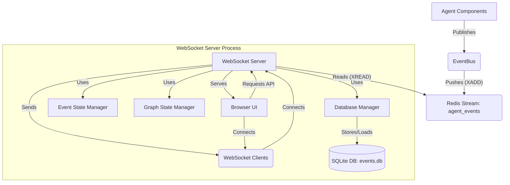

# Recursive Agent Event Logging System

## Overview

The Recursive Agent Event Logging System provides real-time visibility into the execution of the agent through a Redis-based event streaming architecture, backed by a persistent SQLite database. This document describes the system design, event schemas, database structure, and instructions for developers who want to build enhanced UI visualizations for monitoring agent runs.

## System Architecture

The event logging system consists of several main components:

1.  **Event Bus** (`recursive/utils/event_bus.py`): Handles the emission of events from the agent.
2.  **Instrumentation Points**: Strategic locations in the codebase where events are emitted to track agent execution using the Event Bus.
3.  **Redis Stream**: (`agent_events` by default) Acts as the message broker for real-time event distribution.
4.  **SQLite Database**: (`runs/events.db` by default) Persistently stores all events, node data, and graph structure for analysis and session replay.
5.  **Database Manager** (`recursive/utils/db_manager.py`): Manages the SQLite connection, schema creation, and data storage/retrieval logic.
6.  **WebSocket Server** (`recursive/utils/ws_server.py`): A FastAPI server that:
    - Reads events from the Redis stream.
    - Stores events and related graph data into the SQLite database via the `DatabaseManager`.
    - Updates in-memory state managers (`EventStateManager`, `GraphStateManager`) for real-time API access.
    - Optionally reloads the latest run state from the database on startup.
    - Forwards live events to connected WebSocket clients.
    - Serves the React UI.



## Core Components and Files

| Component         | File Path                                | Description                                                        |
| ----------------- | ---------------------------------------- | ------------------------------------------------------------------ |
| EventBus          | `recursive/utils/event_bus.py`           | Defines event types, schemas, and publish methods                  |
| WebSocket Server  | `recursive/utils/ws_server.py`           | Relays events, stores data, manages state, serves UI               |
| Database Manager  | `recursive/utils/db_manager.py`          | Handles SQLite connection, schema, storage, retrieval              |
| Event State Mgr   | `recursive/utils/event_state_manager.py` | Manages in-memory list of events for the current/latest run        |
| Graph State Mgr   | `recursive/utils/graph_state_manager.py` | Manages in-memory graph state for the current/latest run           |
| Standalone Server | `server-main.py`                         | Entry point for running the WebSocket server as a separate process |
| React UI Source   | `ui-react/`                              | Source code for the React/Redux/Bootstrap event visualization UI   |
| Basic UI          | `ui/index.html`                          | ~~Simple visualization of event stream~~ (REMOVED)                 |
| SQLite Database   | `runs/events.db` (default)               | Persistent storage for all runs, events, nodes, and edges          |

## Event Schema

All events follow a common base schema (`Event` class in `recursive/utils/event_bus.py`) and are serialized as JSON:

```json
{
  "event_id": "uuid-string",
  "timestamp": "2025-04-16T10:30:45.123Z",
  "event_type": "step_started|step_finished|...",
  "payload": {
    /* Event-specific data */
  },
  "run_id": "agent-run-uuid"
}
```

### Event Types and Payloads

The system emits 14 types of events, all defined in the `EventType` enum in `recursive/utils/event_bus.py`:

#### 1. `run_started` (Implemented)

Emitted once at the beginning of an agent run.

**Emission Point**: In `story_writing()` and `report_writing()` functions, after reading input data.

**Payload**:

```json
{
  "input_data": {
    "filename": "path/to/input.jsonl",
    "data": [
      // Array of input items from JSONL file
      { "id": "task-1", "prompt": "..." },
      { "id": "task-2", "prompt": "..." }
    ]
  },
  "config": {
    "model": "gpt-4o",
    "engine_backend": "google",
    "start": 0,
    "end": 50,
    "today_date": "Apr 22, 2025",
    "planning_config": {
      "language": "en",
      "task_types": ["COMPOSITION", "REASONING", "RETRIEVAL"],
      "agents": {
        "plan": "UpdateAtomPlanningAgent",
        "execute": "SimpleExecutor"
      },
      "composition_settings": {
        "prompt_versions": {
          "execute": "ReportWriter",
          "atom": {
            "without_update": "ReportAtom",
            "with_update": "ReportAtomWithUpdate"
          }
        }
      },
      "retrieval_settings": {
        "search_config": {
          "backend": "google",
          "region": "US",
          "max_turn": 4
        }
      }
    }
  },
  "run_mode": "report",
  "timestamp_utc": "2025-04-22T10:00:00.000Z"
}
```

#### 2. `step_started`

Emitted when the engine begins a new execution step. Generated in `recursive/engine.py:forward_one_step_not_parallel()`. The `node_goal` is included in the explicit payload, but other context fields (`node_id`, `task_type`) might be added by the event bus if available.

```json
{
  "event_type": "step_started",
  "payload": {
    "step": 42,
    "node_id": "node-uuid-string",
    "task_type": "REASONING",
    "node_goal": "Analyze customer feedback data",
    "root_id": "root-node-uuid-string"
  }
}
```

**Emission point**: `emit_step_started()` in file `recursive/engine.py` around line ~215

#### 3. `step_finished`

Emitted when an execution step completes. Generated in `recursive/engine.py:forward_one_step_not_parallel()`. Contextual fields (`node_id`, `task_type`, `task_goal`, etc.) are added by the event bus from the provided `ExecutionContext`.

```json
{
  "event_type": "step_finished",
  "payload": {
    "step": 42,
    "node_id": "node-uuid-string",
    "action_name": "analyze",
    "status_after": "PLANNING_POST_REFLECT",
    "duration_seconds": 3.75,
    "task_type": "REASONING",
    "task_goal": "Analyze customer feedback data"
  }
}
```

**Emission point**: `emit_step_finished()` in file `recursive/engine.py` around line ~240

#### 4. `node_status_changed`

Emitted when a node's status transitions to a new state. The status values come from `recursive/common/enums.py:TaskStatus`. Contextual fields (`step`, `node_id`, `task_type`, `task_goal`, etc.) are added by the event bus from the provided `ExecutionContext`.

```json
{
  "event_type": "node_status_changed",
  "payload": {
    "node_id": "node-uuid-string",
    "node_goal": "Generate conclusion paragraph",
    "old_status": "PLANNING",
    "new_status": "DOING",
    "step": 42,
    "task_type": "COMPOSITION"
  }
}
```

**Emission point**: `emit_node_status_changed()` in file `recursive/node/abstract.py` inside the `do_exam()` method

**Status values**: Defined in `recursive/common/enums.py` as `TaskStatus` enum (e.g., `NOT_READY`, `READY`, `PLANNING`, `PLANNING_POST_REFLECT`, `DOING`, `FINISH`)

#### 5. `llm_call_started`

Emitted when the agent initiates an LLM call. The agent class is passed explicitly and also added to the context. Contextual fields (`step`, `node_id`, `task_type`, `task_goal`, `action_name`, etc.) are added by the event bus from the provided `ExecutionContext`.

```json
{
  "event_type": "llm_call_started",
  "payload": {
    "agent_class": "SimpleExecutor",
    "model": "gpt-4o",
    "prompt_preview": "...",
    "prompt": [
      { "role": "system", "content": "You are a helpful assistant." },
      {
        "role": "user",
        "content": "Given the following information, generate a conclusion paragraph..."
      }
    ],
    "step": 51,
    "node_id": "node-uuid-string",
    "task_type": "REASONING",
    "action_name": "execute"
  }
}
```

**Emission point**: `emit_llm_call_started()` in file `recursive/agent/base.py` in the `call_llm()` method
**Agent classes**: Found in `recursive/agent/` directory (e.g., `simple_executor.py`, `final_aggregate.py`)

#### 6. `llm_call_completed`

Emitted when an LLM call completes with results or errors. Contextual fields (`step`, `node_id`, `task_type`, `task_goal`, `action_name`, etc.) are added by the event bus from the provided `ExecutionContext`.

```json
{
  "event_type": "llm_call_completed",
  "payload": {
    "agent_class": "SimpleExecutor",
    "model": "gpt-4o",
    "duration_seconds": 2.34,
    "result_summary": "...",
    "response": "The analysis of customer feedback reveals three primary concerns: product usability, customer support responsiveness, and pricing clarity. Addressing these areas proactively can significantly enhance user satisfaction.",
    "step": 51,
    "token_usage": {
      "prompt_tokens": 1234,
      "completion_tokens": 567
    },
    "node_id": "node-uuid-string",
    "error": null,
    "task_type": "REASONING",
    "action_name": "execute"
  }
}
```

**Emission point**: `emit_llm_call_completed()` in file `recursive/agent/base.py` in the `call_llm()` method

#### 7. `tool_invoked`

Emitted when the agent invokes a tool. Tools are defined in the `recursive/executor/action/` directory. Contextual fields (`step`, `node_id`, `task_type`, `task_goal`, `agent_class`, `action_name`, etc.) are added by the event bus from the provided `ExecutionContext` (assuming the caller agent added `agent_class` to the context).

```json
{
  "event_type": "tool_invoked",
  "payload": {
    "tool_name": "search",
    "api_name": "run",
    "args_summary": "{\"query\": \"recent advancements in reinforcement learning\", \"limit\": 5}",
    "node_id": "node-uuid-string",
    "step": 52,
    "agent_class": "SearchAgent"
  }
}
```

**Emission point**: `emit_tool_invoked()` in file `recursive/executor/action/action_executor.py` in the `__call__()` method
**Tool definitions**: Found in `recursive/executor/action/` directory

#### 8. `tool_returned`

Emitted when a tool execution completes. The state comes from `recursive/executor/schema.py:ActionStatusCode` enum. Contextual fields (`step`, `node_id`, `task_type`, `task_goal`, `agent_class`, `action_name`, etc.) are added by the event bus from the provided `ExecutionContext`.

```json
{
  "event_type": "tool_returned",
  "payload": {
    "tool_name": "search",
    "api_name": "run",
    "state": "SUCCESS",
    "duration_seconds": 1.23,
    "result_summary": "[{\"title\": \"Recent Advances in RL\", \"url\": \"http://example.com/paper1\"}...]",
    "node_id": "node-uuid-string",
    "error": null,
    "step": 52,
    "agent_class": "SearchAgent"
  }
}
```

**Emission point**: `emit_tool_returned()` in file `recursive/executor/action/action_executor.py` in the `__call__()` method
**Status values**: Defined in `recursive/executor/schema.py` as `ActionStatusCode` enum (e.g., `SUCCESS`, `ING`, `HTTP_ERROR`, `ARGS_ERROR`, `API_ERROR`)

#### 9. `node_created`

Emitted when an `AbstractNode` is instantiated. Includes the execution step number if context is available (e.g., if created during a planning step). The `node_id`, `task_type`, and `task_goal` are passed explicitly as they are fundamental properties of the node being created.

```json
{
  "event_type": "node_created",
  "payload": {
    "node_id": "uuid-string",
    "node_nid": "1.2",
    "node_type": "PLAN_NODE",
    "task_type": "COMPOSITION",
    "task_goal": "Goal description...",
    "layer": 2,
    "outer_node_id": "uuid-string" | null,
    "root_node_id": "uuid-string",
    "initial_parent_nids": ["1.1", "0.3"],
    "step": 42
  }
}
```

**Emission point**: `emit_node_created()` in file `recursive/node/abstract.py` at the end of `__init__()` method.

#### 9. `plan_received`

Emitted when a node receives a raw plan (before graph building). Contextual fields (`step`, `node_id`, `task_type`, `task_goal`, etc.) are added by the event bus from the provided `ExecutionContext`.

```json
{
  "event_type": "plan_received",
  "payload": {
    "node_id": "uuid-string",
    "raw_plan": [{"id": "1.1", "goal": "...", ...}],
    "step": 42,
    "task_type": "COMPOSITION",
    "task_goal": "Write introduction"
  }
}
```

**Emission point**: `emit_plan_received()` in file `recursive/node/abstract.py` at the beginning of `plan2graph()` method.

#### 10. `node_added`

Emitted when a node is added to a `Graph` instance (specifically, an `inner_graph`). Contextual fields related to the _graph owner_ node (`step`, `node_id`, `task_type`, `task_goal`) are added by the event bus from the provided `ExecutionContext` passed during graph building.

```json
{
  "event_type": "node_added",
  "payload": {
    "graph_owner_node_id": "uuid-string",
    "added_node_id": "uuid-string",
    "added_node_nid": "1.3",
    "step": 42,
    "task_type": "COMPOSITION",
    "task_goal": "Write introduction"
  }
}
```

**Emission point**: `emit_node_added()` in file `recursive/graph.py` in the `add_node()` method.

#### 11. `edge_added`

Emitted when an edge (dependency) is added between nodes in a `Graph` instance. Contextual fields related to the _graph owner_ node (`step`, `node_id`, `task_type`, `task_goal`) are added by the event bus from the provided `ExecutionContext` passed during graph building.

```json
{
  "event_type": "edge_added",
  "payload": {
    "graph_owner_node_id": "uuid-string",
    "parent_node_id": "uuid-string",
    "child_node_id": "uuid-string",
    "parent_node_nid": "1.2",
    "child_node_nid": "1.3",
    "step": 42,
    "task_type": "COMPOSITION",
    "task_goal": "Write introduction"
  }
}
```

**Emission point**: `emit_edge_added()` in file `recursive/graph.py` in the `add_edge()` method.

#### 12. `inner_graph_built`

Emitted when a node finishes constructing its `inner_graph` from a plan. Contextual fields (`step`, `node_id`, `task_type`, `task_goal`, etc.) are added by the event bus from the provided `ExecutionContext`.

```json
{
  "event_type": "inner_graph_built",
  "payload": {
    "node_id": "uuid-string",
    "node_count": 5,
    "edge_count": 4,
    "node_ids": ["uuid1", "uuid2", ...],
    "step": 42,
    "task_type": "COMPOSITION",
    "task_goal": "Write introduction"
  }
}
```

**Emission point**: `emit_inner_graph_built()` in file `recursive/node/abstract.py` at the end of `plan2graph()` method.

#### 13. `node_result_available`

Emitted when a node computes its final result (typically via `do_action`). Contextual fields (`step`, `node_id`, `task_type`, `task_goal`, `action_name`, etc.) are added by the event bus from the provided `ExecutionContext`.

```json
{
  "event_type": "node_result_available",
  "payload": {
    "node_id": "uuid-string",
    "action_name": "execute",
    "result_summary": "Truncated result...",
    "step": 42,
    "task_type": "REASONING",
    "task_goal": "Analyze data"
  }
}
```

**Emission point**: `emit_node_result_available()` in file `recursive/node/abstract.py` at the end of `do_action()` method (after result is stored).

#### 1.2 `run_finished` (Implemented)

**Purpose**: Signals successful completion of an agent run with summary statistics.

**Emission Point**: At the end of `story_writing()` and `report_writing()` functions, after all items are processed.

**Payload**:

```json
{
  "event_type": "run_finished",
  "payload": {
    "total_steps": 42,
    "duration_seconds": 123.45,
    "total_nodes": 15,
    "total_llm_calls": 30,
    "total_tool_calls": 10,
    "token_usage_summary": {
      "total_prompt_tokens": 5000,
      "total_completion_tokens": 2000
    },
    "node_statistics": {
      "total_created": 15,
      "total_completed": 15,
      "by_type": {
        "PLAN_NODE": 5,
        "EXECUTE_NODE": 10
      }
    },
    "search_statistics": {
      // Optional, only in report mode
      "total_searches": 25,
      "total_pages_processed": 100,
      "total_search_tokens": 15000
    }
  }
}
```

**Data Sources**:

- Step count from engine
- Duration from start/end timestamps
- Node counts from root node's graph
- LLM/tool call counts from statistics tracking
- Token usage accumulated during execution
- Search statistics (report mode only) from search operations

#### 1.3 `run_error` (Implemented)

**Purpose**: Signals an unrecoverable error during run execution.

**Emission Point**: Top-level try/catch blocks in `story_writing()` and `report_writing()` functions.

**Payload**:

```json
{
  "event_type": "run_error",
  "payload": {
    "error_type": "LLMError|ToolError|GraphError",
    "error_message": "...",
    "stack_trace": "...",
    "node_id": "uuid", // Optional
    "step": 42, // Optional
    "context": {
      "last_successful_step": 41,
      "total_processed_items": 5,
      "last_item_id": "task-123",
      "engine_backend": "google" // Only in report mode
    }
  }
}
```

**Implementation Details**:

- Captures unhandled exceptions that would terminate the run
- Includes context about progress made before error
- Preserves full stack trace for debugging
- Adds mode-specific context (e.g., engine_backend for report mode)
- Optional node_id and step fields for errors during node execution

## Event Bus Implementation

The `EventBus` class in `recursive/utils/event_bus.py` is responsible for publishing events to Redis. The key methods are:

- `EventBus.publish(event)`: Pushes an event to the Redis stream
- Helper methods like `emit_step_started()`, `emit_llm_call_completed()`, etc., that create and publish specific event types

**Note:** The system previously used a global `_current_run_id` and a `set_run_id()` function. This has been **removed**. The `run_id` is now exclusively managed and propagated via the `ExecutionContext`.

The `_create_event` helper function in `event_bus.py` now extracts the `run_id` from the `ExecutionContext` passed to the emitter function (e.g., `emit_step_started(..., ctx=...)`).

## Instrumentation Points in Code

Events are emitted from various key points in the agent's execution flow. To ensure contextual information like the `run_id`, execution `step` number, `node_id`, `task_type`, `task_goal`, and `agent_class` is available when needed, an `ExecutionContext` object (`recursive/common/context.py`) is used. This object acts as a carrier for data that needs to be passed down the call stack, using the immutable `with_` method to add context specific to certain scopes (like agent calls).

### Propagating ExecutionContext

The `ExecutionContext` object, including the crucial `run_id`, is propagated down the call stack as follows:

1.  **`recursive/main.py`**: A unique `run_id` is generated. An initial `ExecutionContext` (`initial_ctx`) is created containing this `run_id`.
2.  **`story_writing()` / `report_writing()`**: These functions receive `initial_ctx` as an argument.
3.  **`GraphRunEngine.__init__`**: Receives `initial_ctx` from `story_writing` or `report_writing` and stores it as `self.initial_ctx`.
4.  **`GraphRunEngine.forward_one_step_not_parallel`**: Receives the `step` number. Creates the context for the current step (`ctx`) by calling `self.initial_ctx.with_(step=..., node_id=..., ...)`. This ensures the `run_id` from the initial context is carried forward into the step's context.
5.  **`AbstractNode.next_action_step`**: Receives `ctx` (containing `run_id`, `step`, etc.). Creates `action_step_ctx = ctx.with_(action_name=..., node_status=..., node_next_status=...)`. Passes `action_step_ctx` to `do_action`.
6.  **`AbstractNode.do_action`**: Receives `action_step_ctx`. Passes it down to the agent's `forward` method.
7.  **Agent `forward` Methods (e.g., `SimpleExecutor.forward`)**: Receives `ctx`. Passes it down to helper methods or LLM/tool calls.
8.  **`Agent.call_llm`**: Receives `ctx`. Creates `agent_ctx = ctx.with_(agent_class=self.__class__.__name__)`. Passes `agent_ctx` to the `emit_llm_call_started` and `emit_llm_call_completed` functions.
9.  **Agent methods invoking tools (e.g., potentially `SearchAgent.chat`)**: Should receive `ctx`, create `agent_ctx = ctx.with_(agent_class=self.__class__.__name__)`, and pass `agent_ctx` to the `ActionExecutor` call.
10. **`ActionExecutor.__call__`**: Receives `ctx` (expected to contain `agent_class` from the calling agent). Passes `ctx` to `emit_tool_invoked` and `emit_tool_returned`.
11. **Other Node Methods (`plan2graph`, `do_exam`)**: Receive `ctx` and pass it down. May use `ctx.with_(...)` to add node-specific context (`node_id`, `task_type`) if needed for specific event emissions within those methods (like graph building events).
12. **Event Emission (`emit_*` functions)**: Receive `ctx`. Pass it to `_create_event`.
13. **`_create_event`**: Receives `ctx`. Extracts `run_id` from `ctx` if available. It also iterates through other known context fields (`step`, `node_id`, `task_type`, `task_goal`, `agent_class`, `action_name`, `node_status`, `node_next_status`) and adds any non-null value to the event payload _if that key is not already present in the payload_.

This explicit passing and enrichment ensures that the `run_id` and other relevant context attributes are available deep within the agent logic for event emission without relying on global state.

### Event Emission Table

| Event Type              | File                                           | Method                          | Description                   |
| ----------------------- | ---------------------------------------------- | ------------------------------- | ----------------------------- |
| `step_started`          | `recursive/engine.py`                          | `forward_one_step_not_parallel` | Beginning of a step execution |
| `step_finished`         | `recursive/engine.py`                          | `forward_one_step_not_parallel` | End of a step execution       |
| `node_status_changed`   | `recursive/node/abstract.py`                   | `do_exam`                       | When a node changes status    |
| `llm_call_started`      | `recursive/agent/base.py`                      | `call_llm`                      | Before LLM API call           |
| `llm_call_completed`    | `recursive/agent/base.py`                      | `call_llm`                      | After LLM API call            |
| `tool_invoked`          | `recursive/executor/action/action_executor.py` | `__call__`                      | Before tool execution         |
| `tool_returned`         | `recursive/executor/action/action_executor.py` | `__call__`                      | After tool execution          |
| `node_created`          | `recursive/node/abstract.py`                   | `__init__`                      | Node instantiation            |
| `plan_received`         | `recursive/node/abstract.py`                   | `plan2graph`                    | Start of graph building       |
| `node_added`            | `recursive/graph.py`                           | `add_node`                      | Node added to inner graph     |
| `edge_added`            | `recursive/graph.py`                           | `add_edge`                      | Edge added to inner graph     |
| `inner_graph_built`     | `recursive/node/abstract.py`                   | `plan2graph`                    | End of graph building         |
| `node_result_available` | `recursive/node/abstract.py`                   | `do_action`                     | Node action produced result   |

## Database Storage (SQLite)

To ensure persistence and enable analysis of past runs, all events, along with the constructed graph data (nodes and edges), are stored in a SQLite database managed by the `DatabaseManager` class.

### Database Schema

The schema is designed to capture all event data and the relationships between runs, nodes, and edges.

```sql
-- Base events table storing common fields
CREATE TABLE events (
    id INTEGER PRIMARY KEY AUTOINCREMENT,
    event_id TEXT NOT NULL,          -- UUID from original event
    run_id TEXT NOT NULL,            -- Groups events by agent run
    event_type TEXT NOT NULL,        -- One of the 14 event types
    timestamp TEXT NOT NULL,         -- ISO format timestamp
    payload JSON NOT NULL,           -- Full event payload as JSON
    node_id TEXT,                    -- Optional link to related node
    created_at TIMESTAMP DEFAULT CURRENT_TIMESTAMP
);

-- Table to track runs for easier session management
CREATE TABLE runs (
    run_id TEXT PRIMARY KEY,
    start_time TEXT NOT NULL,        -- From run_started event
    end_time TEXT,                   -- From run_finished event
    status TEXT NOT NULL,            -- 'running', 'completed', 'error'
    total_steps INTEGER,
    total_nodes INTEGER,
    error_message TEXT,              -- If status is 'error'
    root_node_id TEXT,               -- Link to root node of the run
    created_at TIMESTAMP DEFAULT CURRENT_TIMESTAMP,
    updated_at TIMESTAMP DEFAULT CURRENT_TIMESTAMP
);

-- Table to store nodes
CREATE TABLE nodes (
    node_id TEXT PRIMARY KEY,        -- UUID of the node
    run_id TEXT NOT NULL,            -- Link to parent run
    node_nid TEXT NOT NULL,          -- Hierarchical ID (e.g., "1.2.3")
    node_type TEXT NOT NULL,         -- PLAN_NODE, EXECUTE_NODE, etc.
    task_type TEXT NOT NULL,         -- COMPOSITION, REASONING, etc.
    task_goal TEXT NOT NULL,         -- Node's goal/purpose
    status TEXT NOT NULL,            -- Current node status
    layer INTEGER NOT NULL,          -- Node's depth in the tree
    outer_node_id TEXT,              -- Parent node in hierarchy (if any)
    root_node_id TEXT NOT NULL,      -- Top-level node of this branch
    result JSON,                     -- Node's final output (if any)
    metadata JSON,                   -- Additional node properties
    created_at TIMESTAMP DEFAULT CURRENT_TIMESTAMP,
    updated_at TIMESTAMP DEFAULT CURRENT_TIMESTAMP,
    FOREIGN KEY (run_id) REFERENCES runs(run_id),
    FOREIGN KEY (outer_node_id) REFERENCES nodes(node_id)
);

-- Table to store node relationships (edges)
CREATE TABLE edges (
    id INTEGER PRIMARY KEY AUTOINCREMENT,
    run_id TEXT NOT NULL,            -- Link to parent run
    parent_node_id TEXT NOT NULL,    -- Source node
    child_node_id TEXT NOT NULL,     -- Target node
    parent_nid TEXT NOT NULL,        -- Parent's hierarchical ID
    child_nid TEXT NOT NULL,         -- Child's hierarchical ID
    metadata JSON,                   -- Edge properties (if any)
    created_at TIMESTAMP DEFAULT CURRENT_TIMESTAMP,
    FOREIGN KEY (run_id) REFERENCES runs(run_id),
    FOREIGN KEY (parent_node_id) REFERENCES nodes(node_id),
    FOREIGN KEY (child_node_id) REFERENCES nodes(node_id)
);
```

_(Indexes and Views are defined in `db_manager.py` for performance and querying ease)_

### Data Flow

1.  An event occurs in the agent and is published to Redis via `EventBus`.
2.  The `redis_listener` in `ws_server.py` reads the event from Redis.
3.  The event is passed to `db_manager.store_event(event)`.
4.  `store_event` inserts the base event record into the `events` table.
5.  Based on the `event_type`, specific handler methods (`_handle_run_started`, `_handle_node_created`, `_handle_edge_added`, etc.) are called to insert or update records in the `runs`, `nodes`, and `edges` tables.

## WebSocket Server Implementation

The WebSocket server (`recursive/utils/ws_server.py`) integrates the Redis listener, Database Manager, State Managers, and WebSocket broadcasting:

- **Startup (`startup_event`)**: Initializes the `DatabaseManager`. If `RELOAD_LATEST_SESSION` is true, it loads events from the latest run from the DB and replays them into the `EventStateManager` and `GraphStateManager` to restore the server's in-memory state. Connects to Redis and starts the `redis_listener` task.
- **Redis Listener (`redis_listener`)**: Continuously reads new events from Redis. For each event, it calls `db_manager.store_event()` to persist the data, then updates the in-memory state managers (`event_manager`, `graph_manager`), and finally broadcasts the raw event string to all connected WebSocket clients.
- **WebSocket Endpoint (`websocket_endpoint`)**: Handles new client connections. If historical events were loaded during startup, they are sent to the newly connected client.
- **API Endpoints (`/api/...`)**: Serve data directly from the in-memory `EventStateManager` and `GraphStateManager`, reflecting either a live run or the reloaded state.
- **Shutdown (`shutdown_event`)**: Cancels the Redis listener task and closes the SQLite database connection via `db_manager.close()`.

## Deployment Options

The event system supports two deployment options:

1. **Integrated Mode**: The WebSocket server runs as a thread within the agent process.
2. **Standalone Mode**: The WebSocket server runs as a separate process using `server-main.py`.

The standalone mode provides better reliability, especially for long-running agent sessions.

### Starting the System

The system can be configured using environment variables:

- `SQLITE_DB_PATH`: Path to the SQLite database file (default: `runs/events.db`).
- `RELOAD_LATEST_SESSION`: Set to `true` to load the state from the latest run in the database when the server starts (default: `false`).

**Integrated Mode:**

```bash
# Run agent with integrated server, persisting to default DB
python -m recursive.main --mode report --filename input.jsonl --output-filename output.jsonl --model gpt-4o

# Run agent, persisting to a specific DB and reloading state on start
export SQLITE_DB_PATH=/path/to/my_runs.db
export RELOAD_LATEST_SESSION=true
python -m recursive.main --mode report --filename input.jsonl --output-filename output.jsonl --model gpt-4o
```

**Standalone Mode:**

```bash
# Start the WebSocket server, reloading latest state from default DB
export RELOAD_LATEST_SESSION=true
python server-main.py

# In another terminal, run the agent without the integrated server
# It will still publish events to Redis, which the standalone server picks up
python -m recursive.main --no-ws-server --mode report --filename input.jsonl --output-filename output.jsonl --model gpt-4o
```

## Building Enhanced Visualizations

The event monitoring UI has been rebuilt using React, Redux Toolkit, and Bootstrap, located in the `ui-react/` directory. It provides a real-time table view of events similar to the previous basic UI but with a more robust foundation.

### Frontend Implementation for Node/Graph Events

The frontend has been updated to support all node and graph lifecycle events:

1. **Type Definitions**: `ui-react/src/features/events/eventsApi.ts`

   - Added TypeScript interfaces for all new event payload types
   - Updated `KnownEventType` union to include new event types
   - Extended `AgentEvent` union with new event variants

2. **Event Table UI**: `ui-react/src/components/EventTable.tsx`

   - Enhanced `getEventStep` and `getEventNodeId` helpers to extract data from new events
   - Added icon mappings for new event types with appropriate visual styling:
     - `node_created`: GitCommit icon (purple)
     - `plan_received`: FileCode icon (teal)
     - `node_added`: PlusCircle icon (green)
     - `edge_added`: GitFork icon (indigo)
     - `inner_graph_built`: Network icon (blue)
     - `node_result_available`: FileText icon (orange)
   - Implemented custom renderers for each new event type's details

3. **Type Guards**: No changes needed to `ui-react/src/helpers/eventType.ts`
   - Existing type guard pattern automatically supports new event types

This frontend implementation enables real-time visualization of the graph building process, showing how nodes and edges are created and connected during the execution of the agent.

### Visualization Ideas

1. **Graph Visualization**: Display the task graph with nodes colored by status. Update in real-time as nodes change state.

   - Use `node_status_changed` events to update node colors
   - Use `node_created`, `node_added`, and `edge_added` events to incrementally build the graph visualization
   - Use `inner_graph_built` events to validate the graph structure
   - Node IDs in events can be used to identify graph nodes
   - Status values come from `TaskStatus` enum in `recursive/common/enums.py`

2. **Timeline View**: Show events on a timeline with different tracks for different event types.

   - Group by event_type
   - Use timestamps for positioning
   - Color-code by event type (similar to the current basic UI)

3. **LLM Call Analysis**: Display token usage, response times, and error rates for LLM calls.

   - Track `llm_call_started` and `llm_call_completed` events
   - Calculate response times from timestamps
   - Extract token usage from `llm_call_completed` payloads
   - Display full prompt/response content (consider UI handling for long text)

4. **Progress Dashboard**: Show overall completion percentage, time spent in different phases, estimated time to completion.

   - Track node status changes to determine progress
   - Use step timestamps to estimate remaining time

5. **Execution Flow**: Visualize the sequence of steps, tool invocations, and state transitions.

   - Create a directed graph of events
   - Show causal relationships between events

6. **Graph Building Replay**: Using the new node/graph events, create a visualization that replays the graph construction process.
   - Use timestamped `node_created`, `node_added`, and `edge_added` events to animate the construction
   - Highlight the planning process by correlating with `plan_received` and `inner_graph_built` events

### Technical Guidelines

1. **WebSocket Connection**: The React UI connects to `ws://localhost:9999/ws/events` (or the configured
   host/port) using the native WebSocket API managed via RTK Query.

   - Implementation example in `ui-react/src/features/events/eventsApi.ts`

2. **Event Processing**: Deserialize JSON data from WebSocket messages into event objects.

   - Each message is a serialized `Event` object

3. **State Management**: The UI should maintain its own state, updated by incoming WebSocket events. It can also fetch the complete current graph/event state via the `/api/graph` and `/api/events` endpoints, which reflect the server's in-memory state (potentially reloaded from the DB).
4. **Session Reload**: If the server is started with `RELOAD_LATEST_SESSION=true`, the UI will initially receive a batch of historical events from the latest run via WebSocket before live events start streaming.

For UI developers: the current UI implementation in `ui-react/` provides a functional table view example. Use this as a starting point for building more sophisticated UI components or visualizations.

**Building and Running the UI:**

1. **Navigate to the UI directory:**
   ```bash
   cd ui-react
   ```
2. **Install dependencies (if not already done):**
   ```bash
   npm install
   ```
3. **Build the static assets:**
   ```bash
   npm run build
   ```
   This will create optimized static files in the `ui-react/dist` directory.
4. **Run the WebSocket Server:** Start the server using `server-main.py` (either standalone or integrated mode). The Python server will automatically serve the built React application from `ui-react/dist`.
   ```bash
   # Example: Standalone mode
   python server-main.py
   ```
5. **Access the UI:** Open your browser to `http://localhost:9999` (or the configured host/port).

**Development Mode:**

For faster development with hot-reloading, you can run the Vite development server:

1. **Navigate to the UI directory:** `cd ui-react`
2. **Start the Vite dev server:**
   ```bash
   npm run dev
   ```
