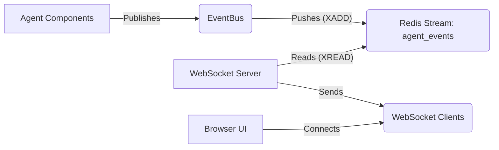

# Recursive Agent Event Logging System

## Overview

The Recursive Agent Event Logging System provides real-time visibility into the execution of the agent through a Redis-based event streaming architecture. This document describes the system design, event schemas, and instructions for developers who want to build enhanced UI visualizations for monitoring agent runs.

## System Architecture

The event logging system consists of three main components:

1. **Event Bus** (`recursive/utils/event_bus.py`): A Redis-based pub/sub mechanism that handles the emission and delivery of events from the agent to consumers.
2. **Instrumentation Points**: Strategic locations in the codebase where events are emitted to track agent execution.
3. **WebSocket Server** (`recursive/utils/ws_server.py`): A FastAPI server that reads events from Redis and forwards them to connected web clients and serves the React UI.



## Core Components and Files

| Component         | File Path                      | Description                                                        |
| ----------------- | ------------------------------ | ------------------------------------------------------------------ |
| EventBus          | `recursive/utils/event_bus.py` | Defines event types, schemas, and publish methods                  |
| WebSocket Server  | `recursive/utils/ws_server.py` | Relays events from Redis to web clients and serves the React UI    |
| Standalone Server | `server-main.py`               | Entry point for running the WebSocket server as a separate process |
| React UI Source   | `ui-react/`                    | Source code for the React/Redux/Bootstrap event visualization UI   |
| Basic UI          | `ui/index.html`                | ~~Simple visualization of event stream~~ (REMOVED)                 |

## Event Schema

All events follow a common base schema (`Event` class in `recursive/utils/event_bus.py`) and are serialized as JSON:

```json
{
  "event_id": "uuid-string",
  "timestamp": "2025-04-16T10:30:45.123Z",
  "event_type": "step_started|step_finished|...",
  "payload": {
    /* Event-specific data */
  },
  "run_id": "agent-run-uuid"
}
```

### Event Types and Payloads

The system currently emits 7 types of events, all defined in the `EventType` enum in `recursive/utils/event_bus.py`:

#### 1. `step_started`

Emitted when the engine begins a new execution step. Generated in `recursive/engine.py:forward_one_step_not_parallel()`.

```json
{
  "event_type": "step_started",
  "payload": {
    "step": 42,
    "node_id": "node-uuid-string",
    "node_goal": "Analyze customer feedback data",
    "root_id": "root-node-uuid-string"
  }
}
```

**Emission point**: `emit_step_started()` in file `recursive/engine.py` around line ~215

#### 2. `step_finished`

Emitted when an execution step completes. Generated in `recursive/engine.py:forward_one_step_not_parallel()`.

```json
{
  "event_type": "step_finished",
  "payload": {
    "step": 42,
    "node_id": "node-uuid-string",
    "action_name": "analyze",
    "status_after": "PLANNING_POST_REFLECT",
    "duration_seconds": 3.75
  }
}
```

**Emission point**: `emit_step_finished()` in file `recursive/engine.py` around line ~240

#### 3. `node_status_changed`

Emitted when a node's status transitions to a new state. The status values come from `recursive/common/enums.py:TaskStatus`.

```json
{
  "event_type": "node_status_changed",
  "payload": {
    "node_id": "node-uuid-string",
    "node_goal": "Generate conclusion paragraph",
    "old_status": "PLANNING",
    "new_status": "DOING"
  }
}
```

**Emission point**: `emit_node_status_changed()` in file `recursive/node/abstract.py` inside the `do_exam()` method

**Status values**: Defined in `recursive/common/enums.py` as `TaskStatus` enum (e.g., `NOT_READY`, `READY`, `PLANNING`, `PLANNING_POST_REFLECT`, `DOING`, `FINISH`)

#### 4. `llm_call_started`

Emitted when the agent initiates an LLM call. The agent class is the name of the agent class (e.g., `SimpleExecutor`, `FinalAggregateAgent`).

```json
{
  "event_type": "llm_call_started",
  "payload": {
    "agent_class": "SimpleExecutor",
    "model": "gpt-4o",
    "prompt_preview": "Given the following information, generate a conclusion paragraph that...",
    "node_id": "node-uuid-string"
  }
}
```

**Emission point**: `emit_llm_call_started()` in file `recursive/agent/base.py` in the `call_llm()` method
**Agent classes**: Found in `recursive/agent/` directory (e.g., `simple_executor.py`, `final_aggregate.py`)

#### 5. `llm_call_completed`

Emitted when an LLM call completes with results or errors.

```json
{
  "event_type": "llm_call_completed",
  "payload": {
    "agent_class": "SimpleExecutor",
    "model": "gpt-4o",
    "duration_seconds": 2.34,
    "result_summary": "The analysis of customer feedback reveals three primary concerns...",
    "token_usage": {
      "prompt_tokens": 1234,
      "completion_tokens": 567
    },
    "node_id": "node-uuid-string",
    "error": null // Present only if there was an error
  }
}
```

**Emission point**: `emit_llm_call_completed()` in file `recursive/agent/base.py` in the `call_llm()` method

#### 6. `tool_invoked`

Emitted when the agent invokes a tool. Tools are defined in the `recursive/executor/action/` directory.

```json
{
  "event_type": "tool_invoked",
  "payload": {
    "tool_name": "search",
    "api_name": "run",
    "args_summary": "{\"query\": \"recent advancements in reinforcement learning\", \"limit\": 5}",
    "node_id": "node-uuid-string"
  }
}
```

**Emission point**: `emit_tool_invoked()` in file `recursive/executor/action/action_executor.py` in the `__call__()` method
**Tool definitions**: Found in `recursive/executor/action/` directory

#### 7. `tool_returned`

Emitted when a tool execution completes. The state comes from `recursive/executor/schema.py:ActionStatusCode` enum.

```json
{
  "event_type": "tool_returned",
  "payload": {
    "tool_name": "search",
    "api_name": "run",
    "state": "SUCCESS",
    "duration_seconds": 1.23,
    "result_summary": "[{\"title\": \"Recent Advances in RL\", \"url\": \"http://example.com/paper1\"}...]",
    "node_id": "node-uuid-string",
    "error": null // Present only if there was an error
  }
}
```

**Emission point**: `emit_tool_returned()` in file `recursive/executor/action/action_executor.py` in the `__call__()` method
**Status values**: Defined in `recursive/executor/schema.py` as `ActionStatusCode` enum (e.g., `SUCCESS`, `ING`, `HTTP_ERROR`, `ARGS_ERROR`, `API_ERROR`)

## Event Bus Implementation

The `EventBus` class in `recursive/utils/event_bus.py` is responsible for publishing events to Redis. The key methods are:

- `EventBus.publish(event)`: Pushes an event to the Redis stream
- `set_run_id(run_id)`: Sets a global run ID for all events in this process
- Helper methods like `emit_step_started()`, `emit_llm_call_completed()`, etc., that create and publish specific event types

## Instrumentation Points in Code

| Event Type            | File                                           | Method                          | Description                   |
| --------------------- | ---------------------------------------------- | ------------------------------- | ----------------------------- |
| `step_started`        | `recursive/engine.py`                          | `forward_one_step_not_parallel` | Beginning of a step execution |
| `step_finished`       | `recursive/engine.py`                          | `forward_one_step_not_parallel` | End of a step execution       |
| `node_status_changed` | `recursive/node/abstract.py`                   | `do_exam`                       | When a node changes status    |
| `llm_call_started`    | `recursive/agent/base.py`                      | `call_llm`                      | Before LLM API call           |
| `llm_call_completed`  | `recursive/agent/base.py`                      | `call_llm`                      | After LLM API call            |
| `tool_invoked`        | `recursive/executor/action/action_executor.py` | `__call__`                      | Before tool execution         |
| `tool_returned`       | `recursive/executor/action/action_executor.py` | `__call__`                      | After tool execution          |

## WebSocket Server Implementation

The WebSocket server (`recursive/utils/ws_server.py`) contains these key components:

- `redis_listener(redis_client)`: Asynchronous function that reads from Redis stream and broadcasts to clients
- `websocket_endpoint(websocket)`: Handles WebSocket connections and message passing
- `run_server()`: Starts the Uvicorn server with the FastAPI app
- `start_ws_thread()`: Starts the server in a background thread (used in integrated mode)

The WebSocket URL endpoint is: `/ws/events` (e.g., `ws://localhost:9999/ws/events`)

## Deployment Options

The event system supports two deployment options:

1. **Integrated Mode**: The WebSocket server runs as a thread within the agent process.
2. **Standalone Mode**: The WebSocket server runs as a separate process using `server-main.py`.

The standalone mode provides better reliability, especially for long-running agent sessions.

### Starting the System

**Integrated Mode:**

```bash
python -m recursive.main --mode report --filename input.jsonl --output-filename output.jsonl --model gpt-4o
```

**Standalone Mode:**

```bash
# Start the WebSocket server in a separate terminal
python server-main.py

# Run the agent without starting the WebSocket server
python -m recursive.main --no-ws-server --mode report --filename input.jsonl --output-filename output.jsonl --model gpt-4o
```

## Building Enhanced Visualizations

The event monitoring UI has been rebuilt using React, Redux Toolkit, and Bootstrap, located in the `ui-react/` directory. It provides a real-time table view of events similar to the previous basic UI but with a more robust foundation.

### Visualization Ideas

1. **Graph Visualization**: Display the task graph with nodes colored by status. Update in real-time as nodes change state.

   - Use `node_status_changed` events to update node colors
   - Node IDs in events can be used to identify graph nodes
   - Status values come from `TaskStatus` enum in `recursive/common/enums.py`

2. **Timeline View**: Show events on a timeline with different tracks for different event types.

   - Group by event_type
   - Use timestamps for positioning
   - Color-code by event type (similar to the current basic UI)

3. **LLM Call Analysis**: Display token usage, response times, and error rates for LLM calls.

   - Track `llm_call_started` and `llm_call_completed` events
   - Calculate response times from timestamps
   - Extract token usage from `llm_call_completed` payloads

4. **Progress Dashboard**: Show overall completion percentage, time spent in different phases, estimated time to completion.

   - Track node status changes to determine progress
   - Use step timestamps to estimate remaining time

5. **Execution Flow**: Visualize the sequence of steps, tool invocations, and state transitions.
   - Create a directed graph of events
   - Show causal relationships between events

### Technical Guidelines

1. **WebSocket Connection**: The React UI connects to `ws://localhost:9999/ws/events` (or the configured host/port) using the native WebSocket API managed via RTK Query.

   - Implementation example in `ui-react/src/features/events/eventsApi.ts`

2. **Event Processing**: Deserialize JSON data from WebSocket messages into event objects.

   - Each message is a serialized `Event` object

3. **State Management**: Maintain a client-side state model that gets updated with incoming events.

   - Track node statuses
   - Build graph representation
   - Maintain statistics on LLM and tool usage

For UI developers: the current UI implementation in `ui-react/` provides a functional table view example. Use this as a starting point for building more sophisticated UI components or visualizations.

**Building and Running the UI:**

1. **Navigate to the UI directory:**
   ```bash
   cd ui-react
   ```
2. **Install dependencies (if not already done):**
   ```bash
   npm install
   ```
3. **Build the static assets:**
   ```bash
   npm run build
   ```
   This will create optimized static files in the `ui-react/dist` directory.
4. **Run the WebSocket Server:** Start the server using `server-main.py` (either standalone or integrated mode). The Python server will automatically serve the built React application from `ui-react/dist`.
   ```bash
   # Example: Standalone mode
   python server-main.py
   ```
5. **Access the UI:** Open your browser to `http://localhost:9999` (or the configured host/port).

**Development Mode:**

For faster development with hot-reloading, you can run the Vite development server:

1. **Navigate to the UI directory:** `cd ui-react`
2. **Start the Vite dev server:**
   ```bash
   npm run dev
   ```
   This will typically start the UI on `http://localhost:5173` (check terminal output for the exact port).
3. **Run the Python WebSocket server:** Start `server-main.py` separately.
4. **Access the UI:** Open the URL provided by the Vite dev server (e.g., `http://localhost:5173`). The React app running on the dev server will still connect to the WebSocket endpoint (`ws://localhost:9999/ws/events`) provided by the Python server.

## Accessing Node Structure

For more advanced visualizations, you might want to access the full node structure:

1. The `step_started` event includes the `root_id`, which is the hashkey of the root node
2. Use the `node_id` values from various events to build a graph structure
3. The status changes in `node_status_changed` events can be used to update node states
4. If available, monitor the `nodes.json` file specified by the `--nodes-json-file` option to get the full graph structure

## Conclusion

The event logging system provides a foundation for real-time monitoring and analytics of the Recursive Agent. By building enhanced visualizations on top of this system, developers can gain deeper insights into agent behavior, debug issues more effectively, and optimize agent performance.

For UI developers: the current UI implementation in `ui-react/` provides a functional table view example. Use this as a starting point for building more sophisticated UI components or visualizations.
