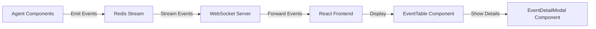
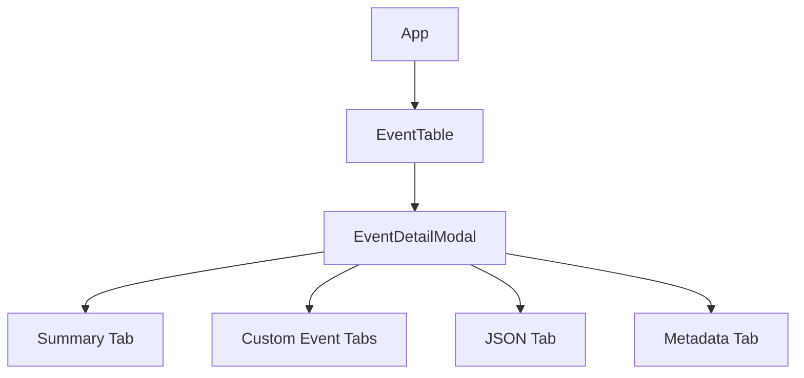
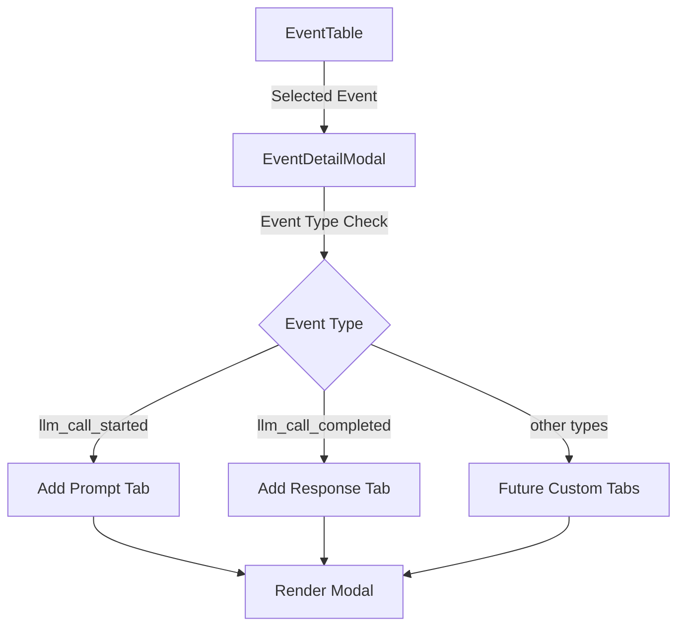

# React Event Modal Implementation Guide

## Introduction

This guide provides a comprehensive overview of the event visualization system in our agent monitoring UI, with specific focus on the implementation of modal dialogs that display detailed information about agent events. The event system visualizes the execution flow of our recursive agent architecture through a real-time event stream displayed in a tabular format, with the ability to view detailed information about each event in modal dialogs.

The target audience for this guide includes frontend developers who are working on enhancing the agent monitoring UI, particularly those who need to implement new modal views for different event types or extend the existing modal functionality.

## Architecture Overview

### Event Visualization System Architecture

The event visualization system follows a data flow architecture where agent events are emitted from the backend, stored in Redis, and streamed to the frontend through WebSockets. The frontend components then process and display these events to users.



### Component Structure

The event visualization system consists of several key React components:



The `EventTable` component displays a list of all events with basic information. When a user clicks on an event row, the `EventDetailModal` component is opened to show detailed information about the selected event in a tabbed interface.

## Event Modal Architecture

The `EventDetailModal` component is designed with extensibility in mind, using a tabbed interface where:

1. **Base Tabs**: Summary, JSON, and Metadata tabs are always present for all event types
2. **Special Tabs**: Additional tabs can be dynamically added based on the event type

This architecture allows for easy addition of specialized visualizations for different event types without modifying the core modal structure.

### Data Flow



## Requirements for Event Modal Implementation

When implementing event modals or extending the current implementation, developers should consider the following requirements:

1. **Consistency**: Maintain a consistent UI pattern across different event types
2. **Extensibility**: Design components that can be easily extended for new event types
3. **Readability**: Ensure that large text content (like prompts and responses) is properly formatted and readable
4. **Performance**: Handle potentially large event payloads efficiently
5. **Usability**: Provide intuitive navigation between different views of the event data

## Implementation Guide

### Core Modal Structure

The `EventDetailModal` component is structured as a React Bootstrap modal with tabs. Here's the basic structure:

```typescript
import React, { useState } from "react";
import { Modal, Tab, Nav, Button, Badge } from "react-bootstrap";
import { AgentEvent } from "../features/events/eventsApi";

interface EventDetailModalProps {
  show: boolean;
  onHide: () => void;
  event: AgentEvent | null;
}

const EventDetailModal: React.FC<EventDetailModalProps> = ({
  show,
  onHide,
  event,
}) => {
  const [activeTab, setActiveTab] = useState("summary");

  if (!event) return null;

  // Rendering logic...

  return (
    <Modal
      show={show}
      onHide={onHide}
      size="lg"
      aria-labelledby="event-detail-modal"
      centered
    >
      <Modal.Header closeButton>
        <Modal.Title>{/* Event title */}</Modal.Title>
      </Modal.Header>
      <Modal.Body className="p-0">
        <Tab.Container
          activeKey={activeTab}
          onSelect={(k) => setActiveTab(k || "summary")}
        >
          <Nav variant="tabs">{/* Tab navigation items */}</Nav>
          <Tab.Content>{/* Tab content */}</Tab.Content>
        </Tab.Container>
      </Modal.Body>
    </Modal>
  );
};
```

### Adding Special Tabs for Event Types

The modal uses a dynamic approach to add special tabs based on the event type. This is done through the `getSpecialTabs` function:

```typescript
const getSpecialTabs = () => {
  if (isEventType("llm_call_started")(event) && event.payload.prompt) {
    return [
      {
        key: "prompt",
        title: "Prompt",
        content: (
          <div className="card">
            <div className="card-header bg-light py-2">
              <strong>Full Prompt</strong>
            </div>
            <div className="card-body">
              {renderPromptMessages(event.payload.prompt)}
            </div>
          </div>
        ),
      },
    ];
  }

  if (isEventType("llm_call_completed")(event) && event.payload.response) {
    return [
      {
        key: "response",
        title: "Response",
        content: (
          <div className="card">
            <div className="card-header bg-light py-2">
              <strong>Full Response</strong>
            </div>
            <div className="card-body">{/* Response content */}</div>
          </div>
        ),
      },
    ];
  }

  return [];
};

const specialTabs = getSpecialTabs();
```

These special tabs are then rendered in the modal:

```typescript
<Nav variant="tabs" className="px-3 pt-3">
  <Nav.Item>
    <Nav.Link eventKey="summary">Summary</Nav.Link>
  </Nav.Item>
  {specialTabs.map(tab => (
    <Nav.Item key={tab.key}>
      <Nav.Link eventKey={tab.key}>{tab.title}</Nav.Link>
    </Nav.Item>
  ))}
  <Nav.Item>
    <Nav.Link eventKey="json">JSON</Nav.Link>
  </Nav.Item>
  <Nav.Item>
    <Nav.Link eventKey="metadata">Metadata</Nav.Link>
  </Nav.Item>
</Nav>

<Tab.Content className="p-3">
  <Tab.Pane eventKey="summary">
    {renderSummaryContent()}
  </Tab.Pane>
  {specialTabs.map(tab => (
    <Tab.Pane key={tab.key} eventKey={tab.key}>
      {tab.content}
    </Tab.Pane>
  ))}
  {/* Other standard tabs */}
</Tab.Content>
```

### Event Type-Specific Rendering

For rendering different content based on event types, we use type guards provided by the `isEventType` helper function:

```typescript
import { isEventType } from "../helpers/eventType";

// In component...
if (isEventType("llm_call_started")(event)) {
  // Render llm_call_started specific content
}
```

This helper function ensures proper TypeScript typing so we can safely access event-specific payload properties.

### Handling Complex Data: The Prompt Example

For complex data like LLM prompts which contain multiple messages, we implement special renderers:

```typescript
const renderPromptMessages = (messages: LlmMessage[]) => {
  return (
    <div className="prompt-messages">
      {messages.map((message, index) => (
        <div
          key={index}
          className={`message message-${message.role} mb-3 p-3 rounded`}
        >
          <div className="message-header mb-2">
            <Badge
              bg={
                message.role === "system"
                  ? "secondary"
                  : message.role === "assistant"
                  ? "success"
                  : "primary"
              }
              className="text-uppercase"
            >
              {message.role}
            </Badge>
          </div>
          <div className="message-content">
            <pre
              style={{
                maxHeight: "300px",
                overflowY: "auto",
                whiteSpace: "pre-wrap",
                margin: 0,
              }}
            >
              {message.content}
            </pre>
          </div>
        </div>
      ))}
    </div>
  );
};
```

## Step-by-Step Guide: Adding a New Event Type Tab

Let's walk through the process of adding a new special tab for a hypothetical event type `tool_details` that contains detailed information about tool execution.

### 1. Identify the Event Type and Structure

First, understand the structure of the event you want to create a special tab for:

```typescript
// Example tool_details event structure
{
  "event_id": "123-456-789",
  "timestamp": "2025-04-17T14:30:00Z",
  "event_type": "tool_details",
  "payload": {
    "tool_name": "data_analyzer",
    "execution_steps": [
      { "step": 1, "action": "Load data", "status": "completed" },
      { "step": 2, "action": "Transform data", "status": "completed" },
      { "step": 3, "action": "Generate insights", "status": "error" }
    ],
    "execution_log": "Detailed execution log...",
    "performance_metrics": {
      "cpu_usage": "45%",
      "memory_usage": "128MB",
      "execution_time": "3.2s"
    }
  }
}
```

### 2. Create a Type Guard (if needed)

If this is a new event type, you may need to add it to the `KnownEventType` union type in `eventsApi.ts`:

```typescript
export type KnownEventType =
  | "step_started"
  | "step_finished"
  | "node_status_changed"
  | "llm_call_started"
  | "llm_call_completed"
  | "tool_invoked"
  | "tool_returned"
  | "tool_details"; // Added new event type
```

### 3. Update the Event Modal Implementation

Next, extend the `getSpecialTabs` function to handle the new event type:

```typescript
const getSpecialTabs = () => {
  // Existing code for other event types...

  if (isEventType("tool_details")(event) && event.payload.execution_steps) {
    return [
      {
        key: "execution_details",
        title: "Execution Details",
        content: (
          <div className="card">
            <div className="card-header bg-light py-2">
              <strong>Tool Execution Steps</strong>
            </div>
            <div className="card-body">
              <div className="execution-timeline">
                {event.payload.execution_steps.map((step, index) => (
                  <div
                    key={index}
                    className={`execution-step mb-2 p-2 border-start border-3 ps-3 ${
                      step.status === "completed"
                        ? "border-success"
                        : step.status === "error"
                        ? "border-danger"
                        : "border-warning"
                    }`}
                  >
                    <div className="d-flex justify-content-between">
                      <strong>
                        Step {step.step}: {step.action}
                      </strong>
                      <Badge
                        bg={
                          step.status === "completed"
                            ? "success"
                            : step.status === "error"
                            ? "danger"
                            : "warning"
                        }
                      >
                        {step.status}
                      </Badge>
                    </div>
                  </div>
                ))}
              </div>

              <h5 className="mt-4">Performance Metrics</h5>
              <div className="row">
                <div className="col-md-4">
                  <div className="card bg-light">
                    <div className="card-body text-center">
                      <h6>CPU Usage</h6>
                      <div className="h4">
                        {event.payload.performance_metrics.cpu_usage}
                      </div>
                    </div>
                  </div>
                </div>
                <div className="col-md-4">
                  <div className="card bg-light">
                    <div className="card-body text-center">
                      <h6>Memory Usage</h6>
                      <div className="h4">
                        {event.payload.performance_metrics.memory_usage}
                      </div>
                    </div>
                  </div>
                </div>
                <div className="col-md-4">
                  <div className="card bg-light">
                    <div className="card-body text-center">
                      <h6>Execution Time</h6>
                      <div className="h4">
                        {event.payload.performance_metrics.execution_time}
                      </div>
                    </div>
                  </div>
                </div>
              </div>
            </div>
          </div>
        ),
      },
      {
        key: "execution_log",
        title: "Execution Log",
        content: (
          <div className="card">
            <div className="card-header bg-light py-2">
              <strong>Full Execution Log</strong>
            </div>
            <div className="card-body">
              <pre
                className="bg-dark text-light p-3 rounded"
                style={{ maxHeight: "500px", overflowY: "auto" }}
              >
                {event.payload.execution_log}
              </pre>
            </div>
          </div>
        ),
      },
    ];
  }

  return [];
};
```

### 4. Add Styling for the New Components

Create styles for your new components in the `styles.css` file:

```css
/* Tool Execution Steps Styling */
.execution-timeline {
  position: relative;
}

.execution-step {
  position: relative;
  transition: background-color 0.2s ease;
}

.execution-step:hover {
  background-color: rgba(0, 0, 0, 0.05);
}
```

### 5. Update the Summary Content Rendering

Finally, update the `renderSummaryContent` function to provide a summary view for the new event type:

```typescript
const renderSummaryContent = () => {
  // Existing code for other event types...

  if (isEventType("tool_details")(event)) {
    const completedSteps = event.payload.execution_steps.filter(
      (s) => s.status === "completed"
    ).length;
    const totalSteps = event.payload.execution_steps.length;
    const hasErrors = event.payload.execution_steps.some(
      (s) => s.status === "error"
    );

    return (
      <>
        <div className="card mb-3">
          <div className="card-header bg-light py-2">
            <strong>Tool Execution Summary</strong>
          </div>
          <div className="card-body">
            <div className="row g-2">
              <div className="col-md-6">
                <p className="mb-1">
                  <strong>Tool Name:</strong> {event.payload.tool_name}
                </p>
                <p className="mb-1">
                  <strong>Execution Progress:</strong> {completedSteps}/
                  {totalSteps} steps completed
                </p>
              </div>
              <div className="col-md-6">
                <p className="mb-1">
                  <strong>Status:</strong>
                  <Badge bg={hasErrors ? "danger" : "success"} className="ms-2">
                    {hasErrors ? "Error" : "Success"}
                  </Badge>
                </p>
                <p className="mb-1">
                  <strong>Execution Time:</strong>{" "}
                  {event.payload.performance_metrics.execution_time}
                </p>
              </div>
            </div>

            <div className="mt-3 d-flex justify-content-end">
              <Button
                size="sm"
                variant="outline-primary"
                onClick={() => setActiveTab("execution_details")}
                className="me-2"
              >
                View Execution Details
              </Button>
              <Button
                size="sm"
                variant="outline-secondary"
                onClick={() => setActiveTab("execution_log")}
              >
                View Execution Log
              </Button>
            </div>
          </div>
        </div>
      </>
    );
  }

  // Default case for unknown event types...
};
```

## Mock Event Tutorial

To help you test your new event modal implementations, here's a guide on creating and testing with mock events.

### Creating a Mock Event

For development and testing purposes, you can create mock events directly in your components. Here's how to create a mock event for testing the tool details modal:

```typescript
// In a test component or mock data file
const mockToolDetailsEvent: AgentEvent = {
  event_id: "test-event-" + Math.random().toString(36).substring(2, 9),
  timestamp: new Date().toISOString(),
  event_type: "tool_details",
  run_id: "test-run-123",
  payload: {
    tool_name: "data_analyzer",
    execution_steps: [
      { step: 1, action: "Initialize analyzer", status: "completed" },
      { step: 2, action: "Load dataset from source", status: "completed" },
      { step: 3, action: "Preprocess raw data", status: "completed" },
      { step: 4, action: "Apply statistical analysis", status: "completed" },
      { step: 5, action: "Generate insights", status: "error" },
    ],
    execution_log: `[2025-04-17 14:30:00] INFO: Starting data analyzer
[2025-04-17 14:30:01] INFO: Initializing analyzer components
[2025-04-17 14:30:03] INFO: Loading dataset from source: s3://example-bucket/data.csv
[2025-04-17 14:30:05] INFO: Dataset loaded successfully (1023 records)
[2025-04-17 14:30:07] INFO: Beginning preprocessing pipeline
[2025-04-17 14:30:10] INFO: Preprocessing complete
[2025-04-17 14:30:12] INFO: Starting statistical analysis
[2025-04-17 14:30:15] INFO: Statistical analysis complete
[2025-04-17 14:30:17] ERROR: Failed to generate insights: TypeError: Cannot read property 'correlations' of undefined
[2025-04-17 14:30:17] ERROR: Stack trace:
  at GenerateInsights (/app/analyzer.js:245)
  at ProcessData (/app/analyzer.js:180)
  at RunAnalysis (/app/index.js:42)`,
    performance_metrics: {
      cpu_usage: "45%",
      memory_usage: "128MB",
      execution_time: "3.2s",
    },
  },
};
```

### Testing the Modal with Mock Events

To test your modal implementation with mock events, you can create a simple test component:

```typescript
import React, { useState } from "react";
import { Button } from "react-bootstrap";
import EventDetailModal from "./EventDetailModal";
import { AgentEvent } from "../features/events/eventsApi";

const TestEventModal: React.FC = () => {
  const [showModal, setShowModal] = useState(false);

  // Your mock event from above
  const mockEvent: AgentEvent = mockToolDetailsEvent;

  return (
    <div className="p-4">
      <h2>Event Modal Test</h2>
      <Button onClick={() => setShowModal(true)}>
        Show Tool Details Modal
      </Button>

      <EventDetailModal
        show={showModal}
        onHide={() => setShowModal(false)}
        event={mockEvent}
      />
    </div>
  );
};
```

### Integrating with EventTable for Testing

You can also modify the EventTable component temporarily to include your mock event:

```typescript
const EventTable: React.FC = () => {
  // Existing code...

  // Add mock events for testing
  const testEvents = [mockToolDetailsEvent];

  // Combine real and test events
  const allEvents = [...events, ...testEvents];
  const reversedEvents = [...allEvents].reverse();

  // Continue with existing rendering code...
};
```

## Best Practices for Event Modal Development

1. **Maintain Type Safety**: Always use the TypeScript type system and type guards to ensure you're accessing valid properties for each event type.

2. **Progressive Disclosure**: Start with summarized information and provide ways to view more details, rather than overwhelming users with all information at once.

3. **Consistent UI Patterns**: Follow the established patterns for tabs, cards, and styling to maintain consistency across all event types.

4. **Performance Considerations**: Be careful with large text content (like logs or code). Always use virtualization or pagination for large datasets.

5. **Error Handling**: Include fallbacks for missing or unexpected data in event payloads.

6. **Accessibility**: Ensure all UI elements are accessible, with proper contrast, keyboard navigation, and screen reader support.

7. **Responsive Design**: Make sure your modal components work well on different screen sizes.

## Conclusion

This guide provides a comprehensive blueprint for implementing and extending event modals in our agent monitoring UI. By following the architecture, patterns, and examples provided, you can create consistent, user-friendly, and maintainable modal components for any type of agent event.

The extensible nature of the implementation makes it straightforward to add specialized visualizations for different event types, enhancing the monitoring capabilities of the system while maintaining a coherent user experience.

Remember to thoroughly test your implementations with both real and mock data to ensure they handle all edge cases appropriately.
