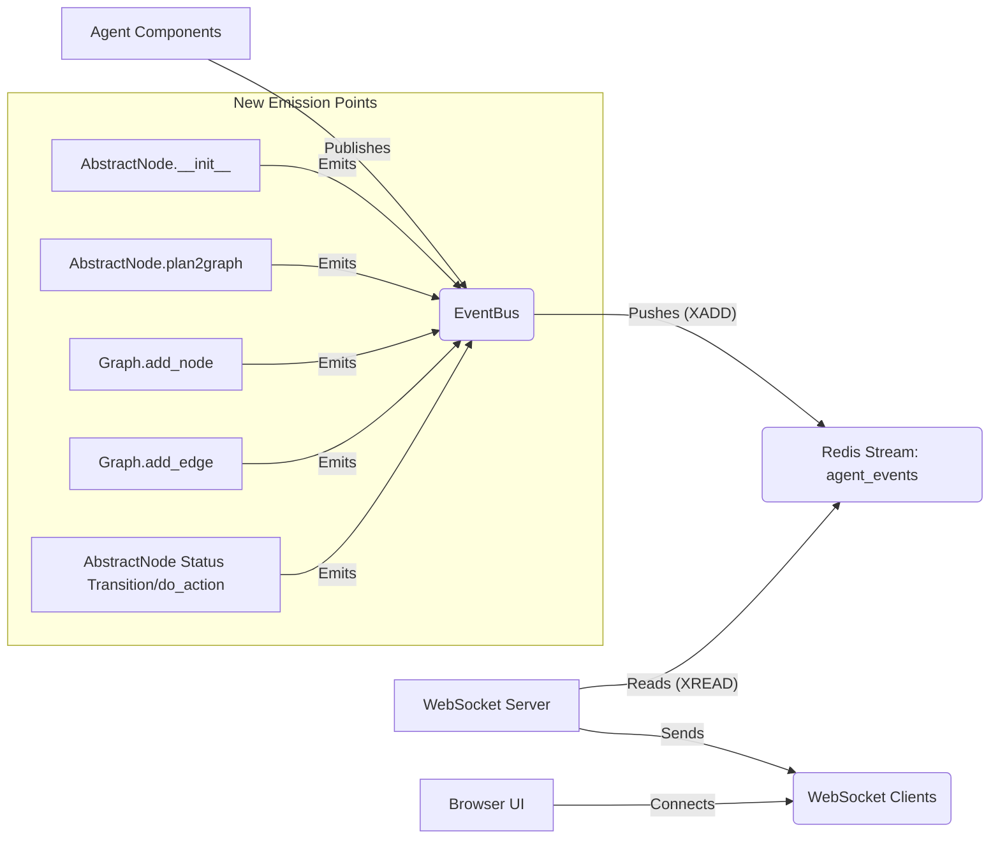

# How-To: Implement Node and Graph Lifecycle Events

## 1. Introduction

### Purpose and Value

This document guides developers on implementing new event types within the Recursive Agent's event logging system. The existing system primarily tracks high-level step execution, LLM calls, tool usage, and node status changes. While valuable, it lacks detailed insight into the dynamic construction and evolution of the internal task graphs generated during planning.

Adding events specifically for node creation, planning, graph building, and result availability provides much finer-grained visibility. This enables:

- Real-time visualization of how task graphs are constructed and modified.
- Better debugging by tracing the exact sequence of node/edge additions.
- Detailed analysis of the planning process itself.
- Richer UI representations that dynamically build the graph structure as it happens.

### Target Audience

This guide is intended for developers working on:

- The core agent execution logic (`recursive/engine.py`, `recursive/node/`, `recursive/graph.py`).
- The event emission system (`recursive/utils/event_bus.py`).
- UI components that visualize agent execution.

### Overview

We will cover:

- Defining new event types.
- Creating helper functions to emit these events.
- Integrating event emission into the `AbstractNode` and `Graph` classes.
- Propagating the `ExecutionContext` to include step information.
- Updating documentation.

## 2. Requirements and Specifications

### Functional Requirements

- Implement the following new event types:
  - `node_created`: Fired when an `AbstractNode` is instantiated.
  - `plan_received`: Fired when a node receives a raw plan (before graph building).
  - `node_added`: Fired when a node is added to a `Graph` instance (specifically, an `inner_graph`).
  - `edge_added`: Fired when an edge (dependency) is added between nodes in a `Graph` instance.
  - `inner_graph_built`: Fired when a node finishes constructing its `inner_graph` from a plan.
  - `node_result_available`: Fired when a node computes its final result (typically upon reaching `FINISH` status).
- All new events must include the standard `event_id`, `timestamp`, and `run_id`.
- Events occurring within the context of an execution step must include the `step` number in their payload.
- Event payloads should contain relevant information as defined in the schema section.

### Technical Constraints

- Leverage the existing Redis-based `EventBus` infrastructure.
- Maintain compatibility with the existing WebSocket server and basic event structure.
- Minimize performance impact of event emission.

## 3. Architecture Overview

We are extending the existing event system:



The core change involves adding calls to `EventBus.publish` (via helper functions) within the `AbstractNode` and `Graph` classes. We also need to ensure the `ExecutionContext` (containing the `step` number) is available in these methods when applicable.

## 4. Data Model / Event Schemas

All events inherit the base `Event` schema (`event_id`, `timestamp`, `event_type`, `run_id`). The specific `payload` for each new type is:

### `node_created`

```json
{
  "node_id": "uuid-string", // The node's hashkey
  "node_nid": "1.2", // Human-readable ID
  "node_type": "PLAN_NODE" | "EXECUTE_NODE",
  "task_type": "COMPOSITION" | "REASONING" | "RETRIEVAL" | "GENERAL",
  "task_goal": "Goal description...",
  "layer": 2,
  "outer_node_id": "uuid-string" | null, // Hashkey of the container node
  "root_node_id": "uuid-string", // Hashkey of the root
  "initial_parent_nids": ["1.1", "0.3"], // From raw plan, before resolution
  "step": 42 // Optional: If created during a step
}
```

### `plan_received`

```json
{
  "node_id": "uuid-string", // Node receiving the plan
  "raw_plan": [{"id": "1.1", "goal": "...", ...}], // Full raw plan
  "step": 42 // Optional: If plan received during a step
}
```

### `node_added`

```json
{
  "graph_owner_node_id": "uuid-string", // Node whose inner_graph this is
  "added_node_id": "uuid-string", // Hashkey of the node being added
  "added_node_nid": "1.3",
  "step": 42 // Optional: If added during a step
}
```

### `edge_added`

```json
{
  "graph_owner_node_id": "uuid-string", // Node whose inner_graph this is
  "parent_node_id": "uuid-string", // Hashkey of the parent node
  "child_node_id": "uuid-string", // Hashkey of the child node
  "parent_node_nid": "1.2",
  "child_node_nid": "1.3",
  "step": 42 // Optional: If added during a step
}
```

### `inner_graph_built`

```json
{
  "node_id": "uuid-string", // Node whose inner graph was built
  "node_count": 5,
  "edge_count": 4,
  "node_ids": ["uuid1", "uuid2", ...], // List of hashkeys in the graph
  "step": 42 // Optional: If built during a step
}
```

### `node_result_available`

```json
{
  "node_id": "uuid-string",
  "action_name": "execute" | "final_aggregate", // Action producing the result
  "result_summary": "Truncated result...",
  // Consider adding full result if needed and feasible
  "step": 42 // Optional: If result generated during a step
}
```

## 5. Implementation Plan

1.  **[ ] Define Event Types**: Add new types to `EventType` enum in `recursive/utils/event_bus.py`.
2.  **[ ] Create Emitter Functions**: Add `emit_*` functions for each new type in `recursive/utils/event_bus.py`. Ensure they accept `ctx: Optional[ExecutionContext]` and add `step` to the payload if `ctx` is provided.
3.  **[ ] Propagate Context (`ctx`)**: Modify method signatures to accept and pass `ctx: Optional[ExecutionContext]`:
    - `AbstractNode.__init__`
    - `AbstractNode.plan2graph`
    - `Graph.__init__` (if needed, though `outer_node` might be sufficient)
    - `Graph.add_node`
    - `Graph.add_edge`
    - Ensure `ctx` is passed down from `GraphRunEngine.forward_one_step_not_parallel` -> `next_action_step` -> `do_action` -> `plan` (or other actions) -> `plan2graph` -> `Graph` methods.
4.  **[ ] Emit `node_created`**: Call `emit_node_created` at the end of `AbstractNode.__init__`, passing `ctx`.
5.  **[ ] Emit `plan_received`**: Call `emit_plan_received` at the beginning of `AbstractNode.plan2graph`, passing `ctx`.
6.  **[ ] Emit `node_added`**: Call `emit_node_added` in `Graph.add_node`, passing `ctx`.
7.  **[ ] Emit `edge_added`**: Call `emit_edge_added` in `Graph.add_edge`, passing `ctx`.
8.  **[ ] Emit `inner_graph_built`**: Call `emit_inner_graph_built` at the end of `AbstractNode.plan2graph`, passing `ctx`.
9.  **[ ] Emit `node_result_available`**: Call `emit_node_result_available` when a node's final result is determined. A potential place is within `AbstractNode.do_action` after the result is stored, or linked to the status transition to `FINISH`. Pass `ctx` if available (likely is, as actions are step-driven).
10. **[ ] Update Documentation**: Add the new event types, schemas, and emission points to the main event system documentation (`ttmp/2025-04-17/04-long-term-document--event-logging-system.md`).

## 6. Key Features Implementation (Examples)

### Adding EventType

```python
# recursive/utils/event_bus.py
class EventType(str, Enum):
    STEP_STARTED = "step_started"
    # ... existing types ...
    TOOL_RETURNED = "tool_returned"

    # --- New Types ---
    NODE_CREATED = "node_created"
    PLAN_RECEIVED = "plan_received"
    NODE_ADDED = "node_added"
    EDGE_ADDED = "edge_added"
    INNER_GRAPH_BUILT = "inner_graph_built"
    NODE_RESULT_AVAILABLE = "node_result_available"
```

### Creating an Emitter Function (with Context)

```python
# recursive/utils/event_bus.py
from recursive.common.context import ExecutionContext # Add this import

def emit_node_created(
    node_id: str,
    node_nid: str,
    node_type: str,
    task_type: str,
    task_goal: str,
    layer: int,
    outer_node_id: Optional[str],
    root_node_id: str,
    initial_parent_nids: List[str],
    ctx: Optional[ExecutionContext] = None, # Accept context
):
    payload = {
        "node_id": node_id,
        "node_nid": node_nid,
        "node_type": node_type,
        "task_type": task_type,
        "task_goal": task_goal,
        "layer": layer,
        "outer_node_id": outer_node_id,
        "root_node_id": root_node_id,
        "initial_parent_nids": initial_parent_nids,
    }
    if ctx is not None and ctx.step is not None: # Add step if context available
        payload["step"] = ctx.step

    bus.publish(_create_event(EventType.NODE_CREATED, payload))

# ... other emitter functions similar pattern ...
```

### Integrating Emission into `AbstractNode.__init__`

```python
# recursive/node/abstract.py
from recursive.utils.event_bus import emit_node_created # Add import
from recursive.common.context import ExecutionContext # Ensure import

class AbstractNode(ABC):
    def __init__(self, config, nid, node_graph_info, task_info, node_type=None, ctx: Optional[ExecutionContext] = None):
        # ... existing init code ...
        self.config = config
        self.nid = nid
        self.hashkey = str(uuid.uuid4())
        # ... rest of assignments ...

        # --- Emit Event ---
        emit_node_created(
            node_id=self.hashkey,
            node_nid=str(self.nid),
            node_type=self.node_type.name if self.node_type else "UNKNOWN",
            task_type=self.task_type_tag, # Use property
            task_goal=self.task_info.get("goal", "N/A"),
            layer=self.node_graph_info.get("layer", -1),
            outer_node_id=self.node_graph_info.get("outer_node").hashkey if self.node_graph_info.get("outer_node") else None,
            root_node_id=self.node_graph_info.get("root_node").hashkey if self.node_graph_info.get("root_node") else "UNKNOWN",
            initial_parent_nids=[str(p_nid) for p_nid in node_graph_info.get("parent_nodes", [])], # Assuming initial list is NIDs
            ctx=ctx,
        )
```

### Integrating Emission into `Graph.add_node`

```python
# recursive/graph.py
from recursive.utils.event_bus import emit_node_added # Add import
from recursive.common.context import ExecutionContext # Add import
from typing import Optional # Add import

class Graph:
    # ... __init__ ...

    def add_node(self, node, ctx: Optional[ExecutionContext] = None):
        if node.nid in self.nid_list:
            raise Exception("Duplicate Node")
        self.nid_list.append(node.nid)
        self.node_list.append(node)
        self.graph_edges[node.nid] = []

        # --- Emit Event ---
        # Ensure outer_node exists and has a hashkey
        owner_id = self.outer_node.hashkey if self.outer_node else None
        if owner_id:
             emit_node_added(
                 graph_owner_node_id=owner_id,
                 added_node_id=node.hashkey,
                 added_node_nid=str(node.nid),
                 ctx=ctx,
             )
```

### Propagating Context (`ctx`)

Ensure `ctx` is passed through the call chain:

- `GraphRunEngine.forward_one_step_not_parallel(..., step: int)` creates `ctx = ExecutionContext(step=step)`.
- Calls `node.next_action_step(memory, ctx=ctx)`.
- `AbstractNode.next_action_step(..., ctx: Optional[ExecutionContext] = None)` calls `self.do_action(..., ctx=ctx)`.
- `AbstractNode.do_action(..., ctx: Optional[ExecutionContext] = None)` calls `getattr(self, action_name)(..., ctx=ctx)`.
- Action methods like `plan(..., ctx: Optional[ExecutionContext] = None)` call `self.plan2graph(raw_plan, ctx=ctx)`.
- `AbstractNode.plan2graph(..., ctx: Optional[ExecutionContext] = None)` calls `self.inner_graph.add_node(node, ctx=ctx)` and `self.inner_graph.add_edge(parent_node, node, ctx=ctx)`.
- Modify `Graph.add_node` and `Graph.add_edge` signatures to accept `ctx: Optional[ExecutionContext] = None`.
- Modify `AbstractNode.__init__` signature to accept `ctx` and ensure it's passed during node creation in `plan2graph`:
  ```python
  # Inside plan2graph
  node = self.__class__(
      config=self.config,
      nid=task["id"],
      node_graph_info=node_graph_info,
      task_info=task_info,
      node_type=...,
      ctx=ctx # Pass context here
  )
  ```

## 7. UI/UX Considerations

These new events directly enable richer UI experiences:

- **Live Graph Building**: The UI can listen for `node_created`, `node_added`, and `edge_added` events to construct and display the task graph dynamically as the agent plans.
- **Plan Inspection**: `plan_received` allows the UI to show the raw output from the planning agent before it's turned into a graph.
- **Result Tracking**: `node_result_available` allows displaying results alongside the corresponding node as soon as they are ready.
- **Step Correlation**: Including the `step` number allows linking graph changes precisely to the execution steps shown in other UI views.

## 8. Deployment Strategy

No changes are required to the deployment strategy. The existing Redis and WebSocket server infrastructure handles the new event types automatically.

## 9. Future Enhancements

- **Payload Optimization**: For `plan_received` and potentially `inner_graph_built`, consider sending only summaries or references if full plans become too large for Redis/WebSockets.
- **Event Filtering**: Implement server-side or client-side filtering if UIs only need specific event types.
- **Error/Retry Events**: Add events specifically for failures during planning or graph construction.

## 10. Conclusion

The addition of these node and graph lifecycle events significantly enhances the observability of the Recursive Agent. By providing detailed, real-time insights into task planning and graph construction, these events empower developers to build more sophisticated debugging tools, visualizations, and analytical dashboards, leading to a deeper understanding and improvement of the agent's behavior.
