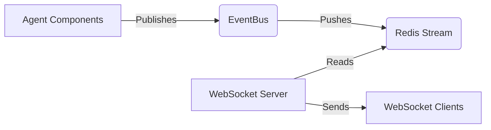
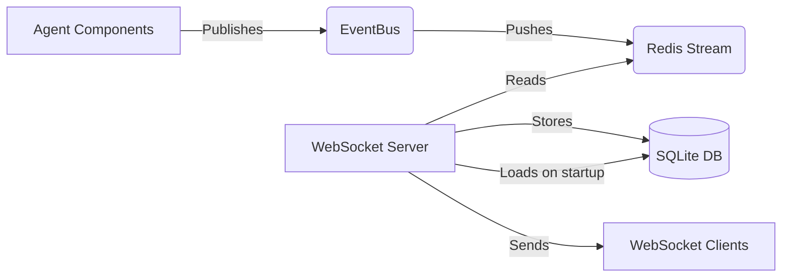

# SQLite Event Storage Implementation Guide

## Overview

This guide will help you implement SQLite storage for the Recursive Agent Event Logging System. The goal is to persist all events to a SQLite database and optionally reload the latest session when starting the WebSocket server. Additionally, we'll store the graph structure and node data to enable full session replay and analysis.

## Background

The Recursive Agent Event Logging System currently uses Redis streams to handle real-time event distribution. Events are published to Redis by various components and then read by the WebSocket server to forward to web clients. However, these events are not persisted long-term, making it difficult to analyze past runs or recover state after a restart.

### Current Event Flow



### Proposed Event Flow with SQLite



## Event Types and Schema Design

Looking at the event documentation, we have 14 different event types, each with its own payload structure, plus graph and node data that needs to be persisted. Here's how we'll model this in SQLite:

### Database Schema

```sql
-- Base events table storing common fields
CREATE TABLE events (
    id INTEGER PRIMARY KEY AUTOINCREMENT,
    event_id TEXT NOT NULL,          -- UUID from original event
    run_id TEXT NOT NULL,            -- Groups events by agent run
    event_type TEXT NOT NULL,        -- One of the 14 event types
    timestamp TEXT NOT NULL,         -- ISO format timestamp
    payload JSON NOT NULL,           -- Full event payload as JSON
    node_id TEXT,                    -- Optional link to related node
    created_at TIMESTAMP DEFAULT CURRENT_TIMESTAMP
);

-- Index for efficient querying
CREATE INDEX idx_events_run_id ON events(run_id);
CREATE INDEX idx_events_type ON events(event_type);
CREATE INDEX idx_events_timestamp ON events(timestamp);
CREATE INDEX idx_events_node_id ON events(node_id);

-- Table to track runs for easier session management
CREATE TABLE runs (
    run_id TEXT PRIMARY KEY,
    start_time TEXT NOT NULL,        -- From run_started event
    end_time TEXT,                   -- From run_finished event
    status TEXT NOT NULL,            -- 'running', 'completed', 'error'
    total_steps INTEGER,
    total_nodes INTEGER,
    error_message TEXT,              -- If status is 'error'
    root_node_id TEXT,               -- Link to root node of the run
    created_at TIMESTAMP DEFAULT CURRENT_TIMESTAMP,
    updated_at TIMESTAMP DEFAULT CURRENT_TIMESTAMP
);

-- Table to store nodes
CREATE TABLE nodes (
    node_id TEXT PRIMARY KEY,        -- UUID of the node
    run_id TEXT NOT NULL,            -- Link to parent run
    node_nid TEXT NOT NULL,          -- Hierarchical ID (e.g., "1.2.3")
    node_type TEXT NOT NULL,         -- PLAN_NODE, EXECUTE_NODE, etc.
    task_type TEXT NOT NULL,         -- COMPOSITION, REASONING, etc.
    task_goal TEXT NOT NULL,         -- Node's goal/purpose
    status TEXT NOT NULL,            -- Current node status
    layer INTEGER NOT NULL,          -- Node's depth in the tree
    outer_node_id TEXT,              -- Parent node in hierarchy (if any)
    root_node_id TEXT NOT NULL,      -- Top-level node of this branch
    result JSON,                     -- Node's final output (if any)
    metadata JSON,                   -- Additional node properties
    created_at TIMESTAMP DEFAULT CURRENT_TIMESTAMP,
    updated_at TIMESTAMP DEFAULT CURRENT_TIMESTAMP,
    FOREIGN KEY (run_id) REFERENCES runs(run_id),
    FOREIGN KEY (outer_node_id) REFERENCES nodes(node_id),
    FOREIGN KEY (root_node_id) REFERENCES nodes(node_id)
);

-- Table to store node relationships (edges)
CREATE TABLE edges (
    id INTEGER PRIMARY KEY AUTOINCREMENT,
    run_id TEXT NOT NULL,            -- Link to parent run
    parent_node_id TEXT NOT NULL,    -- Source node
    child_node_id TEXT NOT NULL,     -- Target node
    parent_nid TEXT NOT NULL,        -- Parent's hierarchical ID
    child_nid TEXT NOT NULL,         -- Child's hierarchical ID
    metadata JSON,                   -- Edge properties (if any)
    created_at TIMESTAMP DEFAULT CURRENT_TIMESTAMP,
    FOREIGN KEY (run_id) REFERENCES runs(run_id),
    FOREIGN KEY (parent_node_id) REFERENCES nodes(node_id),
    FOREIGN KEY (child_node_id) REFERENCES nodes(node_id)
);

-- Index for efficient graph traversal
CREATE INDEX idx_nodes_run_id ON nodes(run_id);
CREATE INDEX idx_nodes_nid ON nodes(node_nid);
CREATE INDEX idx_nodes_outer ON nodes(outer_node_id);
CREATE INDEX idx_nodes_root ON nodes(root_node_id);
CREATE INDEX idx_edges_run ON edges(run_id);
CREATE INDEX idx_edges_parent ON edges(parent_node_id);
CREATE INDEX idx_edges_child ON edges(child_node_id);
CREATE INDEX idx_edges_nids ON edges(parent_nid, child_nid);

-- View for node status history
CREATE VIEW node_status_history AS
SELECT
    e.node_id,
    e.run_id,
    e.timestamp,
    json_extract(e.payload, '$.old_status') as old_status,
    json_extract(e.payload, '$.new_status') as new_status
FROM events e
WHERE e.event_type = 'node_status_changed'
ORDER BY e.timestamp;

-- View for node execution timeline
CREATE VIEW node_execution_timeline AS
SELECT
    n.node_id,
    n.run_id,
    n.node_nid,
    n.task_type,
    n.task_goal,
    MIN(CASE WHEN e.event_type = 'node_created' THEN e.timestamp END) as created_time,
    MIN(CASE WHEN e.event_type = 'step_started' THEN e.timestamp END) as execution_start,
    MAX(CASE WHEN e.event_type = 'node_result_available' THEN e.timestamp END) as completion_time
FROM nodes n
LEFT JOIN events e ON n.node_id = e.node_id
GROUP BY n.node_id, n.run_id, n.node_nid, n.task_type, n.task_goal;
```

### Why This Enhanced Schema?

1. **Events Table Updates**:

   - Added `node_id` column to directly link events to related nodes
   - This enables efficient querying of all events for a particular node

2. **Nodes Table**:

   - Stores complete node information including hierarchical structure
   - Tracks node status, type, and execution results
   - Uses foreign keys to maintain data integrity
   - Includes metadata JSON field for extensibility

3. **Edges Table**:

   - Represents the graph structure explicitly
   - Stores both node IDs and NIDs for flexible querying
   - Enables reconstruction of the execution graph
   - Maintains run context for isolation

4. **Useful Views**:

   - `node_status_history`: Tracks how nodes change state over time
   - `node_execution_timeline`: Shows node lifecycle events

5. **Rich Indexing**:
   - Optimized for common query patterns
   - Supports efficient graph traversal
   - Enables fast lookups by various identifiers

### Key Relationships

1. **Run → Nodes**:

   - Each run has a root node (`runs.root_node_id`)
   - All nodes belong to a run (`nodes.run_id`)
   - Enables full graph reconstruction per run

2. **Node Hierarchy**:

   - Nodes link to their outer node (`nodes.outer_node_id`)
   - Nodes reference their root node (`nodes.root_node_id`)
   - NIDs encode the hierarchical structure

3. **Events → Nodes**:

   - Events can reference related nodes (`events.node_id`)
   - Enables timeline reconstruction
   - Supports detailed node history analysis

4. **Graph Structure**:
   - Edges table captures node relationships
   - Both ID and NID relationships preserved
   - Metadata field allows for future extensions

### Common Queries

Here are some useful queries enabled by this schema:

```sql
-- Get full node tree for a run
WITH RECURSIVE node_tree AS (
    -- Start with root node
    SELECT node_id, node_nid, task_goal, 0 as depth
    FROM nodes
    WHERE node_id = (SELECT root_node_id FROM runs WHERE run_id = ?)
    UNION ALL
    -- Add children recursively
    SELECT n.node_id, n.node_nid, n.task_goal, nt.depth + 1
    FROM nodes n
    JOIN edges e ON n.node_id = e.child_node_id
    JOIN node_tree nt ON e.parent_node_id = nt.node_id
)
SELECT * FROM node_tree ORDER BY node_nid;

-- Get node execution history with events
SELECT
    n.node_nid,
    n.task_goal,
    e.event_type,
    e.timestamp,
    e.payload
FROM nodes n
JOIN events e ON n.node_id = e.node_id
WHERE n.run_id = ?
ORDER BY e.timestamp;

-- Get node completion times
SELECT
    n.node_nid,
    n.task_goal,
    MIN(e1.timestamp) as start_time,
    MAX(e2.timestamp) as end_time,
    COUNT(DISTINCT e3.event_id) as total_events
FROM nodes n
LEFT JOIN events e1 ON n.node_id = e1.node_id AND e1.event_type = 'node_created'
LEFT JOIN events e2 ON n.node_id = e2.node_id AND e2.event_type = 'node_result_available'
LEFT JOIN events e3 ON n.node_id = e3.node_id
WHERE n.run_id = ?
GROUP BY n.node_id, n.node_nid, n.task_goal;
```

## Implementation Steps

### 1. Create Database Manager Class

Create a new file `recursive/utils/db_manager.py`:

```python
import sqlite3
import json
from pathlib import Path
from typing import Optional, Dict, List
import logging

logger = logging.getLogger(__name__)

class DatabaseManager:
    def __init__(self, db_path: str = "events.db"):
        self.db_path = db_path
        self.conn: Optional[sqlite3.Connection] = None
        self._ensure_db()

    def _ensure_db(self):
        """Creates database and tables if they don't exist."""
        create_tables_sql = '''
        -- Base events table
        CREATE TABLE IF NOT EXISTS events (
            id INTEGER PRIMARY KEY AUTOINCREMENT,
            event_id TEXT NOT NULL,
            run_id TEXT NOT NULL,
            event_type TEXT NOT NULL,
            timestamp TEXT NOT NULL,
            payload JSON NOT NULL,
            node_id TEXT,
            created_at TIMESTAMP DEFAULT CURRENT_TIMESTAMP
        );

        -- Runs tracking table
        CREATE TABLE IF NOT EXISTS runs (
            run_id TEXT PRIMARY KEY,
            start_time TEXT NOT NULL,
            end_time TEXT,
            status TEXT NOT NULL,
            total_steps INTEGER,
            total_nodes INTEGER,
            error_message TEXT,
            root_node_id TEXT,
            created_at TIMESTAMP DEFAULT CURRENT_TIMESTAMP,
            updated_at TIMESTAMP DEFAULT CURRENT_TIMESTAMP
        );

        -- Nodes table
        CREATE TABLE IF NOT EXISTS nodes (
            node_id TEXT PRIMARY KEY,
            run_id TEXT NOT NULL,
            node_nid TEXT NOT NULL,
            node_type TEXT NOT NULL,
            task_type TEXT NOT NULL,
            task_goal TEXT NOT NULL,
            status TEXT NOT NULL,
            layer INTEGER NOT NULL,
            outer_node_id TEXT,
            root_node_id TEXT NOT NULL,
            result JSON,
            metadata JSON,
            created_at TIMESTAMP DEFAULT CURRENT_TIMESTAMP,
            updated_at TIMESTAMP DEFAULT CURRENT_TIMESTAMP,
            FOREIGN KEY (run_id) REFERENCES runs(run_id),
            FOREIGN KEY (outer_node_id) REFERENCES nodes(node_id),
            FOREIGN KEY (root_node_id) REFERENCES nodes(node_id)
        );

        -- Edges table
        CREATE TABLE IF NOT EXISTS edges (
            id INTEGER PRIMARY KEY AUTOINCREMENT,
            run_id TEXT NOT NULL,
            parent_node_id TEXT NOT NULL,
            child_node_id TEXT NOT NULL,
            parent_nid TEXT NOT NULL,
            child_nid TEXT NOT NULL,
            metadata JSON,
            created_at TIMESTAMP DEFAULT CURRENT_TIMESTAMP,
            FOREIGN KEY (run_id) REFERENCES runs(run_id),
            FOREIGN KEY (parent_node_id) REFERENCES nodes(node_id),
            FOREIGN KEY (child_node_id) REFERENCES nodes(node_id)
        );

        -- Indexes
        CREATE INDEX IF NOT EXISTS idx_events_run_id ON events(run_id);
        CREATE INDEX IF NOT EXISTS idx_events_type ON events(event_type);
        CREATE INDEX IF NOT EXISTS idx_events_timestamp ON events(timestamp);
        CREATE INDEX IF NOT EXISTS idx_events_node_id ON events(node_id);
        CREATE INDEX IF NOT EXISTS idx_nodes_run_id ON nodes(run_id);
        CREATE INDEX IF NOT EXISTS idx_nodes_nid ON nodes(node_nid);
        CREATE INDEX IF NOT EXISTS idx_nodes_outer ON nodes(outer_node_id);
        CREATE INDEX IF NOT EXISTS idx_nodes_root ON nodes(root_node_id);
        CREATE INDEX IF NOT EXISTS idx_edges_run ON edges(run_id);
        CREATE INDEX IF NOT EXISTS idx_edges_parent ON edges(parent_node_id);
        CREATE INDEX IF NOT EXISTS idx_edges_child ON edges(child_node_id);
        CREATE INDEX IF NOT EXISTS idx_edges_nids ON edges(parent_nid, child_nid);
        '''

        try:
            self.conn = sqlite3.connect(self.db_path)
            # Enable foreign keys and JSON support
            self.conn.execute("PRAGMA foreign_keys = ON")
            # Create tables
            self.conn.executescript(create_tables_sql)
            self.conn.commit()
        except Exception as e:
            logger.error(f"Error initializing database: {e}", exc_info=True)
            raise

    def store_event(self, event: Dict):
        """Stores a single event in the database."""
        try:
            sql = '''
            INSERT INTO events (event_id, run_id, event_type, timestamp, payload, node_id)
            VALUES (?, ?, ?, ?, ?, ?)
            '''

            # Handle run tracking
            if event['event_type'] == 'run_started':
                self._handle_run_started(event)
            elif event['event_type'] == 'run_finished':
                self._handle_run_finished(event)
            elif event['event_type'] == 'run_error':
                self._handle_run_error(event)

            self.conn.execute(sql, (
                event['event_id'],
                event['run_id'],
                event['event_type'],
                event['timestamp'],
                json.dumps(event['payload']),
                event.get('node_id')
            ))
            self.conn.commit()

        except Exception as e:
            logger.error(f"Error storing event: {e}", exc_info=True)
            # Don't raise - we don't want to break the event flow

    def _handle_run_started(self, event: Dict):
        """Creates a new run record when a run starts."""
        sql = '''
        INSERT INTO runs (run_id, start_time, status)
        VALUES (?, ?, 'running')
        '''
        self.conn.execute(sql, (
            event['run_id'],
            event['timestamp']
        ))

    def _handle_run_finished(self, event: Dict):
        """Updates run record when it completes successfully."""
        sql = '''
        UPDATE runs
        SET status = 'completed',
            end_time = ?,
            total_steps = ?,
            total_nodes = ?,
            updated_at = CURRENT_TIMESTAMP
        WHERE run_id = ?
        '''
        payload = event['payload']
        self.conn.execute(sql, (
            event['timestamp'],
            payload.get('total_steps'),
            payload.get('total_nodes'),
            event['run_id']
        ))

    def _handle_run_error(self, event: Dict):
        """Updates run record when it encounters an error."""
        sql = '''
        UPDATE runs
        SET status = 'error',
            end_time = ?,
            error_message = ?,
            updated_at = CURRENT_TIMESTAMP
        WHERE run_id = ?
        '''
        self.conn.execute(sql, (
            event['timestamp'],
            event['payload'].get('error_message'),
            event['run_id']
        ))

    def get_latest_run_events(self) -> List[Dict]:
        """Retrieves all events from the latest run."""
        sql = '''
        SELECT e.*
        FROM events e
        JOIN (
            SELECT run_id, MAX(start_time) as start_time
            FROM runs
            WHERE status != 'error'
            GROUP BY run_id
            ORDER BY start_time DESC
            LIMIT 1
        ) r ON e.run_id = r.run_id
        ORDER BY e.timestamp ASC
        '''
        cursor = self.conn.execute(sql)
        events = []
        for row in cursor:
            event = {
                'event_id': row[1],
                'run_id': row[2],
                'event_type': row[3],
                'timestamp': row[4],
                'payload': json.loads(row[5])
            }
            events.append(event)
        return events

    def close(self):
        """Closes the database connection."""
        if self.conn:
            self.conn.close()
```

### 2. Modify WebSocket Server

Update `recursive/utils/ws_server.py` to use the database manager. Here are the key changes needed:

```python
# Add to imports
from recursive.utils.db_manager import DatabaseManager

# Add to FastAPI app initialization
app.state.db_manager = None

# Modify startup_event
async def startup_event():
    """Creates Redis connection and starts the listener task."""
    logger.info("WebSocket server starting up...")
    try:
        # Initialize database manager
        db_path = os.getenv('SQLITE_DB_PATH', 'events.db')
        app.state.db_manager = DatabaseManager(db_path)
        logger.info(f"Database initialized at {db_path}")

        # Existing Redis connection code...

        # If reload flag is set, send historical events to new clients
        if os.getenv('RELOAD_LATEST_SESSION', '').lower() == 'true':
            app.state.latest_events = app.state.db_manager.get_latest_run_events()
            logger.info(f"Loaded {len(app.state.latest_events)} events from latest session")
        else:
            app.state.latest_events = []

    except Exception as e:
        logger.critical(f"Error during startup: {e}", exc_info=True)
        raise

# Modify shutdown_event
async def shutdown_event():
    logger.info("WebSocket server shutting down...")
    # Existing shutdown code...

    # Close database connection
    if hasattr(app.state, 'db_manager'):
        app.state.db_manager.close()
        logger.info("Database connection closed")

# Modify redis_listener
async def redis_listener(redis_client: aredis.Redis):
    """Listens to Redis stream and broadcasts messages to connected websockets."""
    # ... existing code ...

    # Inside the message processing loop, after parsing the JSON:
    if "json_payload" in fields:
        message_data = fields["json_payload"]
        try:
            event = json.loads(message_data)

            # Store event in SQLite
            if app.state.db_manager:
                app.state.db_manager.store_event(event)

            # Existing broadcast code...

        except Exception as e:
            logger.error(f"Error processing event: {e}", exc_info=True)

# Modify websocket_endpoint
@app.websocket("/ws/events")
async def websocket_endpoint(websocket: WebSocket):
    await websocket.accept()
    logger.info(f"Client connected: {websocket.client}")
    active_connections.add(websocket)

    try:
        # Send historical events if available
        if app.state.latest_events:
            logger.info(f"Sending {len(app.state.latest_events)} historical events")
            for event in app.state.latest_events:
                await websocket.send_text(json.dumps(event))

        # Existing WebSocket handling code...

    except WebSocketDisconnect:
        logger.warning(f"Client disconnected gracefully: {websocket.client}")
    finally:
        active_connections.discard(websocket)
```

## Usage Instructions

1. **Environment Setup**

Add these environment variables to control the SQLite integration:

```bash
# Path to SQLite database file (default: events.db)
export SQLITE_DB_PATH=/path/to/events.db

# Whether to reload latest session on startup (default: false)
export RELOAD_LATEST_SESSION=true
```

2. **Running the Server**

The WebSocket server will now automatically:

- Initialize the SQLite database if it doesn't exist
- Store all incoming events
- Optionally reload and broadcast the latest session to new clients

```bash
# Start server with session reload
RELOAD_LATEST_SESSION=true python server-main.py

# Start server without session reload (default)
python server-main.py
```

3. **Querying the Database**

You can use SQLite command-line tool to explore the stored events:

```bash
# Open database
sqlite3 events.db

# Show all runs
SELECT run_id, status, start_time, end_time FROM runs ORDER BY start_time DESC;

# Show event counts by type for latest run
SELECT event_type, COUNT(*) as count
FROM events
WHERE run_id = (
    SELECT run_id FROM runs
    ORDER BY start_time DESC
    LIMIT 1
)
GROUP BY event_type;

# Export events to JSON (useful for analysis)
.mode json
.once events.json
SELECT * FROM events ORDER BY timestamp;
```

## Resources

- [SQLite Documentation](https://sqlite.org/docs.html)
- [Python sqlite3 Documentation](https://docs.python.org/3/library/sqlite3.html)
- [FastAPI WebSocket Guide](https://fastapi.tiangolo.com/advanced/websockets/)
- [JSON1 Extension in SQLite](https://www.sqlite.org/json1.html)
- [SQLite Graph Traversal](https://www.sqlite.org/lang_with.html)
